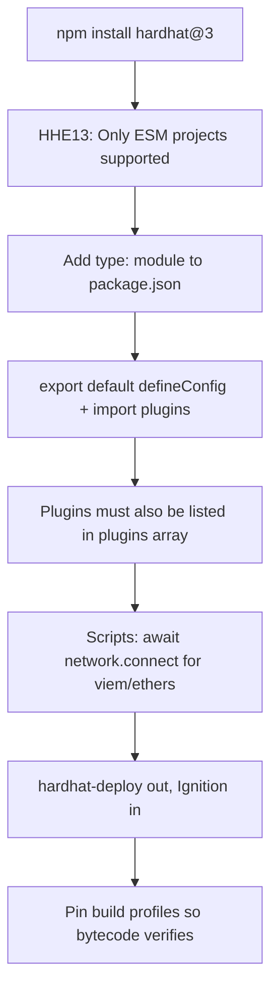

You typed `npm install hardhat@3`, expecting a version bump. A few patched bugs, maybe a faster compile. You committed it on a Friday because what could a minor-sounding upgrade possibly break.

Then you ran `npx hardhat compile` and the terminal answered with this:

```
HHE13: Only ESM projects are supported.
```

No contracts compiled. No tests ran. Your `hardhat.config.js` — the one that has worked unchanged for two years — is suddenly unloadable. Your first thought is that the install corrupted something, so you delete `node_modules` and try again. Same wall. The honest summary of the next two hours: Hardhat 3 is not a version bump, it's a migration, and the config file is only the first thing it takes from you.

This is the trap that catches almost everyone moving from Hardhat 2 to Hardhat 3. It's not a bug. It's a deliberate, documented design change that the version number does a poor job of advertising. Here's the whole cascade, and how to come out the other side without losing a weekend.

## The version bump that wasn't

The headline change: **Hardhat 3 requires your config to be an ES module.** Not "supports." Requires. The CommonJS `module.exports = { ... }` config that every Hardhat 2 tutorial taught you no longer loads.

The official migration guide states it plainly: *"Your Hardhat config must be an ES module."* In practice that means three things have to be true at once before Hardhat 3 will even read your project:

- `package.json` has `"type": "module"`
- the config uses `export default`, not `module.exports`
- every `require()` in that config becomes an `import`

Miss any one and you get a variant of the same refusal. The cleanest reproduction is the one above — a stock Hardhat 2 project with a `.js` config and no `"type"` field in `package.json`. Hardhat 3 reads `package.json`, sees no `"type": "module"`, and stops with `HHE13: Only ESM projects are supported.`

What makes this surprising is that nothing in the *contracts* changed. Same Solidity, same OpenZeppelin imports, same compiler version. The thing that broke is the loader, one layer below the code you actually care about. That mismatch — "my Solidity is fine but Hardhat won't start" — is exactly why people burn an afternoon here. You go looking for the problem in the wrong building.

And it's common. Hardhat 3 is the default install now, so every `npm install hardhat` on an old project walks straight into it. The migration guide exists precisely because the maintainers knew this cutover would sting.

## The debugging dance

Here's how it usually goes, retold from the collective misery of everyone who hit it before you.

**First instinct: it's a typo.** You open `hardhat.config.js`, scan for a stray character, find nothing wrong. The file is valid JavaScript. It was valid yesterday. You run it through `node hardhat.config.js` directly and Node is perfectly happy. So the file isn't broken — Hardhat just refuses to load it. Curse quietly.

**Second guess: it's the TypeScript setup.** If you're on a `.ts` config, you start poking at `tsconfig.json`, flipping `module` between `commonjs` and `nodenext`, rerunning, getting a *different* error each time, which feels like progress and is not. Eight tabs of Stack Overflow are now open. One of them is about a completely different error code you'll convince yourself is related for twenty minutes.

**The wrong turn everyone takes:** you read half a thread, see "rename it to `.cjs`," and rename `hardhat.config.js` to `hardhat.config.cjs`. This is the exact opposite of the fix. Hardhat 3 wants you to go *toward* ESM, not pin yourself to CommonJS. The `.cjs` move makes the next error more confusing, not less, because now the loader and your file extension disagree in a new way.

**The aha:** somewhere around the third reread of the migration guide, the sentence finally lands — *Hardhat 3 dropped CommonJS config support entirely.* This was never a setting to toggle or an error to suppress. The framework changed its mind about how a project is shaped. You're not fixing a config; you're converting a project. Once that clicks, the rest is mechanical.

And then the second shoe drops. You convert the config to ESM, rerun, and a *new* failure appears — your plugins are gone. `hardhat-gas-reporter`, your toolbox, all of it, silently inert. Because Hardhat 3 changed how plugins register too, and the migration guide buries the rule in one sentence: *"Unlike Hardhat 2, you need to both import the plugin and add it to the list of plugins."* In Hardhat 2, importing a plugin was enough — the side effect registered it. In Hardhat 3, an import that you don't also list in `plugins: [...]` does nothing.


## Migrating without losing a weekend

Here's the actual sequence that works. Do them in this order — each step unblocks the next.

**1. Make the project ESM.** Add the type field to `package.json`:

```json
{
  "type": "module"
}
```

**2. Convert the config to `export default defineConfig`.** The new minimal shape:

```ts
import { defineConfig } from "hardhat/config";
import hardhatToolboxViem from "@nomicfoundation/hardhat-toolbox-viem";

export default defineConfig({
  plugins: [hardhatToolboxViem],
  solidity: {
    version: "0.8.28",
  },
});
```

Note the two things that bite people: `defineConfig` is imported from `hardhat/config`, and every plugin appears **twice** — once as an `import`, once inside `plugins`. If a plugin used to "just work" by being imported, it won't anymore. List it.

**3. Rewrite `require()` as `import`.** Top-level `require`, `__dirname`, and `__filename` don't exist in an ES module. Swap requires for imports at the top of the file. If you genuinely need a path relative to the config, derive it from `import.meta.url` instead of `__dirname`.

**4. Fix the network access in scripts.** This is the part that surprises people who got past the config. In Hardhat 2, `hre.network` was a single, always-available connection. In Hardhat 3, you create connections explicitly:

```ts
import { network } from "hardhat";

const { viem, networkHelpers } = await network.connect();
const counter = await viem.deployContract("Counter");
```

The migration guide's own words: *"hre.network no longer represents a single network connection that is immediately available."* Every deploy script and every test that reached for `hre.network.provider` directly needs to call `connect()` first. The upside is real — multiple concurrent connections in one process — but it's a rewrite, not a rename.

**5. Replace `hardhat-deploy` if you used it.** This one has no gentle path. `hardhat-deploy` relies on Hardhat 2's internal APIs and is **not compatible with Hardhat 3.** The experimental `hardhat-deploy@next` exists but is, charitably, not ready. The supported route is Hardhat Ignition. Budget real time here: Ignition modules forbid conditional logic and `async/await` inside the module body, and there's no automated converter for existing `hardhat-deploy` artifacts. Teams report keeping the old `deployments/` folders around read-only while standing up Ignition alongside.

**6. Pin your build profiles.** A nasty late surprise: Hardhat 3 introduced *build profiles*, and production builds use different optimizer defaults than the default profile. The symptom is brutal — *"the exact same contract, compiler version, and optimizer settings that worked perfectly with Hardhat 2 suddenly produced bytecode mismatches"* — and it shows up as a failed Etherscan verification, not a compile error. If you verify contracts, set `evmVersion` and optimizer settings explicitly and identically across profiles so the bytecode is reproducible.

Here's the shape of the whole cutover, so you can see why it's a migration and not a patch:



## The lesson

A major version number is a contract about *intent*, not about *effort*. Hardhat 3's "3" tells you the maintainers gave themselves permission to break things — ESM-only configs, explicit connections, a different deploy story. It does not tell you those breaks are small, and the cheapest way to learn that is the expensive way: on a Friday, in production tooling, with the clock running.

The actionable takeaway is dull and correct: **read the migration guide before you bump the major, not after the error.** When a tool moves from 2 to 3, treat the upgrade as a scheduled project with its own branch and its own test pass, not a line in a dependency-bump PR. Teams already on viem and Node ESM — the stack we favor for contract tooling at GEMBA IT — get a softer landing on the config and connection changes, but the `hardhat-deploy`-to-Ignition piece is the part to plan around regardless, not improvise.

## Credit & further reading

This article is based on the changes documented in the official [Hardhat 3 migration guide](https://hardhat.org/docs/migrate-from-hardhat2) and the [Hardhat 3 error reference](https://hardhat.org/docs/reference/errors). Thanks to the Nomic Foundation team for documenting the ESM cutover and the network-connection model in the open, and to the community writers who mapped the `hardhat-deploy` → Ignition path before the rest of us had to. For the authoritative detail on creating connections and using viem, see [How to use viem with Hardhat](https://hardhat.org/docs/learn-more/using-viem).

## Frequently Asked Questions

### Can I keep my CommonJS config and just suppress the error?

No. `HHE13: Only ESM projects are supported` is not a warning you can silence — Hardhat 3 dropped CommonJS *config* loading entirely. The config file must be an ES module, which means `"type": "module"` in `package.json`, `export default` instead of `module.exports`, and `import` instead of `require`. Your scripts and tests can still be CommonJS if you really need them to be, but the config itself cannot. Renaming the config to `.cjs` is the wrong direction and will lead you into a different, more confusing failure rather than out of this one. The only real fix is to convert the project to ESM.

### Why did my plugins stop working after I fixed the config?

Because Hardhat 3 changed plugin registration. In Hardhat 2, importing a plugin was enough — the import had a side effect that registered it. In Hardhat 3, an `import` alone does nothing; you must also add the plugin to the `plugins: [...]` array passed to `defineConfig`. So every plugin now appears twice in your config: once as an `import` at the top, once as an entry in the `plugins` list. If a toolbox or gas reporter went silent right after your config compiled cleanly, this is almost certainly why. Add it to the array.

### Is `hardhat-deploy` going to work on Hardhat 3?

Not the stable version. `hardhat-deploy` depends on Hardhat 2's internal APIs, which Hardhat 3 reworked, so it's incompatible. There's an experimental `hardhat-deploy@next` aimed at Hardhat 3, but as of mid-2026 it's not a smooth drop-in — teams report being unable to get it working against current Hardhat releases. The supported path is Hardhat Ignition. Be aware that Ignition modules forbid `async/await` and conditional logic inside the module, there's no automated converter for existing deployment artifacts, and you'll likely keep your old `deployments/` folders around for reference while you rebuild.

### My contracts compile but fail Etherscan verification after upgrading. Why?

Almost certainly Hardhat 3's new build profiles. Production builds can use different optimizer defaults than the default profile, so the bytecode you deploy may not match the bytecode produced by the settings you *think* you compiled with. The same source, compiler version, and optimizer runs can yield a different artifact across profiles. The fix is to pin `evmVersion` and the optimizer configuration explicitly and identically across the profiles you use, so the build is reproducible and the on-chain bytecode matches what the verifier recompiles.

### Should I migrate to Hardhat 3 right now, or wait?

If your project is small and actively developed, migrate on a dedicated branch with a full test pass — the ESM and connection changes are mechanical once you understand them, and you get multichain connections and faster builds out of it. If you lean heavily on `hardhat-deploy` or have a large deployment history, plan the Ignition migration as its own piece of work rather than rushing it; that's the part with no automated path. Either way, don't bundle the major bump into an unrelated PR. Treat it as a scheduled migration so the `HHE13` wall lands on a Tuesday with time to spare, not a Friday with a deadline.
