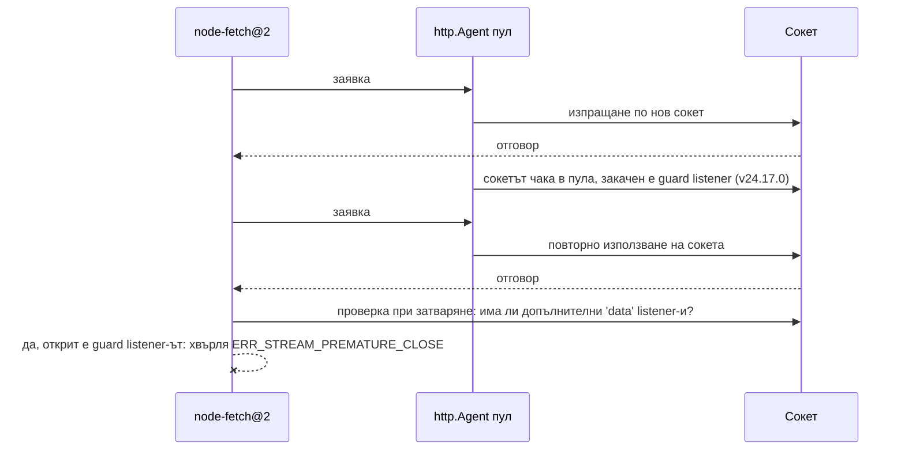

# Как да поправите ERR_STREAM_PREMATURE_CLOSE в node-fetch

Направихте отговорното нещо. На 18 юни 2026 г. Node.js публикува security releases, закърпващи дванадесет уязвимости, и всяко ръководство за добри практики казва едно и също: прилагайте security patch-овете още същия ден. Затова вдигнахте Docker image-а си от `node:24.16.0-slim` на `node:24.17.0-slim`, направихте deploy и си тръгнахте.

На следващата сутрин error tracker-ът ви е стена от червено. Всяко извикване към Google Drive API се проваля. Signed URL-ите за Cloud Storage — провал. Колега на Windows дори не може да влезе с Firebase CLI. Нищо във *вашия* код не се е променило. Самите API-та са наред; можете да ги викате с `curl` по цял ден.

Грешката е една и съща навсякъде и не ви казва почти нищо:

```
FetchError: Invalid response body while trying to fetch
https://www.googleapis.com/drive/v3/files: Premature close
  code: 'ERR_STREAM_PREMATURE_CLOSE'
```

Ето неудобната част: самият security patch беше коректен. Той поправи реална уязвимост. Това, което счупи, беше петгодишно предположение в библиотека, за която вероятно дори не знаете, че използвате.

## Грешката, която се появи от нищото

„Premature close" обикновено означава едно: сървърът е затворил връзката по средата на отговора. Половин файл, после тишина. Така че текстът на грешката ви сочи към сървъра — а сървърът не е направил нищо лошо.

Точно това направи този бъг толкова дезориентиращ за хората, които го удариха. Разработчикът, който отвори [issue #63989 в хранилището на Node.js](https://github.com/nodejs/node/issues/63989) — `@tobalsgithub` — имаше два напълно независими code path-а, които се провалиха едновременно: извиквания на Google Drive `files.list` през `googleapis@144` и генериране на v4 signed URL-и през `@google-cloud/storage@7.14.0`. Различни API-та, различни функции, една и съща грешка. Същия ден потребител на Windows 11 докладва идентичен провал във `firebase-tools` само при опит да достигне `accounts.google.com`.

Какво беше общото между тези пътища? Всеки от тях минава през едни и същи тръби: `googleapis` → `gaxios` (HTTP обвивката на Google) → `node-fetch@2.7.0` → вградения в Node модул `http`, с keep-alive agent. Keep-alive agent-ът е пул от връзки: вместо да отваря нова мрежова връзка за всяка заявка, Node държи връзката отворена след края на отговора и я използва повторно за следващата заявка. Стандартна печалба в производителността — и седи толкова дълбоко във веригата от зависимости, че повечето хора, които я ползват, никога през живота си не са изписвали думите „node-fetch".

Една корелация между версиите проби през шума: закачете runtime-а обратно на Node v24.16.0 и всичко работи. Пуснете v24.17.0 и гори. Както се изрази `@tobalsgithub`, докато ровеше в changelog-а за заподозрени: "anything altering keep-alive socket reuse timing is a candidate" (всичко, което променя тайминга на повторното използване на keep-alive сокети, е кандидат).

Темата събра 80 коментара за два дни. Това не беше граничен случай. Това бяха всички, които бяха обновили.

## Преследване на грешния заподозрян

Поставете се на мястото на първите хора, дебъгвали това, преди issue-то да съществува.

Първи инстинкт: Google е счупил нещо. Тяхното API, тяхната клиентска библиотека, тяхното съобщение за грешка. Проверявате статус страницата на Google Cloud. Всичко зелено. Изругавате тихо.

Второ предположение: нещо с компресията или някое proxy реже отговорите. „Premature close" мирише на load balancer, който прекъсва връзки. Ровите в gzip настройките, заобикаляте корпоративното proxy, пробвате от лаптопа си. Същата грешка. Не е мрежата. Никога не е мрежата. Освен когато е. Не беше.

Трето предположение — и това е конкретният грешен завой, който половината тема направи — downgrade на *node-fetch*. Все пак това е библиотеката, която хвърля грешката. Хората закачаха стари версии, сменяха версии на `gaxios`, преправяха lockfile-ове. Без ефект, защото кодът, хвърлящ грешката, не се беше променял от години. В този момент броят на отворените табове е неудобен за споменаване и сте прочели един и същ отговор в Stack Overflow от 2021 г. четири пъти.

Моментът „аха" дойде от най-безславния инструмент за дебъгване: четенето на changelog-а. Release notes на Node v24.17.0 съдържат един ред, който споменава „keep-alive" и „Agent" в едно изречение: **"http: fix response queue poisoning in `http.Agent`"** — поправката за [CVE-2026-48931](https://nodejs.org/en/blog/vulnerability/june-2026-security-releases). Това беше единственият запис в целия release, който докосваше поведението на pooled сокетите между заявките. Изведнъж корелацията между версиите имаше механизъм.

А щом знаете къде да гледате, откривате и втората половина на историята: issue в node-fetch от **август 2023 г.** — [#1767](https://github.com/node-fetch/node-fetch/issues/1767) — описващо фалшиви „premature close" грешки винаги, когато са замесени keep-alive agent-и. Капанът е бил зареден от три години. Security patch-ът на Node просто най-накрая стъпи в него.


## Какво всъщност се случи вътре в http.Agent

Две парчета код, писани с години разлика, всяко разумно само по себе си, се сблъскаха.

**Парче едно: security поправката.** CVE-2026-48931 описва race condition в HTTP agent-а на Node, наречен response queue poisoning (отравяне на опашката от отговори). С прости думи: злонамерен или дефектен сървър може да изпрати байтове от отговор, *преди* клиентът да е изпратил следващата си заявка по pooled връзка, и Node можеше да съпостави тези непоискани байтове със следващата заявка, все едно са легитимният ѝ отговор. Грешен отговор, доставен с невъзмутимо лице. Поправката е концептуално проста: докато keep-alive сокет стои неактивен в пула, наблюдавай го — ако пристигнат данни, когато няма заявка в движение, сокетът е отровен, така че го унищожи.

Но *как* се наблюдава сокет в Node? Patch-ът направи очевидното: закачи `'data'` event listener на всеки неактивен pooled сокет. Това работи. То обаче е и **публично видимо** — всеки друг код, който държи този сокет, може да преброи listener-ите върху него.

**Парче две: старата евристика.** node-fetch@2 решава реален проблем: сървъри, които умират по средата на отговор при chunked transfer encoding (формат, при който тялото пристига на парчета, всяко обявяващо собствения си размер). За да засече отрязано тяло, node-fetch инспектира сокета при затварянето на отговора — и един от сигналите му е дали върху сокета има допълнителни `'data'` listener-и. Години наред „някой друг слуша този сокет" тихо корелираше с „този отговор не завърши както трябва".

После Node v24.17.0 започна да закача `'data'` listener на *всеки неактивен keep-alive сокет* като защита. node-fetch видя listener-а, заключи, че отговорът е бил отрязан, и хвърли `ERR_STREAM_PREMATURE_CLOSE` — върху отговор, който беше пристигнал байт по байт перфектно.



Никоя от страните не грешеше. Екипът на Node трябваше да пази неактивните сокети. Евристиката на node-fetch беше защитимо предположение през 2023 г. Бъгът живее изцяло в сблъсъка — във факта, че вътрешното счетоводство на единия слой беше видимо за друг слой, който се е научил да чете смисъл в него.

## Поправката — и какво да направите веднага

Matteo Collina (`@mcollina`) поправи проблема в ядрото на Node с [PR #64004](https://github.com/nodejs/node/pull/64004), слят на 20 юни — два дни след доклада. Поправката запазва защитата, но я прави невидима: вместо публичен `'data'` event listener, наблюдението на неактивните сокети вече използва вътрешна кука `onread` на socket handle-а, която външен код не може да види или преброи. Когато сокет бъде изваден обратно от пула за повторна употреба, нормалният път за четене се възстановява. Непоискани байтове по неактивен сокет все още го унищожават — CVE-то остава поправено — но `socket.listenerCount('data')` отново докладва това, което node-fetch очаква.

Поправените версии излязоха на 23–24 юни. Така че истинската поправка е един ред във вашия Dockerfile или version manager:

```bash
# any of these contain the repaired agent guard
node --version   # want >= 24.18.0 on the 24.x LTS line
                 #      >= 22.23.1 on the 22.x LTS line
                 #      >= 26.4.0  on the Current line
```

Това, което *не* трябва да правите, е да останете закачени на v24.16.0 задълго. Да, downgrade-ът кара грешката да изчезне — но той отваря наново всичките дванадесет уязвимости от юнския security release, включително два authentication bypass-а с висока критичност. Да размените известно CVE за чист error log не е размяна.

Ако сте заклещени между версии за няколко дни, две честни временни решения:

```js
// 1) Disable keep-alive for the affected client (costs latency, not correctness)
const { Agent } = require('node:http');
const agent = new Agent({ keepAlive: false });

// 2) Better: move off node-fetch@2 entirely where you control the call site
const res = await fetch(url); // Node's built-in fetch uses undici, not http.Agent
```

Вграденият `fetch` (наличен от Node 18 нататък) никога не е имал този проблем, защото undici — HTTP клиентът под него — изобщо не споделя сокети с наследения пул на `http.Agent`. Ако този инцидент е тласъкът, който ви трябваше, за да мигрирате — приемете тласъка.

## Поуката

Зависимостта, която ви нарани тук, е такава, която никога не сте избирали. Никой в онази GitHub тема не е решавал да използва node-fetch@2 — той е пристигнал тихо, закачен вътре в `gaxios`, вътре в `googleapis`, вътре във `firebase-tools`. Когато даде засечка, грешката изплува три слоя по-нагоре, облечена в съобщение, сочещо към напълно грешния виновник. Знайте какво всъщност отваря сокетите ви: `npm ls node-fetch` отнема десет секунди и ви казва дали сте били в обсега на взрива, преди post-mortem-ът да го направи.

По-дълбокият принцип: **евристика, която чете видимото състояние на друг слой, е бомба със закъснител без часовник.** node-fetch броеше listener-и върху сокет, който не притежава — и това работеше години наред, точно докато истинският собственик на сокета нямаше легитимна причина да промени счетоводството си.

И не, отговорът не е „спрете да прилагате security patch-ове". Прилагайте ги. Но на етапи: в GEMBA IT пускаме LTS security releases първо върху една canary услуга и я оставяме да поработи, преди флотът да я последва. Един ден престой щеше да хване това с една паднала услуга вместо с всичките.

> Тази статия се основава на проблем, първоначално обсъден в [nodejs/node#63989](https://github.com/nodejs/node/issues/63989). Благодарности на `@tobalsgithub` за прецизния, корелиран по версии доклад и на `@mcollina` за бързата поправка в [PR #64004](https://github.com/nodejs/node/pull/64004). Тригодишната node-fetch страна на историята живее в [node-fetch#1767](https://github.com/node-fetch/node-fetch/issues/1767), докладвана от `@steveluscher`. За по-задълбочено четене вижте официалната [документация на http.Agent](https://nodejs.org/api/http.html#class-httpagent) и [бележките към юнските security releases за 2026 г.](https://nodejs.org/en/blog/vulnerability/june-2026-security-releases).

## Често задавани въпроси

### Да сляза ли просто на Node v24.16.0?

Само като временна мярка, измервана в часове, не в седмици. Downgrade-ът наистина кара `ERR_STREAM_PREMATURE_CLOSE` да изчезне, защото v24.16.0 предхожда защитата на неактивните сокети, която спъва евристиката на node-fetch. Но той също така маха целия юнски security release от 2026 г. — дванадесет закърпени уязвимости, включително два authentication bypass-а с висока критичност и самата поправка на response queue poisoning. Поправените версии (v24.18.0, v22.23.1, v26.4.0) излязоха до седмица след доклада за регресията и съдържат както security поправките, така и поправката за съвместимост. Обновявайте напред, не назад. Ако платформата ви закача версии на Node бавно, изключването на keep-alive за засегнатия клиент е по-безопасен временен мост от това да работите без patch-ове.

### Този бъг засяга ли и вградения fetch на Node?

Не. Вграденият `fetch`, който идва с Node 18 и по-нови, се задвижва от undici — отделен HTTP клиент със собствен пул от връзки. Той никога не докосва наследения free-socket пул на `http.Agent`, където беше закачен guard listener-ът, и не използва евристиката на node-fetch с броене на listener-и. И двете половини на сблъсъка липсват. Затова този инцидент е и добър повод за миграция: код, използващ вградения fetch, мина през юнските releases, без да забележи. Засегнатата популация беше конкретно код, използващ node-fetch@2 заедно с keep-alive `http.Agent` — което на практика означава веригата на Google API клиентите (`googleapis`, `gaxios`, `firebase-tools`) и всеки проект, окабелил node-fetch с персонализиран agent за производителност.

### Защо node-fetch просто не го поправи от своя страна?

Две причини. Първо, node-fetch@2 е в режим на поддръжка — евристиката с фалшивите положителни е докладвана още през август 2023 г. (issue #1767) и стоя отворена три години. Координиран release в рамките на същата седмица през node-fetch@2 и всяка downstream закачена версия никога не е бил реалистичен. Второ, поправката в ядрото на Node е просто по-добрата: целта на защитата не изисква публично видим listener, а преместването ѝ във вътрешна кука `onread` поправя всички потребители наведнъж — включително форкове и копия на логиката на node-fetch, които никой никога не би закърпил поотделно. Да поправиш регресията във видимото състояние на платформата бие това да молиш една в общи линии замразена екосистема да обнови допусканията си.

### Какво е response queue poisoning, с прости думи?

HTTP по повторно използвана връзка е стриктна система „вземи си номерче": клиентът изпраща заявка 1, получава отговор 1, изпраща заявка 2, получава отговор 2. Response queue poisoning чупи номерацията. Злонамерен или бъгав сървър изпраща байтове *рано* — преди клиентът да е изпратил следващата си заявка по тази pooled връзка. Уязвим клиентски код тогава съпоставя тези стари байтове със следващата заявка, все едно са истинският ѝ отговор. Поискали сте баланса по сметката си; получили сте каквото сървърът е избутал по-рано. CVE-2026-48931 поправи точно този race в `http.Agent` на Node: всякакви данни, пристигащи по неактивен pooled сокет, вече незабавно унищожават сокета, така че ранните байтове никога не могат да бъдат сбъркани с легитимен отговор.

### Как да проверя дали проектът ми е бил в обсега на взрива?

Изпълнете `npm ls node-fetch` (или `pnpm why node-fetch`). Ако покаже node-fetch@2.x някъде в дървото — най-често под `gaxios` от клиентските библиотеки на Google — и вашият production runtime е минал през v24.17.0, v22.23.0 или v26.3.1 през седмицата на 18 юни 2026 г., сте били изложени. Сигнатурата на провала е `FetchError: Invalid response body … Premature close` с код `ERR_STREAM_PREMATURE_CLOSE` при заявки, които преизползват keep-alive връзки — обикновено втората и следващите заявки към същия хост. Еднократните заявки по нови сокети често пак успяваха, затова бъгът изглеждаше спорадичен в услуги с малко трафик, но постоянен в натоварените.
