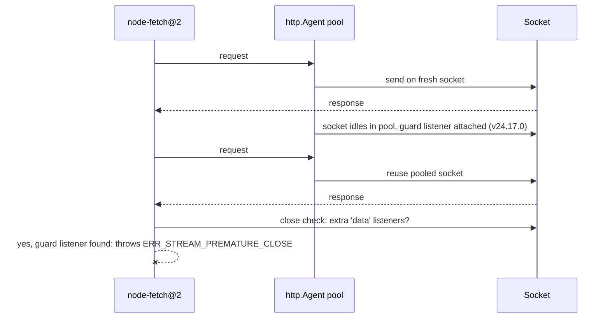

# Fixing ERR_STREAM_PREMATURE_CLOSE in node-fetch

You did the responsible thing. On June 18, 2026, Node.js shipped security releases patching twelve vulnerabilities, and every best-practice guide says the same thing: apply security patches the same day. So you bumped your Docker image from `node:24.16.0-slim` to `node:24.17.0-slim`, redeployed, and went home.

The next morning, your error tracker is a wall of red. Every call to the Google Drive API is failing. Signed URLs for Cloud Storage — failing. A teammate on Windows can't even log in with the Firebase CLI. Nothing in *your* code changed. The APIs themselves are fine; you can `curl` them all day.

The error is the same everywhere, and it tells you almost nothing:

```
FetchError: Invalid response body while trying to fetch
https://www.googleapis.com/drive/v3/files: Premature close
  code: 'ERR_STREAM_PREMATURE_CLOSE'
```

Here's the uncomfortable part: the security patch itself was correct. It fixed a real vulnerability. What it broke was a five-year-old guess inside a library you probably don't even know you're running.

## The error that appeared out of nowhere

"Premature close" normally means one thing: the server hung up in the middle of sending a response. Half a file, then silence. So the error text points you at the server — and the server did nothing wrong.

That's what made this bug so disorienting for the people who hit it. The developer who opened [issue #63989 on the Node.js repository](https://github.com/nodejs/node/issues/63989) — `@tobalsgithub` — had two completely independent code paths fail at once: Google Drive `files.list` calls through `googleapis@144`, and v4 signed-URL generation through `@google-cloud/storage@7.14.0`. Different APIs, different features, same error. The same day, a Windows 11 user reported the identical failure in `firebase-tools` just trying to reach `accounts.google.com`.

What did those paths have in common? Every one of them funnels through the same plumbing: `googleapis` → `gaxios` (Google's HTTP wrapper) → `node-fetch@2.7.0` → Node's built-in `http` module, with a keep-alive agent. A keep-alive agent is a connection pool: instead of opening a fresh network connection for every request, Node keeps the connection open after a response finishes and reuses it for the next request. It's a standard performance win — and it sits so deep in the dependency chain that most people running it have never typed the words "node-fetch" in their life.

One version correlation cut through the noise: pin the runtime back to Node v24.16.0 and everything works. Run v24.17.0 and it burns. As `@tobalsgithub` put it while combing the changelog for suspects, "anything altering keep-alive socket reuse timing is a candidate."

The thread collected 80 comments in two days. This wasn't an edge case. This was everyone who upgraded.

## Chasing the wrong suspect

Put yourself in the shoes of the first people debugging this, before the issue existed.

First instinct: Google broke something. It's their API, their client library, their error message. You check the Google Cloud status page. All green. You curse quietly.

Second guess: something with compression or a proxy is truncating responses. "Premature close" smells like a load balancer cutting connections. You poke at gzip settings, you bypass the corporate proxy, you try from your laptop. Same error. It's not the network. It's never the network. Except when it is. It wasn't.

Third guess — and this is the concrete wrong turn half the thread took — downgrade *node-fetch*. It's the library throwing the error, after all. People pinned older versions, swapped `gaxios` versions, rebuilt lockfiles. No effect, because the code throwing the error hadn't changed in years. At this point the tab count is embarrassing and you've read the same Stack Overflow answer from 2021 four times.

The aha moment came from the least glamorous debugging tool there is: reading the changelog. The Node v24.17.0 release notes contain one line that mentions the words "keep-alive" and "Agent" in the same breath: **"http: fix response queue poisoning in `http.Agent`"** — the fix for [CVE-2026-48931](https://nodejs.org/en/blog/vulnerability/june-2026-security-releases). That was the only entry in the whole release that touched how pooled sockets behave between requests. Suddenly the version correlation had a mechanism.

And once you know where to look, you find the second half of the story: a node-fetch issue from **August 2023** — [#1767](https://github.com/node-fetch/node-fetch/issues/1767) — describing false "premature close" errors whenever keep-alive agents are involved. The trap had been armed for three years. Node's security patch just finally stepped on it.


## What actually happened inside http.Agent

Two pieces of code, written years apart, each reasonable on its own, collided.

**Piece one: the security fix.** CVE-2026-48931 describes a race condition in Node's HTTP agent called response queue poisoning. In plain words: a malicious or misbehaving server could send response bytes *before* the client had sent its next request on a pooled connection, and Node could match those unsolicited bytes to the next request as if they were its legitimate answer. Wrong response, delivered with a straight face. The fix is conceptually simple: while a keep-alive socket sits idle in the pool, watch it — if any data arrives when no request is in flight, the socket is poisoned, so destroy it.

But *how* do you watch a socket in Node? The patch did the obvious thing: it attached a `'data'` event listener to every idle pooled socket. That works. It's also **publicly observable** — any other code holding that socket can count the listeners on it.

**Piece two: the old heuristic.** node-fetch@2 has a real problem to solve: servers that die mid-response while using chunked transfer encoding (a format where the body arrives in pieces, each announcing its own size). To detect a body that was cut off, node-fetch inspects the socket when the response closes — and one of its signals is whether extra `'data'` listeners are attached to it. For years, "someone else is listening to this socket" quietly correlated with "this response didn't end properly."

Then Node v24.17.0 started attaching a `'data'` listener to *every idle keep-alive socket*, as a security guard. node-fetch saw the listener, concluded the response had been truncated, and threw `ERR_STREAM_PREMATURE_CLOSE` — on a response that had completed byte-for-byte perfectly.



Neither side was wrong. Node's team needed to guard idle sockets. node-fetch's heuristic was a defensible guess in 2023. The bug lives entirely in the collision — in the fact that one layer's internal bookkeeping was visible to another layer that had learned to read meaning into it.

## The fix, and what to do right now

Matteo Collina (`@mcollina`) fixed it in Node core with [PR #64004](https://github.com/nodejs/node/pull/64004), merged on June 20 — two days after the report. The fix keeps the security guard but makes it invisible: instead of a public `'data'` event listener, the idle-socket watch now uses an internal socket-handle `onread` hook that external code cannot see or count. When a socket is pulled back out of the pool for reuse, the normal read path is restored. Unsolicited bytes on an idle socket still destroy it — the CVE stays fixed — but `socket.listenerCount('data')` reports what node-fetch expects again.

The repaired releases shipped June 23–24. So the actual fix is a one-liner in your Dockerfile or version manager:

```bash
# any of these contain the repaired agent guard
node --version   # want >= 24.18.0 on the 24.x LTS line
                 #      >= 22.23.1 on the 22.x LTS line
                 #      >= 26.4.0  on the Current line
```

What you should *not* do is stay pinned to v24.16.0 for long. Yes, downgrading makes the error disappear — but it also reopens all twelve vulnerabilities from the June security release, including two high-severity authentication bypasses. Trading a known CVE for a clean error log is not a trade.

If you're stuck between versions for a few days, two honest workarounds:

```js
// 1) Disable keep-alive for the affected client (costs latency, not correctness)
const { Agent } = require('node:http');
const agent = new Agent({ keepAlive: false });

// 2) Better: move off node-fetch@2 entirely where you control the call site
const res = await fetch(url); // Node's built-in fetch uses undici, not http.Agent
```

The built-in `fetch` (available since Node 18) never had this problem, because undici — the HTTP client underneath it — doesn't share sockets with the legacy `http.Agent` pool at all. If this incident is the push you needed to migrate, take the push.

## The lesson

The dependency that hurt you here is one you never chose. Nobody in that GitHub thread decided to use node-fetch@2 — it arrived silently, pinned inside `gaxios`, inside `googleapis`, inside `firebase-tools`. When it misfired, the error surfaced three layers above it, wearing a message that pointed at the wrong culprit entirely. Know what actually opens your sockets: `npm ls node-fetch` takes ten seconds and tells you whether you were in the blast radius before the postmortem does.

The deeper principle: **a heuristic that reads another layer's observable state is a time bomb with no clock.** node-fetch counting listeners on a socket it didn't own worked for years — right up until the socket's real owner had a legitimate reason to change its bookkeeping.

And no, the answer is not "stop applying security patches." Apply them. But stage them: at GEMBA IT we roll LTS security releases to one canary service first and let it soak before the fleet follows. A one-day soak would have caught this with one service down instead of all of them.

> This article is based on a problem originally discussed in [nodejs/node#63989](https://github.com/nodejs/node/issues/63989). Thanks to `@tobalsgithub` for the sharp version-correlated report and to `@mcollina` for the fast fix in [PR #64004](https://github.com/nodejs/node/pull/64004). The three-year-old node-fetch side of the story lives in [node-fetch#1767](https://github.com/node-fetch/node-fetch/issues/1767), reported by `@steveluscher`. For deeper reading, see the official [http.Agent documentation](https://nodejs.org/api/http.html#class-httpagent) and the [June 2026 security release notes](https://nodejs.org/en/blog/vulnerability/june-2026-security-releases).

## Frequently Asked Questions

### Should I just downgrade to Node v24.16.0?

Only as a stopgap measured in hours, not weeks. Downgrading does make `ERR_STREAM_PREMATURE_CLOSE` disappear, because v24.16.0 predates the idle-socket guard that trips node-fetch's heuristic. But it also strips out the entire June 2026 security release — twelve patched vulnerabilities, including two high-severity authentication bypasses and the response-queue-poisoning fix itself. The repaired releases (v24.18.0, v22.23.1, v26.4.0) shipped within a week of the regression report and contain both the security fixes and the compatibility fix. Upgrade forward, not backward. If your platform pins Node versions slowly, disabling keep-alive on the affected client is a safer temporary bridge than running unpatched.

### Does this bug affect Node's built-in fetch too?

No. The built-in `fetch` that ships with Node 18 and later is powered by undici, a separate HTTP client with its own connection pooling. It never touches the legacy `http.Agent` free-socket pool where the guard listener was attached, and it doesn't use node-fetch's listener-counting heuristic. Both halves of the collision are absent. That's also why this incident is a good migration prompt: code using built-in fetch sailed through the June releases without noticing. The affected population was specifically code using node-fetch@2 together with a keep-alive `http.Agent` — which in practice means the Google API client chain (`googleapis`, `gaxios`, `firebase-tools`) and any project that wired up node-fetch with a custom agent for performance.

### Why didn't node-fetch just fix it on their side?

Two reasons. First, node-fetch@2 is in maintenance mode — the false-positive heuristic was reported back in August 2023 (issue #1767) and stayed open for three years. A same-week coordinated release across node-fetch@2 and every downstream pin was never realistic. Second, the Node core fix is simply the better one: the guard's purpose doesn't require a publicly visible listener, and moving it to an internal `onread` hook fixes every consumer at once — including forks and copies of node-fetch's logic that no one would ever patch individually. Fixing the platform's observable-state regression beats asking a mostly-frozen ecosystem to update its assumptions.

### What is response queue poisoning, in plain words?

HTTP on a reused connection is a strict take-a-number system: the client sends request 1, gets answer 1, sends request 2, gets answer 2. Response queue poisoning breaks the numbering. A malicious or buggy server sends bytes *early* — before the client has sent its next request on that pooled connection. Vulnerable client code then matches those stale bytes to the next request as if they were its real answer. You asked for your account balance; you got whatever the server pushed earlier. CVE-2026-48931 fixed exactly this race in Node's `http.Agent`: any data arriving on an idle pooled socket now destroys that socket immediately, so early bytes can never be mistaken for a legitimate response.

### How do I check whether my project was in the blast radius?

Run `npm ls node-fetch` (or `pnpm why node-fetch`). If it shows node-fetch@2.x anywhere in the tree — most commonly under `gaxios` from the Google client libraries — and your production runtime moved through v24.17.0, v22.23.0, or v26.3.1 during the week of June 18, 2026, you were exposed. The failure signature is `FetchError: Invalid response body … Premature close` with code `ERR_STREAM_PREMATURE_CLOSE` on requests that reuse keep-alive connections, typically the second and later requests to the same host. One-off requests on fresh sockets often still succeeded, which is why the bug looked intermittent in low-traffic services but constant in busy ones.
