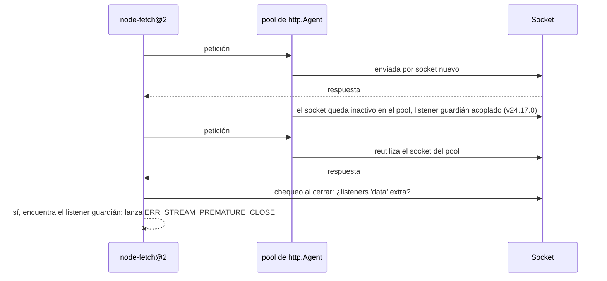

# Cómo arreglar ERR_STREAM_PREMATURE_CLOSE en node-fetch

Hiciste lo responsable. El 18 de junio de 2026, Node.js publicó security releases que parcheaban doce vulnerabilidades, y todas las guías de buenas prácticas dicen lo mismo: aplica los parches de seguridad el mismo día. Así que subiste tu imagen de Docker de `node:24.16.0-slim` a `node:24.17.0-slim`, hiciste el deploy y te fuiste a casa.

A la mañana siguiente, tu error tracker es una pared de rojo. Todas las llamadas a la API de Google Drive fallan. Las signed URLs de Cloud Storage — fallan. Un compañero en Windows ni siquiera puede iniciar sesión con la CLI de Firebase. Nada en *tu* código cambió. Las APIs en sí están bien; puedes llamarlas con `curl` todo el día.

El error es el mismo en todas partes, y no te dice casi nada:

```
FetchError: Invalid response body while trying to fetch
https://www.googleapis.com/drive/v3/files: Premature close
  code: 'ERR_STREAM_PREMATURE_CLOSE'
```

Aquí viene la parte incómoda: el parche de seguridad en sí era correcto. Arregló una vulnerabilidad real. Lo que rompió fue una suposición de cinco años dentro de una librería que probablemente ni sabes que estás usando.

## El error que apareció de la nada

"Premature close" normalmente significa una cosa: el servidor colgó a mitad del envío de una respuesta. Medio archivo, y luego silencio. Así que el texto del error te apunta al servidor — y el servidor no hizo nada malo.

Eso es lo que hizo este bug tan desorientador para la gente que lo sufrió. El desarrollador que abrió el [issue #63989 en el repositorio de Node.js](https://github.com/nodejs/node/issues/63989) — `@tobalsgithub` — tenía dos rutas de código completamente independientes fallando a la vez: llamadas `files.list` de Google Drive a través de `googleapis@144`, y la generación de signed URLs v4 a través de `@google-cloud/storage@7.14.0`. APIs distintas, funcionalidades distintas, el mismo error. El mismo día, un usuario de Windows 11 reportó el fallo idéntico en `firebase-tools` simplemente intentando llegar a `accounts.google.com`.

¿Qué tenían en común esas rutas? Todas pasan por la misma tubería: `googleapis` → `gaxios` (el wrapper HTTP de Google) → `node-fetch@2.7.0` → el módulo `http` integrado de Node, con un agente keep-alive. Un agente keep-alive es un pool de conexiones: en vez de abrir una conexión de red nueva para cada petición, Node mantiene la conexión abierta cuando termina una respuesta y la reutiliza para la siguiente. Es una mejora de rendimiento estándar — y está tan profundo en la cadena de dependencias que la mayoría de quienes la ejecutan jamás han escrito las palabras "node-fetch" en su vida.

Una correlación de versiones cortó el ruido: fija el runtime de vuelta a Node v24.16.0 y todo funciona. Ejecuta v24.17.0 y arde. Como dijo `@tobalsgithub` mientras peinaba el changelog en busca de sospechosos, "cualquier cosa que altere el timing de reutilización de sockets keep-alive es candidata".

El hilo acumuló 80 comentarios en dos días. Esto no era un caso raro. Esto era todo el que actualizó.

## Persiguiendo al sospechoso equivocado

Ponte en los zapatos de las primeras personas que depuraron esto, antes de que el issue existiera.

Primer instinto: Google rompió algo. Es su API, su librería cliente, su mensaje de error. Revisas la página de estado de Google Cloud. Todo en verde. Maldices en voz baja.

Segunda apuesta: algo con la compresión o un proxy está truncando las respuestas. "Premature close" huele a un balanceador de carga cortando conexiones. Toqueteas la configuración de gzip, saltas el proxy corporativo, pruebas desde tu portátil. El mismo error. No es la red. Nunca es la red. Excepto cuando lo es. No lo era.

Tercera apuesta — y este es el giro equivocado concreto que tomó la mitad del hilo — hacer downgrade de *node-fetch*. Al fin y al cabo, es la librería que lanza el error. La gente fijó versiones antiguas, cambió versiones de `gaxios`, reconstruyó lockfiles. Sin efecto, porque el código que lanzaba el error no había cambiado en años. A estas alturas el número de pestañas abiertas da vergüenza y has leído la misma respuesta de Stack Overflow de 2021 cuatro veces.

El momento de revelación llegó de la herramienta de depuración menos glamurosa que existe: leer el changelog. Las notas de la versión v24.17.0 de Node contienen una línea que menciona las palabras "keep-alive" y "Agent" en la misma frase: **"http: fix response queue poisoning in `http.Agent`"** — el arreglo del [CVE-2026-48931](https://nodejs.org/en/blog/vulnerability/june-2026-security-releases). Era la única entrada de todo el release que tocaba cómo se comportan los sockets del pool entre peticiones. De repente, la correlación de versiones tenía un mecanismo.

Y una vez sabes dónde mirar, encuentras la segunda mitad de la historia: un issue de node-fetch de **agosto de 2023** — [#1767](https://github.com/node-fetch/node-fetch/issues/1767) — que describe falsos errores de "premature close" siempre que hay agentes keep-alive de por medio. La trampa llevaba tres años armada. El parche de seguridad de Node simplemente por fin la pisó.


## Qué pasó realmente dentro de http.Agent

Dos piezas de código, escritas con años de diferencia, cada una razonable por sí sola, chocaron.

**Pieza uno: el arreglo de seguridad.** El CVE-2026-48931 describe una race condition en el agente HTTP de Node llamada response queue poisoning (envenenamiento de la cola de respuestas). En palabras simples: un servidor malicioso o defectuoso podía enviar bytes de respuesta *antes* de que el cliente hubiera enviado su siguiente petición por una conexión del pool, y Node podía emparejar esos bytes no solicitados con la siguiente petición como si fueran su respuesta legítima. Respuesta equivocada, entregada sin pestañear. El arreglo es conceptualmente simple: mientras un socket keep-alive está inactivo en el pool, vigílalo — si llegan datos cuando no hay ninguna petición en vuelo, el socket está envenenado, así que destrúyelo.

Pero ¿*cómo* se vigila un socket en Node? El parche hizo lo obvio: acopló un listener del evento `'data'` a cada socket inactivo del pool. Funciona. También es **públicamente observable** — cualquier otro código que tenga ese socket puede contar los listeners que lleva encima.

**Pieza dos: la vieja heurística.** node-fetch@2 tiene un problema real que resolver: servidores que mueren a mitad de respuesta usando chunked transfer encoding (un formato donde el cuerpo llega en trozos, cada uno anunciando su propio tamaño). Para detectar un cuerpo cortado, node-fetch inspecciona el socket cuando la respuesta se cierra — y una de sus señales es si hay listeners `'data'` extra acoplados a él. Durante años, "alguien más está escuchando este socket" correlacionó silenciosamente con "esta respuesta no terminó bien".

Entonces Node v24.17.0 empezó a acoplar un listener `'data'` a *cada socket keep-alive inactivo*, como guardia de seguridad. node-fetch vio el listener, concluyó que la respuesta había sido truncada, y lanzó `ERR_STREAM_PREMATURE_CLOSE` — sobre una respuesta que había llegado completa byte a byte.



Ninguno de los dos lados estaba equivocado. El equipo de Node necesitaba proteger los sockets inactivos. La heurística de node-fetch era una apuesta defendible en 2023. El bug vive enteramente en la colisión — en el hecho de que la contabilidad interna de una capa era visible para otra capa que había aprendido a leerle significado.

## El arreglo, y qué hacer ahora mismo

Matteo Collina (`@mcollina`) lo arregló en el core de Node con el [PR #64004](https://github.com/nodejs/node/pull/64004), fusionado el 20 de junio — dos días después del reporte. El arreglo mantiene la guardia de seguridad pero la hace invisible: en vez de un listener público del evento `'data'`, la vigilancia del socket inactivo ahora usa un hook interno `onread` del handle del socket que el código externo no puede ver ni contar. Cuando un socket vuelve a salir del pool para reutilizarse, se restaura la ruta de lectura normal. Los bytes no solicitados en un socket inactivo siguen destruyéndolo — el CVE sigue arreglado — pero `socket.listenerCount('data')` vuelve a reportar lo que node-fetch espera.

Las versiones reparadas salieron el 23–24 de junio. Así que el arreglo real es una línea en tu Dockerfile o gestor de versiones:

```bash
# any of these contain the repaired agent guard
node --version   # want >= 24.18.0 on the 24.x LTS line
                 #      >= 22.23.1 on the 22.x LTS line
                 #      >= 26.4.0  on the Current line
```

Lo que *no* debes hacer es quedarte fijado en v24.16.0 mucho tiempo. Sí, el downgrade hace desaparecer el error — pero también reabre las doce vulnerabilidades del security release de junio, incluidos dos bypasses de autenticación de severidad alta. Cambiar un CVE conocido por un log de errores limpio no es un buen trato.

Si te quedas atrapado entre versiones durante unos días, dos soluciones temporales honestas:

```js
// 1) Disable keep-alive for the affected client (costs latency, not correctness)
const { Agent } = require('node:http');
const agent = new Agent({ keepAlive: false });

// 2) Better: move off node-fetch@2 entirely where you control the call site
const res = await fetch(url); // Node's built-in fetch uses undici, not http.Agent
```

El primer bloque desactiva el keep-alive para el cliente afectado (cuesta latencia, no corrección). El segundo — mejor — abandona node-fetch@2 por completo donde tú controles la llamada: el `fetch` integrado (disponible desde Node 18) nunca tuvo este problema, porque undici — el cliente HTTP que lleva debajo — no comparte sockets con el pool legado de `http.Agent` en absoluto. Si este incidente es el empujón que necesitabas para migrar, acepta el empujón.

## La lección

La dependencia que te hizo daño aquí es una que nunca elegiste. Nadie en ese hilo de GitHub decidió usar node-fetch@2 — llegó en silencio, fijada dentro de `gaxios`, dentro de `googleapis`, dentro de `firebase-tools`. Cuando falló, el error afloró tres capas más arriba, vestido con un mensaje que apuntaba al culpable equivocado. Conoce qué abre realmente tus sockets: `npm ls node-fetch` toma diez segundos y te dice si estabas en el radio de la explosión antes de que te lo diga el postmortem.

El principio más profundo: **una heurística que lee el estado observable de otra capa es una bomba de tiempo sin reloj.** Que node-fetch contara listeners en un socket que no era suyo funcionó durante años — justo hasta que el verdadero dueño del socket tuvo una razón legítima para cambiar su contabilidad.

Y no, la respuesta no es "deja de aplicar parches de seguridad". Aplícalos. Pero por etapas: en GEMBA IT desplegamos los security releases de LTS primero en un servicio canario y lo dejamos reposar antes de que le siga la flota. Un día de reposo habría atrapado esto con un servicio caído en vez de con todos.

> Este artículo se basa en un problema discutido originalmente en [nodejs/node#63989](https://github.com/nodejs/node/issues/63989). Gracias a `@tobalsgithub` por el reporte preciso correlacionado por versiones y a `@mcollina` por el arreglo rápido en el [PR #64004](https://github.com/nodejs/node/pull/64004). La mitad de la historia que pertenece a node-fetch, con tres años de antigüedad, vive en [node-fetch#1767](https://github.com/node-fetch/node-fetch/issues/1767), reportado por `@steveluscher`. Para lectura más profunda, consulta la [documentación oficial de http.Agent](https://nodejs.org/api/http.html#class-httpagent) y las [notas de los security releases de junio de 2026](https://nodejs.org/en/blog/vulnerability/june-2026-security-releases).

## Preguntas frecuentes

### ¿Debería simplemente bajar a Node v24.16.0?

Solo como medida temporal medida en horas, no en semanas. El downgrade sí hace desaparecer `ERR_STREAM_PREMATURE_CLOSE`, porque v24.16.0 es anterior a la guardia de sockets inactivos que dispara la heurística de node-fetch. Pero también elimina todo el security release de junio de 2026 — doce vulnerabilidades parcheadas, incluidos dos bypasses de autenticación de severidad alta y el propio arreglo del response queue poisoning. Las versiones reparadas (v24.18.0, v22.23.1, v26.4.0) salieron en menos de una semana tras el reporte de la regresión y contienen tanto los arreglos de seguridad como el de compatibilidad. Actualiza hacia adelante, no hacia atrás. Si tu plataforma fija versiones de Node con lentitud, desactivar el keep-alive en el cliente afectado es un puente temporal más seguro que correr sin parches.

### ¿Este bug afecta también al fetch integrado de Node?

No. El `fetch` integrado que viene con Node 18 y posteriores funciona con undici, un cliente HTTP separado con su propio pool de conexiones. Nunca toca el pool legado de sockets libres de `http.Agent` donde se acopló el listener guardián, y no usa la heurística de node-fetch de contar listeners. Las dos mitades de la colisión están ausentes. Por eso este incidente es también un buen motivo de migración: el código que usa el fetch integrado atravesó los releases de junio sin enterarse. La población afectada era específicamente el código que usa node-fetch@2 junto con un `http.Agent` keep-alive — que en la práctica significa la cadena de clientes de las APIs de Google (`googleapis`, `gaxios`, `firebase-tools`) y cualquier proyecto que hubiera conectado node-fetch con un agente personalizado por rendimiento.

### ¿Por qué node-fetch no lo arregló por su lado?

Dos razones. Primero, node-fetch@2 está en modo de mantenimiento — la heurística de falsos positivos se reportó en agosto de 2023 (issue #1767) y quedó abierta tres años. Un release coordinado la misma semana entre node-fetch@2 y cada versión fijada aguas abajo nunca fue realista. Segundo, el arreglo en el core de Node es simplemente el mejor: el propósito de la guardia no requiere un listener públicamente visible, y moverla a un hook interno `onread` arregla a todos los consumidores de una vez — incluidos forks y copias de la lógica de node-fetch que nadie parchearía individualmente. Arreglar la regresión de estado observable de la plataforma gana a pedirle a un ecosistema mayormente congelado que actualice sus suposiciones.

### ¿Qué es el response queue poisoning, en palabras simples?

HTTP sobre una conexión reutilizada es un sistema estricto de "toma tu número": el cliente envía la petición 1, recibe la respuesta 1, envía la petición 2, recibe la respuesta 2. El response queue poisoning rompe la numeración. Un servidor malicioso o con bugs envía bytes *antes de tiempo* — antes de que el cliente haya enviado su siguiente petición por esa conexión del pool. El código cliente vulnerable entonces empareja esos bytes viejos con la siguiente petición como si fueran su respuesta real. Pediste el saldo de tu cuenta; recibiste lo que el servidor empujó antes. El CVE-2026-48931 arregló exactamente esta race condition en el `http.Agent` de Node: cualquier dato que llegue por un socket inactivo del pool ahora destruye ese socket de inmediato, de modo que los bytes tempranos nunca puedan confundirse con una respuesta legítima.

### ¿Cómo compruebo si mi proyecto estaba en el radio de la explosión?

Ejecuta `npm ls node-fetch` (o `pnpm why node-fetch`). Si muestra node-fetch@2.x en cualquier parte del árbol — lo más común, bajo `gaxios` de las librerías cliente de Google — y tu runtime de producción pasó por v24.17.0, v22.23.0 o v26.3.1 durante la semana del 18 de junio de 2026, estuviste expuesto. La firma del fallo es `FetchError: Invalid response body … Premature close` con código `ERR_STREAM_PREMATURE_CLOSE` en peticiones que reutilizan conexiones keep-alive, típicamente la segunda y siguientes peticiones al mismo host. Las peticiones sueltas por sockets nuevos a menudo seguían funcionando, y por eso el bug parecía intermitente en servicios con poco tráfico pero constante en los cargados.
