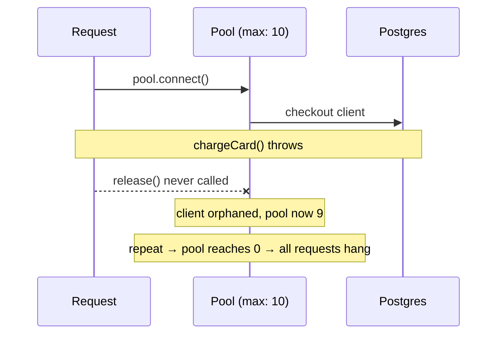
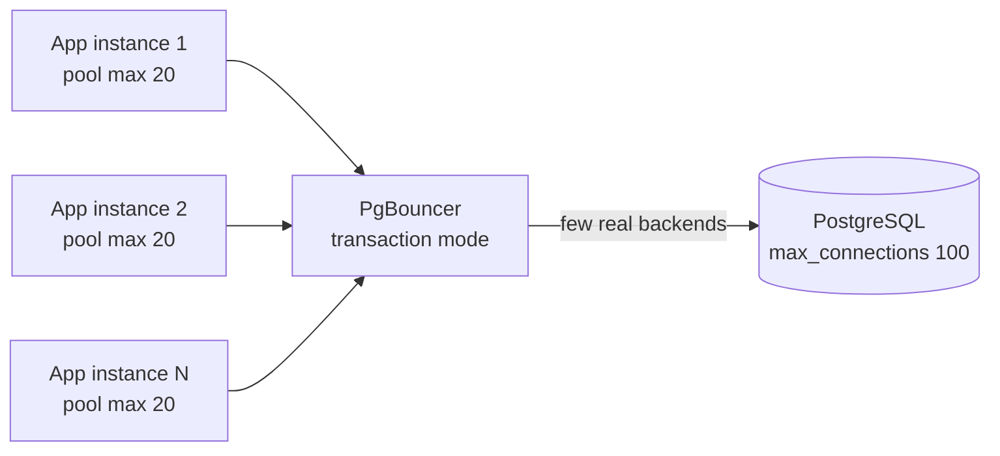

# Why Your Postgres Pool Runs Out

It's 9:14 on a Tuesday. Traffic is up — a campaign went out, people are clicking, the dashboard is green. Then it isn't. Requests start hanging. Some time out. The logs fill with a line nobody wrote on purpose:

```
error: sorry, too many clients already
```

You didn't change the database. You didn't change the queries. You added users. And the one piece of your stack that was supposed to *protect* the database from exactly this — the connection pool — turns out to be the thing pointing the gun at it.

Here's the uncomfortable truth this post is about: a connection pool doesn't shrink the number of connections you make. It caps and reuses them. And if you cap them wrong, or never give them back, or run twenty copies of your app each with its own cap, the pool isn't a safety net. It's a multiplier.

This is the full tour of how a Node.js + PostgreSQL pool runs dry in production, why it almost never shows up in testing, and the handful of settings and habits that actually keep it alive. If you run [node-postgres](https://node-postgres.com/features/pooling) (`pg`) behind any real traffic, every failure mode below is one you'll meet eventually.

## The problem, in three error messages

Connection trouble doesn't announce itself clearly. It shows up wearing three different masks, and people waste hours because the masks look unrelated.

**Mask one — the pool gives up:**

```
Error: timeout exceeded when trying to connect
```

This is your *own app's* pool talking. Every connection it's allowed to make is checked out and busy, a new request asked for one, and after `connectionTimeoutMillis` nobody freed one up. (Spoiler: by default that timeout is `0`, which means "wait forever" — so often you don't even get this error. The request just hangs.)

**Mask two — Postgres slams the door:**

```
FATAL: sorry, too many clients already
```

This one comes from the database itself. PostgreSQL has a hard ceiling called `max_connections` (default `100`). When every slot is taken, the next connection attempt is refused outright. Your pool wanted more connections; Postgres said no.

**Mask three — the polite version of mask two:**

```
FATAL: remaining connection slots are reserved for non-replication superuser connections
```

Same ceiling, slightly earlier. Postgres keeps a few slots in reserve (`superuser_reserved_connections`, default `3`) so an admin can still log in and fix things while normal apps are locked out. You hit the wall three connections before the real maximum.

This is a genuinely common wall. There are dozens of "too many clients already" threads on Stack Overflow, the node-postgres repo, and hosting-provider forums — the [n8n community](https://community.n8n.io/t/postgres-connection-error-sorry-too-many-clients-already/63473) and [AWS RDS support](https://repost.aws/knowledge-center/rds-postgresql-error-connection-slots) both keep standing answers for it because it never stops being asked. As one developer on the node-postgres issues put it while staring at a pool that drained and never refilled: *"acquiring a connection always returns a new, freshly created connection that is immediately discarded once it is released."* The pool was there. It just wasn't pooling.

## The debugging dance

Let me tell you how this actually goes, because the order in which you panic matters.

**First instinct: it's a slow query.** Something must be locking. You open `pg_stat_activity`, you look for long-running statements, you find… a few queries, all fast. Nothing's blocked. You add an index anyway, because adding an index feels like progress. It changes nothing.

**Second guess: restart Postgres.** The connections clear, the errors stop, everyone exhales. Twenty minutes later, under the same traffic, it's back. You've now confirmed the problem scales with load, which you already knew, and burned a restart you'll have to explain.

**Third guess: bump the limits.** You set `max_connections` to 500. You feel powerful. Then your database server's memory starts climbing, because every Postgres connection is a real OS process that reserves real memory — `work_mem` per sort, the lot — and 500 mostly-idle connections is a fantastic way to trade one outage for a slower, fatter one. Raising `max_connections` is the move everyone reaches for and it's almost always treating the symptom.

By now you've got eight tabs open and you're starting to suspect the network. It's not the network.

The thing nobody checks first — because it's *your* code, and surely your code is fine — is two questions:

1. How many connections is each instance of your app allowed to open?
2. How many instances are running?

Multiply them. That's your real connection count. Not the number in your pool config. The number in your pool config *times every copy of the process*. Ten pods, default pool of `max: 10`, and you're asking Postgres for up to 100 connections — which is exactly its default ceiling, before you've counted your migration job, your cron worker, your admin console, or that one teammate connected over `psql`.

That's the aha. The pool size isn't a global budget. It's a *per-process* budget, and you've been doing the multiplication wrong — or not at all.

## How a single leak drains everything

There's a second way to run dry that's sneakier than the math, and it's the one that bites in code you've read a hundred times.

When you call `pool.connect()` to check out a client and run a transaction by hand, you are responsible for giving that client back. The docs are blunt about what happens if you don't: *"your application will leak them and eventually your pool will be empty forever and all future requests to check out a client from the pool will wait forever."*

Here's the classic leak. It looks completely reasonable:

```js
// BROKEN: leaks a client on every error
async function chargeOrder(orderId) {
  const client = await pool.connect();
  await client.query('BEGIN');
  const order = await client.query('SELECT * FROM orders WHERE id = $1', [orderId]);
  await chargeCard(order.rows[0]);          // <-- throws sometimes
  await client.query('COMMIT');
  client.release();                          // <-- never reached on throw
}
```

The day `chargeCard` throws — a declined card, a timeout, anything — the function bails out before `client.release()`. That client is gone. Not returned, not closed in a way the pool understands: just orphaned, checked out forever. Do that a few hundred times and your pool of ten is a pool of zero, and every request after that waits in line for a connection that's never coming back.

The fix is the boring one your linter has been quietly begging for: `try/finally`.

```js
// CORRECT: the client always goes home
async function chargeOrder(orderId) {
  const client = await pool.connect();
  try {
    await client.query('BEGIN');
    const order = await client.query('SELECT * FROM orders WHERE id = $1', [orderId]);
    await chargeCard(order.rows[0]);
    await client.query('COMMIT');
  } catch (err) {
    await client.query('ROLLBACK');
    throw err;
  } finally {
    client.release();   // runs on success, on error, on early return — always
  }
}
```

`finally` runs no matter how the `try` block exits. Success, exception, early `return` — the client goes back to the pool every time. If you only remember one pattern from this post, remember that `pool.connect()` and `client.release()` must be tied together with `finally`, the way you'd tie `open` to `close` on a file.

And when you *don't* need a manual transaction — when it's a single query — skip the manual checkout entirely:

```js
const { rows } = await pool.query('SELECT now()');
```

`pool.query()` checks out a client, runs the query, and returns it for you. The docs describe it exactly as *"removes the risk of leaking a client."* Reach for `pool.connect()` only when you genuinely need several statements on the *same* connection — a transaction, a session setting, an advisory lock. For everything else, `pool.query()` is the safer default.




## Sizing the pool so the math works

So how big *should* the pool be? Not "as big as possible." The whole point is to keep total connections under what Postgres can handle. The formula is simple and it's the one people skip:

```
(pool.max  ×  number of app instances)  +  headroom for jobs/admin
        ≤  max_connections − superuser_reserved_connections
```

Work an example. Postgres at the default `max_connections = 100`, minus `3` reserved, leaves `97` usable. You run 4 app instances and want to keep, say, 17 connections spare for migrations, a cron worker, and the occasional human with `psql`. That leaves 80 for the web tier, split across 4 instances: `max: 20` each. If tomorrow you autoscale to 8 instances, that same `max: 20` now demands 160 connections and you're back in the wall. **Pool size and instance count are one decision, not two.**

A few settings make this behave under stress instead of falling over:

```js
import { Pool } from 'pg';

const pool = new Pool({
  max: 20,                       // per-process ceiling — see the formula above
  idleTimeoutMillis: 10_000,     // drop a client after 10s idle (default 10000)
  connectionTimeoutMillis: 5_000 // FAIL after 5s instead of hanging forever
});
```

The one that changes your life is `connectionTimeoutMillis`. Its default is `0` — wait forever. That means under exhaustion your requests don't error, they *hang*, your load balancer's queue backs up, and a connection problem cosplays as a total outage. Set it to a few seconds and a starved request fails fast and cleanly. A `503` you can retry beats a hang that takes the whole node down with it.

While we're talking defaults that surprise people: `maxUses` defaults to `Infinity`, so a pooled connection is reused forever. Usually fine. But if you sit behind a load balancer that silently kills long-lived TCP connections, or you want connections to rotate so they rebalance across database replicas after a failover, set `maxUses` to something like `7500` so each connection retires and is replaced after a while. (This is the same family of setting that bit users in [node-postgres issue #3298](https://github.com/brianc/node-postgres/issues/3298), where the documented default and the real default disagreed — always trust the behavior you can measure over the number in the README.)

## The crash nobody sees coming

Here's a failure mode that isn't about *running out* of connections — it's about one connection dying quietly and taking your whole process with it.

A client sitting idle in the pool is still a live TCP connection to Postgres. If the database restarts, or the network blips, or a managed provider recycles a backend, that idle client emits an `error` event. And node-postgres is explicit about what happens next: *"if a pool emits an `error` event and no listeners are added node will emit an uncaught error and potentially crash your node process."*

Read that again. An idle connection — one not even in use — can crash your server, in the background, with no request involved, if you never attached a listener. The fix is one line you add once and forget:

```js
pool.on('error', (err) => {
  console.error('Unexpected idle client error', err);
  // don't exit — the pool will replace the dead client on its own
});
```

That listener turns a process-killing uncaught exception into a logged blip. The pool quietly discards the dead client and makes a fresh one on the next request. We learned to treat this as non-optional: GembaPay's payment service runs on PostgreSQL streaming replication on Hetzner, and during a planned failover the *primary* goes away on purpose — without that idle-error handler, a routine database promotion would take the app down with it.

## When the pool isn't enough: serverless and PgBouncer

Everything above assumes a small, fixed number of long-lived Node processes. The moment you go serverless — Lambda, Cloud Functions, Vercel, anything that spins up instances on demand — the model breaks in a specific way.

Each warm instance gets its own pool. A traffic burst spins up dozens of instances in seconds, each opening its own connections, and Postgres sees a flood it can't refuse fast enough. As one write-up on serverless pooling put it plainly: with serverless, *"pool max = 10 can overwhelm Postgres in minutes."* You can't size your way out, because you don't control how many instances exist at peak.

The answer is a second pool that *does* outlive your app: a dedicated pooler like **PgBouncer** (or a managed equivalent — RDS Proxy, Supavisor, the pooler your host ships). It sits between your many short-lived app connections and the database's few precious ones, in "transaction mode," handing a real Postgres backend to a client only for the length of a transaction and reclaiming it the instant the transaction ends. A thousand app connections can share a few dozen real ones.



There's one trap that catches everyone the day they put PgBouncer in transaction mode: **prepared statements break.** You'll see:

```
ERROR: prepared statement "S_1" does not exist
```

Why? A prepared statement lives on one specific backend connection for the whole session. But in transaction mode, your next query might land on a *different* backend. The statement you prepared isn't there. For years the only fix was to turn prepared statements off in the driver:

```js
const pool = new Pool({ /* ... */, prepare: false });
```

The good news, if you're on a recent stack: **PgBouncer 1.21+** can track prepared statements across transaction-mode connections — set `max_prepared_statements` to a non-zero value and they get re-prepared on the linked backend automatically. So the modern answer is "upgrade PgBouncer and turn on `max_prepared_statements`," with `prepare: false` as the fallback when you can't.

## The lesson

A connection pool is a budget, not a faucet. It doesn't reduce demand; it puts a ceiling on it and makes you choose that ceiling on purpose. Almost every "too many clients already" outage traces back to forgetting that the ceiling is *per process* and gets multiplied by everything you run, or to a client that left and never came home.

So the discipline is small and boring and it works: tie every `pool.connect()` to a `client.release()` in `finally`, prefer `pool.query()` when you don't need a transaction, set `connectionTimeoutMillis` so starvation fails loud instead of hanging silent, always attach `pool.on('error')`, and do the arithmetic — `pool.max × instances` has to fit under `max_connections` with room to spare. When instances become unpredictable, stop sizing and put a real pooler in front. The database's connection limit is a hard physical fact. Your job is to make sure your app respects it before traffic does the math for you.

## Credit & Further Reading

> This article synthesizes a problem class discussed across the node-postgres community — the [official pooling guide](https://node-postgres.com/features/pooling), the long-running "too many clients" threads on [Stack Overflow](https://stackoverflow.com/questions/tagged/node-postgres) and the [node-postgres issues](https://github.com/brianc/node-postgres/issues/3298), and provider runbooks like [AWS RDS's connection-slots guide](https://repost.aws/knowledge-center/rds-postgresql-error-connection-slots). Thanks to the maintainers and commenters who keep documenting it. For the authoritative reference, see the [node-postgres Pool API docs](https://node-postgres.com/apis/pool) and the [PostgreSQL connection settings](https://www.postgresql.org/docs/current/runtime-config-connection.html). For PgBouncer transaction-mode prepared statements, see the [Crunchy Data write-up](https://www.crunchydata.com/blog/prepared-statements-in-transaction-mode-for-pgbouncer).

## Frequently Asked Questions

### What's a good value for pool max?

There's no universal number, because the right value depends on how many copies of your app run. Start from the database: take `max_connections`, subtract `superuser_reserved_connections` (default 3) and a buffer for migrations, cron jobs, and admin access, then divide what's left by the number of app instances you'll have *at peak* — not on average. If autoscaling can quadruple your instance count, your pool size has to assume that peak or you'll hit the wall the moment it scales. For many small apps, a `max` of 10–20 per instance with a handful of instances is plenty. The number matters far less than doing the multiplication.

### Why does my pool work in tests but fail in production?

Tests run one process, one request at a time, and tear down cleanly — so a leaked client or an undersized pool never has a chance to pile up. Production runs many instances, concurrently, for days. Two things only show up there: leaks accumulate (each error path that skips `release()` permanently shrinks the pool until it's empty), and the per-process pool size gets multiplied by every instance until the total crosses the database ceiling. Load-test with concurrency against a real Postgres, and deliberately throw errors inside checked-out clients to confirm they're still released. If a forced error doesn't return the connection, you've found a leak.

### Should I create a new Pool per request?

No. A `Pool` is meant to be long-lived and shared — create one when your app starts and reuse it for the whole process lifetime. Creating a pool per request (or per function call) is the opposite of pooling: you pay the 20–30ms connection handshake every time and you can open an unbounded number of connections, which is exactly how you exhaust Postgres. The guidance from the node-postgres docs is to keep a single pool (or a small fixed number) per process. The one exception is short-lived serverless instances, and even there the answer isn't more pools — it's a shared external pooler like PgBouncer.

### How do I find a connection leak?

Watch `pg_stat_activity` while your app runs: `SELECT count(*), state FROM pg_stat_activity WHERE datname = 'yourdb' GROUP BY state;`. If `idle in transaction` keeps climbing and never falls, you have transactions that start but never commit or roll back — a classic leak. You can also log `pool.totalCount`, `pool.idleCount`, and `pool.waitingCount` on an interval: if `waitingCount` grows while `idleCount` stays at zero, the pool is starved. Then audit every `pool.connect()` in your code and confirm each one has a matching `release()` in a `finally` block. The error path is almost always where the leak hides.

### Does raising max_connections fix it?

Rarely, and usually it makes things worse. Each PostgreSQL connection is a separate OS process that reserves memory, so a high `max_connections` full of mostly-idle connections trades a crash for sustained memory pressure and slower performance. Raise it only after you've right-sized your pools and confirmed you genuinely need more concurrent work than the current ceiling allows — and even then, prefer putting a pooler like PgBouncer in front so a large number of app connections share a small number of real database connections. The goal is fewer, busier connections, not more idle ones.
