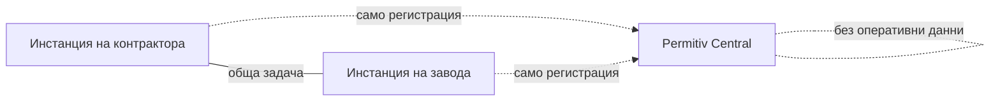

# Строим Permitiv

Ще си призная нещо. От години пазя една папка с планове за един-единствен софтуер — скици, списъци с модули, бележки, писани по нощни смени и по летищни салони. На всеки няколко месеца я отварях, добавях страница и я затварях, защото моментът все не беше подходящ, а нещото вътре беше твърде голямо.

Този месец спряхме да добавяме страници. Разработката на **Permitiv** — софтуер от ново поколение за високорискова индустриална работа — официално започна в GEMBA IT. Плановете се превръщат в код и искам да ви разкажа какво е това, защо точно ние и колко в началото сме всъщност. (Спойлер: съвсем.)

Началната страница е на [permitiv.com](https://permitiv.com), а за инвеститори и ранни партньори има директен, без украси, брийф на [permitiv.com/investors](https://permitiv.com/investors/).

## Проблемът, в който постоянно се спъвахме

GEMBA IT има сестринска компания — [Gemba Industrial](https://gembaindustrial.com) — която праща специализирани екипи в рафинерии и нефтохимически заводи: смени на катализатор, планови ремонти (turnarounds), работа в затворени пространства. Онзи тип работа, при която грешката не е бъг в тикет система.

И ето какво виждат нашите хора на почти всеки обект през 2026 г.: системата за безопасност, която управлява тази работа, още върви на **хартия**.

Разрешителното за работа (permit-to-work) — документът, който казва *този екип може да върши тази работа, на това място, при тези предпазни мерки* — се попълва на ръка на гише в началото на смяната. Входът в затворено пространство иска подписи от три различни роли, затова някой обикаля завода да ги събира. Резултати от газови замервания се преписват от екрана на уреда върху формуляр. Когато дойде одиторът, доказателствата са стена от класьори — а когато нещо се обърка, разследващите възстановяват хронологията по почерци.

Цената се плаща два пъти. Първо в пари: екипи, които стоят на празен ход пред permit офиса, докато часовникът върти на престой, в който всеки час е скъп. После в безопасност: permit система, която никой не може да претърси, да съпостави или да провери в реално време, е система, в която дупките остават невидими, докато не ги намери инцидент. Прочетете няколко публични доклада от разследвания — ние го правим всяка седмица за [блога на Gemba Industrial](https://gembaindustrial.com/bg/blog) — и „документите казваха едно, теренът правеше друго" е повтарящ се персонаж.

Строили сме платежни системи, тикетинг системи, блокчейн инфраструктура. А нашите екипи се връщаха от обекти и питаха защо никой не е построил *това*.

## Какво е Permitiv

Permitiv е платформа за планиране, разрешаване и одитиране на високорискова индустриална работа — рафинерии, нефтохимия, корабостроене и кораборемонт, жп и пътна инфраструктура, голямо строителство, индустриална поддръжка.

Необичайната част е, че е **двустранна**. Индустриалната работа е танц между две организации: **обектът** (заводът, който притежава опасността и издава разрешителните) и **контракторът** (компанията, която идва с екипа и сертификатите). Днес всяка страна върти собствените си таблици, а шевът между тях е мястото, където информацията умира. Permitiv слага двата режима на една и съща платформа, така че сертификатите на екипа на контрактора, условията по разрешителното на завода и реалните подписи живеят в един свързан поток.

Една кодова база обслужва три повърхности: контролна зала за хората, които управляват операцията, обикновено браузър приложение за офиса и полево приложение за телефони и таблети, направено за заводската реалност — ръкавици, прах и нестабилна връзка.

А обхватът е честен за това къде свършва: пълният план е петнайсет модула (от персонал и сертификати през офериране, планиране и оборудване до полево изпълнение), но първо строим тесен клин — **разрешителни и оторизация на работа, контрол на затворени пространства и офериране**. Първо проблемът с хартията. Всичко останало ще си заслужи мястото по-късно.

## Твърдото правило: AI никога не подписва

Permitiv е AI-native — през цялата платформа е вплетен AI помощник. Той чете регулации и стари разрешителни, подготвя чернови на документи, обобщава смяна, отговаря на „какво още блокира задача 47". В тази част от бъдещето сме с двата крака.

Но има граница, която записахме в ден първи и която третираме като закон: **всяко критично за безопасността решение е детерминистично, базирано на правила и носи човешки подпис.** Дали газовото замерване е в нормите, дали сертификатът на работника е валиден за този вход, дали разрешителното може да се активира — това са твърдо разписани правила, които инженер по безопасност може да прочете, а не изход от модел. AI-ят може да подготви всичко; поименно посочен човек подписва, и подписът влиза в записа.

Ако сте гледали индустрията напоследък, знаете защо. Асистент, който си измисля абзац в блог пост, е неудобство. Асистент, който си измисли разрешение за вход в затворено пространство, е немислим. Предпочитаме да пуснем помощник, който е честно ограничен, пред взимащ решения, на когото никой не бива да вярва.

## Защо федерирана

Ето каква е истината за заводите и данните за безопасност: големите оператори няма да излеят — и честно казано не бива да излеят — своите разрешителни, история на инциденти и данни за персонала в нечий споделен облак на стартъп.

Затова Permitiv е **федерирана**. Едно предприятие може да върти собствена инстанция, на собствена инфраструктура, под собствен контрол. Централна услуга — Permitiv Central — действа само като регистър и маршрутизатор, за да могат инстанциите да се намират, когато контрактор и завод работят по една и съща задача. Central не държи **никакви оперативни данни**. Вашите разрешителни живеят там, където вие решите.

По-малките компании, които просто искат софтуер, ще получат хоствана версия, разбира се. Но федерацията е в архитектурата от самото начало, защото суверенитет, закован отгоре по-късно, никога не работи.

## Къде сме (честно)

В началото. Наистина в началото — и предпочитам да го кажа направо, вместо да го украсявам.

Какво съществува днес: фундаментът на платформата. Multi-tenant ядро с твърда изолация между организациите, автентикация и append-only одитен запис, в който всеки запис е криптографски навързан към предишния — така че историята може да бъде проверена, а не просто повярвана. Пускаме одити по сигурността и пентест минавания върху този фундамент отпреди да има и една бизнес функция, защото в тази област одитната следа *е* продуктът.

Какво още не съществува: продуктът, през който да щракате. Първият функционален модул — персонал и сертификати — тръгва сега. Няма екранни снимки за показване и нищо за продаване, а всяка дата „очаквайте скоро", която бих ви казал днес, би била измислица.

Тогава защо обявяваме сега? Три причини. Публичното писане ни държи отговорни — тази папка не се връща в чекмеджето. Търсим шепа заводи и индустриални контрактори, които разпознават собствената си болка в този текст и искат да оформят клина с нас. И сме отворени за разговори с инвеститори, които разбират, че индустриалният софтуер се строи с години, не със спринтове — за това е [инвеститорският брийф](https://permitiv.com/investors/).

## Кой го строи

GEMBA IT е технологичното звено на GEMBA Team EOOD във Варна, България. Ние изграждаме [GembaPay](https://gembapay.com) (платформа за картови и PayPal плащания), билетни системи и останалата част от стека, който този блог обикновено разглежда. Gemba Industrial носи частта, която повечето софтуерни компании имитират: хора, които реално са стояли на permit гишето в 6 сутринта с екип зад гърба, който гори пари.

Тази комбинация — една компания, която пуска продукционни системи, и една, която живее вътре в проблема — е целият залог.

## Накратко

- **Permitiv** е в разработка: permit-to-work, контрол на затворени пространства и съответствие за високорискова индустрия — рафинерии, корабостроителници, инфраструктура, тежка поддръжка.
- Двустранна (заводи **и** контрактори), три повърхности от една кодова база, полево приложение за заводски условия.
- AI помощник навсякъде, но **AI никога не взима решението за безопасност** — детерминистични правила плюс човешки подпис, винаги.
- Федерирана: предприятията могат да въртят собствена инстанция; централната услуга само маршрутизира и регистрира, без оперативни данни.
- Статус: фундаментът е построен и тестван за сигурност, първият модул е в работа. В началото — нарочно. Обявено — нарочно.

Следете ни на [permitiv.com](https://permitiv.com). Ако управлявате завод, индустриален контрактор или фонд, който разбира тази област — [пишете ни](https://permitiv.com/investors/).

## Често задавани въпроси

### Какво е permit-to-work софтуер?

Разрешителното за работа (permit-to-work) е формалната оторизация зад опасните индустриални задачи: то определя работата, мястото, опасностите, предпазните мерки и кой е одобрил. На повечето обекти това още е хартиен формуляр, попълван в началото на смяната и подписван на ръка. Permit-to-work софтуерът дигитализира този поток — създава разрешителното от шаблони, проверява автоматично предусловия като газови замервания и сертификати на работниците, събира подписи електронно и пази претърсваем, проверим запис. Смисълът не е само скорост на гишето; дигиталната система може да съпоставя това, което хартията никога не е можела — например дали заварчикът в разрешителното наистина има валиден сертификат за затворено пространство.

### AI-ят на Permitiv ще взима ли решения за безопасност?

Не — и това е закон на дизайна, не бележка под черта. AI помощникът асистира: подготвя чернови на разрешителни от история и регулации, обобщава смени, показва конфликти, отговаря на въпроси. Но дали разрешително може да се активира, дали газово замерване минава, дали сертификат е валиден — тези проверки минават през детерминистични, четими от човек правила, а всяка критична за безопасността стъпка изисква подпис на поименно посочен човек, записан в защитена от подправяне одитна следа. Ако AI-ят сгреши в черновата, човек го хваща при подписването. Системата е строена така, че грешка на AI-я да може да е досадна, но никога опасна.

### Кога заводът или контракторската ми компания ще може да го пробва?

Още не — и няма да се преструваме на друго. Фундаментът (multi-tenant ядро, автентикация, проверим одитен запис) е построен и тестван за сигурност, а първият модул — персонал и сертификати — е в разработка сега. Клинът — разрешителни, контрол на затворени пространства и офериране — идва след него. Това, което търсим днес, е малка група ранни партньори: заводи и индустриални контрактори, готови да споделят как реално върви техният permit поток и да подложат нашия на натиск. Ако това сте вие — пишете ни през формата за контакт на [permitiv.com/investors](https://permitiv.com/investors/) и ни разкажете за обекта си.

### Защо обявявате нещо толкова незавършено?

Защото алтернативата — да строиш мълчаливо две години и да разкриеш „завършен" продукт, който нито един завод не е докосвал — е начинът, по който индустриалният софтуер свършва мразен от хората, принудени да го ползват. Ранното обявяване ни държи отговорни пред публичен запис, започва разговорите с операторите и екипите, чиято реалност трябва да оформи продукта, и дава на инвеститорите честна входна точка вместо полирана илюзия. Всичко останало строим на открито в този блог — до грешките ни в базата данни включително. Permitiv получава същото отношение: това е ден първи, казан на глас.

## Източници и допълнително четене

Началната страница на Permitiv е [permitiv.com](https://permitiv.com); брийфът за инвеститори и ранни партньори — включително къде е компанията и какво следва — е на [permitiv.com/investors](https://permitiv.com/investors/). Полевият опит зад проекта идва от [Gemba Industrial](https://gembaindustrial.com), чиито екипи работят плановите ремонти и затворените пространства, за които е този софтуер. За системите, които GEMBA IT вече върти в продукция, вижте [gembait.com](https://gembait.com) и [gembapay.com](https://gembapay.com).
