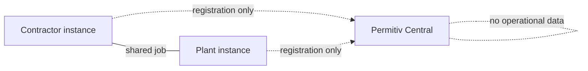

# We're Building Permitiv

I'll admit something. For years I've kept a folder of plans for one piece of software — sketches, module lists, notes typed on night shifts and in airport lounges. Every few months I'd reopen it, add a page, and close it again, because the timing was never right and the thing inside it was too big.

This month we stopped adding pages. Development of **Permitiv** — a new generation of software for high-risk industrial work — has officially started at GEMBA IT. The plans are becoming a codebase, and I want to tell you what it is, why us, and exactly how early we are. (Spoiler: very.)

The landing page is up at [permitiv.com](https://permitiv.com), and there's a straight-talking brief for investors and early partners at [permitiv.com/investors](https://permitiv.com/investors/).

## The problem we kept walking into

GEMBA IT has a sister company, [Gemba Industrial](https://gembaindustrial.com), that sends specialist crews into refineries and petrochemical plants — catalyst changeouts, turnarounds, confined-space work. The kind of jobs where a mistake isn't a bug ticket.

And here's what our own people see on almost every site, in 2026: the safety system that governs that work still runs on **paper**.

A permit-to-work — the document that says *this crew may do this job, in this place, under these precautions* — gets filled in by hand at a shift-start window. A confined-space entry needs signatures from three different roles, so someone walks the plant collecting them. Gas test results are copied from a meter's screen onto a form. When the auditor comes, the evidence is a wall of binders — and when something goes wrong, investigators reconstruct the timeline from handwriting.

The cost shows up twice. First in money: crews standing idle at the permit office while the clock runs on a shutdown where every hour is expensive. Then in safety: a permit system nobody can search, cross-check, or verify in real time is a system where the holes stay invisible until an incident finds them. Read a few public incident investigation reports — we do, weekly, for the [Gemba Industrial blog](https://gembaindustrial.com/en/blog) — and "the paperwork said one thing, the field did another" is a recurring character.

We've built payment systems, ticketing systems, blockchain infrastructure. Our crews kept coming back from sites asking why nobody had built *this*.

## What Permitiv is

Permitiv is a platform for planning, authorizing, and auditing high-risk industrial work — refineries, petrochemical, shipbuilding and ship repair, rail and road infrastructure, large construction, industrial maintenance.

The unusual part is that it's **dual-sided**. Industrial work is a dance between two organizations: the **site** (the plant that owns the hazard and issues the permits) and the **contractor** (the company that brings the crew and the certifications). Today each side runs its own spreadsheets and the seam between them is where information dies. Permitiv puts both role-modes on the same platform, so a contractor's crew certifications, the plant's permit conditions, and the actual sign-offs live in one connected flow.

One codebase serves three surfaces: a control-room view for the people running the operation, a normal browser app for the office, and a field app on phones and tablets built for plant reality — gloves, dust, and patchy connectivity.

And the scope is honest about where it ends: the full plan is fifteen modules (from workforce and certifications through bidding, planning, equipment, and field execution), but we're building a narrow wedge first — **permits and work authorization, confined-space control, and bidding**. The paper problem first. Everything else earns its way in later.

## The hard rule: AI never signs

Permitiv is AI-native — there's an AI copilot woven through the platform. It reads regulations and past permits, drafts documents, summarizes a shift, answers "what's still blocking job 47." That part of the future we're fully in.

But there's a boundary we wrote down on day one and treat as law: **every safety-critical decision is deterministic, rule-based, and carries a human signature.** Whether a gas reading is within limits, whether a worker's certification is valid for this entry, whether a permit can activate — those are hard-coded rules a safety engineer can read, not model outputs. The AI can prepare everything; a named human signs it, and the signature goes into the record.

If you've watched the industry lately, you know why. An assistant that hallucinates a paragraph in a blog post is embarrassing. One that hallucinates a confined-space clearance is unthinkable. We'd rather ship a copilot that's honestly limited than a decision-maker nobody should trust.

## Why federated

Here's the thing about plants and safety data: the big operators will not — and honestly should not — pour their permit records, incident history, and workforce data into some startup's shared cloud.

So Permitiv is **federated**. An enterprise can run its own instance, on its own infrastructure, under its own control. A central service — Permitiv Central — acts only as a registry and router so instances can find each other when a contractor and a plant work the same job. Central holds **no operational data**. Your permits live where you decide they live.

Smaller companies that just want software will get a hosted version, of course. But federation is in the architecture from the start, because bolting sovereignty on later never works.

## Where we are, honestly

Early. Genuinely early — and I'd rather say that plainly than decorate it.

What exists today: the platform foundation. Multi-tenant core with hard isolation between organizations, authentication, and an append-only audit log where every record is cryptographically chained to the previous one — so history can be verified, not just trusted. We've been running security audits and penetration-test passes on this foundation since before it had a single business feature, because in this domain the audit trail *is* the product.

What doesn't exist yet: the product you could click through. The first functional module — workforce and certifications — is now starting. There are no screenshots to show and nothing to sell, and any "coming soon" date I gave you today would be fiction.

So why announce now? Three reasons. Writing it publicly holds us accountable — this folder doesn't go back in the drawer. We're looking for a handful of plants and industrial contractors who recognize their own pain in this post and want to shape the wedge with us. And we're open to talking to investors who understand that industrial software is built in years, not sprints — that's what the [investor brief](https://permitiv.com/investors/) is for.

## Who's building it

GEMBA IT is the technology division of GEMBA Team EOOD in Varna, Bulgaria. We run [GembaPay](https://gembapay.com) (a non-custodial payment platform, Stripe and PayPal partner), NFT ticketing, and the rest of the stack this blog usually dissects. Gemba Industrial brings the part most software companies fake: people who have actually stood at the permit window at 6 a.m. with a crew burning money behind them.

That combination — one company that ships production systems, one that lives inside the problem — is the whole bet.

## The short version

- **Permitiv** is in development: permit-to-work, confined-space control, and compliance for high-risk industry — refineries, shipyards, infrastructure, heavy maintenance.
- Dual-sided (plants **and** contractors), three surfaces from one codebase, field app built for plant conditions.
- AI copilot everywhere, but **AI never makes the safety call** — deterministic rules plus a human signature, always.
- Federated: enterprises can run their own instance; the central service routes and registers, and holds no operational data.
- Status: foundation built and security-tested, first module in progress. Early on purpose, announced on purpose.

Follow along at [permitiv.com](https://permitiv.com). If you run a plant, an industrial contractor, or a fund that gets this space — [we'd like to hear from you](https://permitiv.com/investors/).

## Frequently Asked Questions

### What is permit-to-work software?

A permit-to-work is the formal authorization behind dangerous industrial jobs: it defines the work, the location, the hazards, the precautions, and who approved it. On most sites it's still a paper form filled in at shift start and signed by hand. Permit-to-work software digitizes that flow — creating the permit from templates, checking preconditions like gas tests and worker certifications automatically, collecting signatures electronically, and keeping a searchable, verifiable record. The point isn't just speed at the permit window; it's that a digital system can cross-check what paper never could, like whether the welder on the permit actually holds a valid confined-space certificate.

### Will Permitiv's AI make safety decisions?

No — and this is a design law, not a disclaimer. The AI copilot assists: it drafts permits from history and regulations, summarizes shifts, surfaces conflicts, and answers questions. But whether a permit can activate, whether a gas reading passes, whether a certification is valid — those checks run through deterministic, human-readable rules, and every safety-critical step requires a named person's signature, which is recorded in a tamper-evident audit trail. If the AI is wrong in a draft, a human catches it at signing. The system is built so that the AI being wrong can be annoying, but never dangerous.

### When can my plant or contracting company try it?

Not yet — and we won't pretend otherwise. The foundation (multi-tenant core, authentication, verifiable audit log) is built and security-tested, and the first module, workforce and certifications, is in development now. The wedge — permits, confined-space control, and bidding — comes after that. What we're looking for today is a small group of early partners: plants and industrial contractors willing to share how their permit flow actually works and pressure-test ours against it. If that's you, reach us through the contact form at [permitiv.com/investors](https://permitiv.com/investors/) and tell us about your site.

### Why announce something this unfinished?

Because the alternative — building in silence for two years and unveiling a "finished" product no plant ever touched — is how industrial software ends up hated by the people forced to use it. Announcing early keeps us accountable to a public record, starts conversations with the operators and crews whose reality has to shape the product, and gives investors an honest entry point instead of a polished illusion. We build everything else in the open on this blog, down to our database mistakes. Permitiv gets the same treatment: this is day one, said out loud.

## Credit & further reading

Permitiv's landing page is at [permitiv.com](https://permitiv.com); the brief for investors and early partners, including where the company stands and what's next, is at [permitiv.com/investors](https://permitiv.com/investors/). The field experience behind it comes from [Gemba Industrial](https://gembaindustrial.com), whose crews work the turnarounds and confined spaces this software is for. For the systems GEMBA IT already runs in production, see [gembait.com](https://gembait.com) and [gembapay.com](https://gembapay.com).
