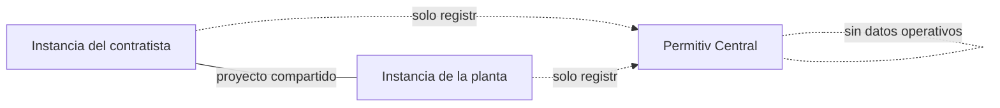

# Estamos construyendo Permitiv

Voy a confesar algo. Durante años he guardado una carpeta de planes para una sola pieza de software: bocetos, listas de módulos, notas escritas en turnos de noche y salas de aeropuerto. Cada pocos meses la reabría, añadía una página y la volvía a cerrar, porque nunca era el momento y lo que había dentro era demasiado grande.

Este mes dejamos de añadir páginas. El desarrollo de **Permitiv** —una nueva generación de software para trabajo industrial de alto riesgo— ha comenzado oficialmente en GEMBA IT. Los planes se están convirtiendo en código, y quiero contarle qué es, por qué nosotros y exactamente lo temprano que estamos. (Spoiler: mucho.)

La página de presentación está en [permitiv.com](https://permitiv.com), y hay un resumen sin adornos para inversores y socios tempranos en [permitiv.com/investors](https://permitiv.com/investors/).

## El problema con el que no dejábamos de tropezar

GEMBA IT tiene una empresa hermana, [Gemba Industrial](https://gembaindustrial.com), que envía cuadrillas especializadas a refinerías y plantas petroquímicas: cambios de catalizador, paradas de planta, trabajo en espacios confinados. El tipo de trabajo en el que un error no es un ticket de soporte.

Y esto es lo que nuestra propia gente ve en casi cualquier obra, en 2026: el sistema de seguridad que gobierna ese trabajo sigue funcionando sobre **papel**.

Un permiso de trabajo —el documento que dice *esta cuadrilla puede hacer este trabajo, en este lugar, con estas precauciones*— se rellena a mano en una ventanilla al empezar el turno. Una entrada en espacio confinado necesita firmas de tres roles distintos, así que alguien recorre la planta recogiéndolas. Los resultados de las mediciones de gases se copian de la pantalla del equipo a un formulario. Cuando llega el auditor, la evidencia es una pared de archivadores; y cuando algo sale mal, los investigadores reconstruyen la cronología a partir de caligrafías.

El coste aparece dos veces. Primero en dinero: cuadrillas paradas ante la oficina de permisos mientras corre el reloj de una parada en la que cada hora es cara. Después en seguridad: un sistema de permisos que nadie puede buscar, cruzar ni verificar en tiempo real es un sistema donde los huecos permanecen invisibles hasta que un incidente los encuentra. Lea unos cuantos informes públicos de investigación de accidentes —nosotros lo hacemos cada semana para el [blog de Gemba Industrial](https://gembaindustrial.com/es/blog)— y «el papel decía una cosa y el campo hacía otra» es un personaje recurrente.

Hemos construido sistemas de pago, ticketing, infraestructura blockchain. Nuestras cuadrillas volvían de las obras preguntando por qué nadie había construido *esto*.

## Qué es Permitiv

Permitiv es una plataforma para planificar, autorizar y auditar trabajo industrial de alto riesgo: refinerías, petroquímica, construcción y reparación naval, infraestructura ferroviaria y vial, gran construcción, mantenimiento industrial.

La parte inusual es que es **de dos lados**. El trabajo industrial es un baile entre dos organizaciones: la **planta** (que es dueña del riesgo y emite los permisos) y el **contratista** (que aporta la cuadrilla y las certificaciones). Hoy cada lado gestiona sus propias hojas de cálculo, y la costura entre ambos es donde muere la información. Permitiv pone los dos modos de rol en la misma plataforma, de modo que las certificaciones de la cuadrilla del contratista, las condiciones del permiso de la planta y las firmas reales viven en un único flujo conectado.

Una sola base de código sirve tres superficies: una vista de sala de control para quienes dirigen la operación, una aplicación de navegador normal para la oficina y una aplicación de campo para móviles y tabletas hecha para la realidad de planta: guantes, polvo y conectividad irregular.

Y el alcance es honesto sobre dónde termina: el plan completo son quince módulos (desde personal y certificaciones hasta licitación, planificación, equipos y ejecución en campo), pero primero construimos una cuña estrecha: **permisos y autorización de trabajo, control de espacios confinados y licitación**. Primero el problema del papel. Todo lo demás tendrá que ganarse su sitio después.

## La regla dura: la IA nunca firma

Permitiv es nativo de IA: hay un copiloto de IA entretejido en toda la plataforma. Lee normativas y permisos anteriores, redacta borradores, resume un turno, responde a «qué sigue bloqueando el trabajo 47». En esa parte del futuro estamos con los dos pies.

Pero hay una frontera que escribimos el primer día y tratamos como ley: **toda decisión crítica para la seguridad es determinista, basada en reglas y lleva una firma humana.** Si una medición de gases está dentro de límites, si la certificación de un trabajador es válida para esta entrada, si un permiso puede activarse: esas son reglas codificadas que un ingeniero de seguridad puede leer, no salidas de un modelo. La IA puede prepararlo todo; una persona con nombre firma, y la firma queda en el registro.

Si ha seguido la industria últimamente, sabe por qué. Un asistente que alucina un párrafo en un artículo de blog es vergonzoso. Uno que alucina una autorización de espacio confinado es impensable. Preferimos entregar un copiloto honestamente limitado antes que un tomador de decisiones en el que nadie debería confiar.

## Por qué federado

Esta es la verdad sobre las plantas y sus datos de seguridad: los grandes operadores no van a verter —y francamente no deberían verter— sus registros de permisos, su historial de incidentes y sus datos de personal en la nube compartida de una startup.

Por eso Permitiv es **federado**. Una empresa puede ejecutar su propia instancia, en su propia infraestructura, bajo su propio control. Un servicio central —Permitiv Central— actúa solo como registro y enrutador para que las instancias puedan encontrarse cuando un contratista y una planta trabajan el mismo proyecto. Central no guarda **ningún dato operativo**. Sus permisos viven donde usted decida.

Las empresas más pequeñas que solo quieren software tendrán una versión alojada, por supuesto. Pero la federación está en la arquitectura desde el principio, porque la soberanía atornillada después nunca funciona.

## Dónde estamos (con honestidad)

Temprano. Genuinamente temprano — y prefiero decirlo claro antes que decorarlo.

Lo que existe hoy: los cimientos de la plataforma. Un núcleo multi-tenant con aislamiento duro entre organizaciones, autenticación y un registro de auditoría de solo-añadir en el que cada registro está encadenado criptográficamente al anterior, de modo que la historia puede verificarse, no solo creerse. Hemos estado ejecutando auditorías de seguridad y pases de pentesting sobre estos cimientos desde antes de que tuvieran una sola función de negocio, porque en este dominio la traza de auditoría *es* el producto.

Lo que aún no existe: el producto por el que hacer clic. El primer módulo funcional —personal y certificaciones— arranca ahora. No hay capturas de pantalla que enseñar ni nada que vender, y cualquier fecha de «próximamente» que le diera hoy sería ficción.

¿Entonces por qué anunciar ahora? Tres razones. Escribirlo en público nos hace responsables: esta carpeta no vuelve al cajón. Buscamos un puñado de plantas y contratistas industriales que reconozcan su propio dolor en este texto y quieran dar forma a la cuña con nosotros. Y estamos abiertos a hablar con inversores que entiendan que el software industrial se construye en años, no en sprints; para eso está el [resumen para inversores](https://permitiv.com/investors/).

## Quién lo construye

GEMBA IT es la división tecnológica de GEMBA Team EOOD, en Varna, Bulgaria. Operamos [GembaPay](https://gembapay.com) (plataforma de pagos con tarjeta y PayPal), ticketing de eventos y el resto del stack que este blog suele diseccionar. Gemba Industrial aporta la parte que la mayoría de las empresas de software finge: gente que de verdad ha estado en la ventanilla de permisos a las 6 de la mañana con una cuadrilla quemando dinero a su espalda.

Esa combinación —una empresa que entrega sistemas en producción y otra que vive dentro del problema— es toda la apuesta.

## La versión corta

- **Permitiv** está en desarrollo: permisos de trabajo, control de espacios confinados y cumplimiento para industria de alto riesgo — refinerías, astilleros, infraestructura, mantenimiento pesado.
- De dos lados (plantas **y** contratistas), tres superficies desde una sola base de código, aplicación de campo hecha para condiciones de planta.
- Copiloto de IA en todas partes, pero **la IA nunca toma la decisión de seguridad**: reglas deterministas más firma humana, siempre.
- Federado: las empresas pueden ejecutar su propia instancia; el servicio central solo enruta y registra, sin datos operativos.
- Estado: cimientos construidos y probados en seguridad, primer módulo en marcha. Temprano a propósito, anunciado a propósito.

Síganos en [permitiv.com](https://permitiv.com). Si dirige una planta, un contratista industrial o un fondo que entiende este espacio, [nos gustaría saber de usted](https://permitiv.com/investors/).

## Preguntas frecuentes

### ¿Qué es el software de permisos de trabajo?

Un permiso de trabajo es la autorización formal detrás de los trabajos industriales peligrosos: define el trabajo, el lugar, los riesgos, las precauciones y quién lo aprobó. En la mayoría de las obras sigue siendo un formulario de papel rellenado al inicio del turno y firmado a mano. El software de permisos digitaliza ese flujo: crea el permiso desde plantillas, comprueba automáticamente condiciones previas como mediciones de gases y certificaciones de los trabajadores, recoge firmas electrónicamente y mantiene un registro consultable y verificable. La cuestión no es solo la rapidez en la ventanilla; es que un sistema digital puede cruzar datos que el papel nunca pudo, como si el soldador del permiso tiene de verdad un certificado de espacio confinado vigente.

### ¿La IA de Permitiv tomará decisiones de seguridad?

No — y esto es una ley de diseño, no un descargo. El copiloto de IA asiste: redacta permisos a partir del historial y la normativa, resume turnos, señala conflictos y responde preguntas. Pero si un permiso puede activarse, si una medición de gases pasa, si una certificación es válida: esas comprobaciones pasan por reglas deterministas y legibles por humanos, y cada paso crítico para la seguridad exige la firma de una persona con nombre, registrada en una traza de auditoría a prueba de manipulación. Si la IA se equivoca en un borrador, un humano lo detecta al firmar. El sistema está construido para que un error de la IA pueda ser molesto, pero nunca peligroso.

### ¿Cuándo podrá probarlo mi planta o mi empresa contratista?

Todavía no — y no vamos a fingir lo contrario. Los cimientos (núcleo multi-tenant, autenticación, registro de auditoría verificable) están construidos y probados en seguridad, y el primer módulo, personal y certificaciones, está ahora en desarrollo. La cuña —permisos, control de espacios confinados y licitación— viene después. Lo que buscamos hoy es un pequeño grupo de socios tempranos: plantas y contratistas industriales dispuestos a compartir cómo funciona realmente su flujo de permisos y a poner el nuestro a prueba. Si es usted, escríbanos a través del formulario de contacto en [permitiv.com/investors](https://permitiv.com/investors/) y cuéntenos sobre su obra.

### ¿Por qué anunciar algo tan inacabado?

Porque la alternativa —construir en silencio durante dos años y desvelar un producto «terminado» que ninguna planta ha tocado— es como el software industrial acaba odiado por la gente obligada a usarlo. Anunciar temprano nos hace responsables ante un registro público, arranca las conversaciones con los operadores y cuadrillas cuya realidad debe dar forma al producto, y ofrece a los inversores un punto de entrada honesto en lugar de una ilusión pulida. Todo lo demás lo construimos en abierto en este blog, incluidos nuestros errores de base de datos. Permitiv recibe el mismo trato: esto es el día uno, dicho en voz alta.

## Créditos y lecturas adicionales

La página de Permitiv está en [permitiv.com](https://permitiv.com); el resumen para inversores y socios tempranos —incluido dónde está la empresa y qué viene después— está en [permitiv.com/investors](https://permitiv.com/investors/). La experiencia de campo detrás del proyecto viene de [Gemba Industrial](https://gembaindustrial.com), cuyas cuadrillas trabajan las paradas de planta y los espacios confinados para los que existe este software. Para los sistemas que GEMBA IT ya opera en producción, vea [gembait.com](https://gembait.com) y [gembapay.com](https://gembapay.com).
