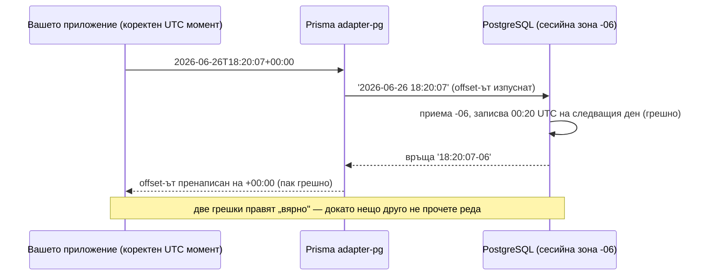

# Prisma тихо изпуска timezone offset-ите

Базата ви данни отхвърля нова блог публикация, защото била „публикувана в бъдещето". Проверявате timestamp-а, който сте изпратили: той е точно сега, в UTC, с offset и всичко. Проверявате часовника на сървъра: наред е. Изпълнявате същия insert на ръка в `psql`: минава. Пускате го през Prisma: нарушено ограничение. Провалилият се ред, според Postgres, е шест часа напред спрямо настоящия момент — шест часа, които никъде не сте написали.

Това е капанът, в който попадна един разработчик в края на юни, а докладът, който подаде — [prisma/prisma#29662](https://github.com/prisma/prisma/issues/29662) — е едно от най-чистите описания на бъг, които сме чели тази година. Накратко: ако използвате Prisma с PostgreSQL, колона от тип `timestamptz` и driver adapter-а `@prisma/adapter-pg`, Prisma маха timezone offset-а от вашите timestamp-и на входа. И после — това е частта, която го прави наистина коварен — пренаписва offset-а на изхода, така че всичко изглежда коректно, докато само Prisma докосва данните.

Избрали сте `timestamptz` точно за да са обработени часовите зони вместо вас. Инструментът по средата ги е „разобработил".

## Бъгът в един абзац

Бърз речник, защото отнема само минута. Един ORM (библиотека като Prisma, която превръща вашите JavaScript обекти в SQL заявки) трябва да преобразува JavaScript `Date` в текстов литерал, който Postgres разбира. Postgres има два типа за timestamp: `timestamp` (без часова зона — просто показание на стенен часовник) и `timestamptz` (timestamp *с* часова зона — реален момент във времето). Когато записвате `2026-06-26T18:20:07+00:00` в колона `timestamptz`, частта `+00:00` е offset-ът — етикетът „от коя часова зона е това показание на часовника".

Бъгът: Postgres driver adapter-ът на Prisma форматираше стойността **без** този етикет. Вместо да изпрати:

```sql
INSERT INTO "Posts" (publish_date) VALUES ('2026-06-26 18:20:07+00');
```

изпращаше:

```sql
INSERT INTO "Posts" (publish_date) VALUES ('2026-06-26 18:20:07');
```

Същите цифри. Напълно различно значение.

## Шест часа в бъдещето

Ето защо тези два литерала не са едно и също нещо. Postgres всъщност не съхранява часова зона в колона `timestamptz` — той съхранява един универсален момент. [Официалната документация](https://www.postgresql.org/docs/current/datatype-datetime.html) описва и двете половини на поведението. С offset: *„входен низ, който включва изрична часова зона, ще бъде преобразуван към UTC чрез съответния offset за тази зона."* Без offset: *„приема се, че е в часовата зона, указана от системния параметър TimeZone."*

Така че голият литерал `2026-06-26 18:20:07` не е „18:20 UTC". Той е „18:20 *в каквато часова зона се окаже тази сесия към базата*". Базата на автора на доклада работеше на време `America/Monterrey`, UTC-6. Postgres прочете 18:20, прие Монтерей и записа момента 00:20 UTC *на следващия ден*. Шест часа в бъдещето — точно когато напълно разумното им защитно ограничение гръмна:

```
originalCode: '23514',
message: 'new row for relation "Posts" violates check constraint "past_date"',
detail: 'Failing row contains (2026-06-27 18:20:07-06).'
```

Ограничение `CHECK ("publish_date" <= CURRENT_TIMESTAMP)` — „не може да публикуваш в бъдещето" — си вършеше работата перфектно. Timestamp-ът наистина беше в бъдещето. Prisma го сложи там.

И това не е екзотичен ъгъл на Prisma. Обработката на часови зони е една от най-старите отворени рани в проекта: [issue #5051](https://github.com/prisma/prisma/issues/5051), искащ по-добра поддръжка на не-UTC часови зони, е отворен от юни 2020 г. и е събрал 135 коментара. Още един детайл, който повдига вежди: помощна функция на име `formatDateTime` беше реферирана в кода за преобразуване на adapter-а за обикновени `timestamp` колони, но *никога не беше дефинирана* — чист `ReferenceError`, чакащ на този код-път.

## Танцът на дебъгването

Влезте за минута в обувките на автора на доклада.

Първи инстинкт: часовникът ми е грешен. Пускате `SELECT now()` на базата. Верен е. Добре.

Второ предположение: ограничението е грешно. Прочитате го пет пъти. `publish_date <= CURRENT_TIMESTAMP`. Няма как да го прочетете погрешно. Не е ограничението.

Трети ход — класиката — заобикаляте заподозрения. Взимате абсолютно същия timestamp, пишете `INSERT`-а на ръка в `psql` с включен offset и той минава безпроблемно. Значи базата е наред, ограничението е наред, данните са наред. Единственото, което стои между вашия коректен вход и грешния ред, е ORM-ът. Включвате query логването на Prisma, поглеждате реалния SQL, който излиза, и ето го: вашето `+00:00` просто… го няма.

Тук историята обикновено свършва. Тази има второ действие и то е най-добрата част от темата.

Сътрудник, `@amalv35`, пое issue-то до два дни и отвори поправка ([PR #29666](https://github.com/prisma/prisma/pull/29666)). Авторът на доклада я тества през комбинации от часови зони, потвърди, че insert-ите са поправени, и затвори issue-то. После, часове по-късно, го отвори отново: *„Извинявам се, че затворих issue-то преждевременно, току-що забелязах бъг, който сега се появява при четене на записи."*

Insert-ите вече бяха коректни — а четенията бяха изместени. В този момент сътрудникът направи хода, който всеки от нас е правил: заподозря тестовата среда, а не кода. Adapter-ът се разпространява като компилиран пакет, така че кръпките по `.ts` файловете в `node_modules` не правят нищо — runtime-ът зарежда `dist/index.js`. Разумна теория. Грешна. Авторът на доклада беше билднал самия branch и можеше да докаже, че промените са активни.

Истинският отговор беше *втори*, огледален бъг. На излизане от базата функция-нормализатор на име `normalizeTimestamptz` взимаше какъвто offset Postgres върне — да кажем `2026-06-30 10:47:04-06` — и го заменяше с `+00:00`. Десет и четиридесет и седем минус шест ставаше десет и четиридесет и седем *UTC*. Изместване от шест часа, отново, този път в посока на четенето.

И ето го „аха" момента, който обяснява защо никой не беше закрещял за това по-рано: **двата бъга взаимно се неутрализират.** Записът изпуска offset-а и измества съхранения момент в едната посока; четенето стъпква offset-а и го измества обратно. Както се изрази авторът на доклада в оригиналното issue, „стойността на времето в рамките на едно и също prisma приложение и база ще бъде същата". Направете пълна обиколка през Prisma и всяка стойност се връща точно както сте я подали. Unit тестовете ви минават. Интеграционните тестове минават. Повредата е видима само за някой *друг* — сурова SQL заявка, инструмент за отчети, друг сървис или `CHECK` ограничение, което сравнява вашата фикция с реалния часовник на базата.




## Поправката, в две действия

PR-ът с поправката преработва слоя за преобразуване в `@prisma/adapter-pg` (и събратята му `adapter-neon` и `adapter-ppg`, които бяха copy-paste-нали същата логика — три копия на един и същ бъг).

**Първо действие, страната на записа.** Date аргументите, тръгнали към колона `timestamptz`, вече минават през форматер `formatDateTimeTz`, който запазва offset-а, така че литералът, който Postgres получава, казва каквото имате предвид: `'2026-06-26 18:20:07+00'`. Postgres го преобразува към UTC, използвайки *вашия* заявен offset, вместо да гадае от сесийната часова зона. Липсващата функция `formatDateTime` за обикновени `timestamp` колони беше дефинирана междувременно, убивайки латентния `ReferenceError`.

**Второ действие, страната на четенето.** Нормализаторът вече *запазва* offset-а, който Postgres изпраща, вместо да го презаписва с `+00:00`:

```
PG wire format              After normalize                new Date(...) result
2026-06-30 10:47:04-06   →  2026-06-30T10:47:04-06:00  →  2026-06-30T16:47:04.000Z ✔
2026-06-30 23:47:04+07   →  2026-06-30T23:47:04+07:00  →  2026-06-30T16:47:04.000Z ✔
2026-06-30 22:17:04+05:30 → 2026-06-30T22:17:04+05:30  →  2026-06-30T16:47:04.000Z ✔
```

Всяко представяне на момента се свежда до един и същ UTC миг, което е цялата идея на `timestamptz`. Авторът на доклада прегони отново тестова матрица с пет входа (ISO низове с три различни offset-а, суфикс `Z` и суров `Date` обект) през две сесийни часови зони: всяка една обиколка се върна идентична.

## Какво да направите днес

Докато публикуваме това, PR-ът все още е отворен, така че практичният въпрос е какво да направите точно сега.

**Заковете часовите зони на UTC.** Собственото заобиколно решение на автора на доклада е честното — и освен това е просто добра хигиена:

```sql
ALTER DATABASE yourdb SET timezone TO 'UTC';
```

Когато сесийната часова зона е UTC, изпуснат `+00:00` offset не ви струва нищо — „приеми сесийната зона" и „приеми UTC" стават едно и също, стига приложението ви също да изпраща UTC моменти (обикновеният JavaScript `Date` винаги е такъв под капака). Затова повечето хора никога не са виждали този бъг: базите им вече работят на UTC. Нашата собствена инсталация на GembaPay държи всяка Postgres машина на UTC и третира локалното време като грижа на презентационния слой — и това issue е доста добра реклама на това правило.

**Знайте дали сте на този код-път.** Бъгът живее в пакетите driver adapter-и (`@prisma/adapter-pg`, `@prisma/adapter-neon`, `@prisma/adapter-ppg`). Ако проектът ви използва някой от тях, вие сте в обсега на взрива; одитирайте всички `timestamptz` данни, записани докато е била в сила не-UTC сесийна часова зона, защото съхранените моменти са изместени със сесийния offset.

**Проверявайте отстрани.** След всяка поправка — или преди да се доверите на сегашната си конфигурация — проверете една пълна обиколка с нещо, което не е Prisma: `psql`, еднократен скрипт с `pg` клиент, каквото и да е. Вкарайте познат момент с изричен ненулев offset, после направете `SELECT publish_date AT TIME ZONE 'UTC'` и сравнете.

## Поуката

По-дълбокият принцип, скрит в този бъг: **`timestamptz` не съхранява часова зона.** Той съхранява универсален момент, а offset-ът на входния ви литерал е единственото, което казва на Postgres как да изчисли този момент. Махнете offset-а и не сте изпратили „същото време, без етикет" — изпратили сте различно време, което случайно споделя същите цифри. Всеки „гол" timestamp низ е залог върху сесийната часова зона, а сесийната часова зона е конфигурация, която обикновено не контролирате от кода на приложението.

Вторият принцип е за тестването: симетричен бъг е невидим за тестове с пълна обиколка. Ако една и съща библиотека кодира и декодира, грешките ѝ могат да се неутрализират перфектно. Решението е да тествате границата с втори, независим четец — суров SQL, друг драйвер, друг език. Ако данните ви са „коректни" само погледнати през една леща, те не са коректни; те са последователно грешни.

## Благодарности и допълнително четене

Тази статия се основава на проблем, първоначално обсъден в [prisma/prisma#29662](https://github.com/prisma/prisma/issues/29662). Благодарим на `@Vanadium-Milk` за образцовия възпроизводим случай — включително улавянето на бъга при четене след първата поправка — и на `@amalv35` за поправката в [PR #29666](https://github.com/prisma/prisma/pull/29666). За по-задълбочено четене вижте [документацията на PostgreSQL за типовете дата/време](https://www.postgresql.org/docs/current/datatype-datetime.html).

## Често задавани въпроси

### Засегнат ли съм, ако базата ми вече работи в UTC?

Съхранените ви моменти почти сигурно са наред. При сесийна часова зона UTC изпуснатият offset не променя нищо за UTC входове, защото резервното допускане на Postgres („интерпретирай това в сесийната зона") случайно съвпада с това, което приложението ви е имало предвид. JavaScript `Date` обектите се сериализират като UTC моменти, така че честата комбинация Node плюс UTC база маскира и двете половини на бъга. Все пак бихте загазили, ако подавате ISO низове с ненулеви offset-и *и* нещо различно от Prisma чете редовете, или ако някоя клиентска сесия презапише зоната със `SET TIME ZONE`. Евтина застраховка: направете една изрична проверка с пълна обиколка през `psql` с вход от типа `+05:30` и потвърдете, че съхраненият момент е верен.

### Защо тестовете ми не хванаха това?

Защото бъгът при запис и бъгът при четене са огледални образи, а тестовете ви вероятно използват Prisma и в двете посоки. Insert-ът измества съхранения момент със сесийния offset; четенето го връща обратно със същата стойност; стойността, върху която правите assert, изглежда перфектна. Повредата става наблюдаема само на граница, която Prisma не притежава — сурова SQL заявка, `CHECK` ограничение спрямо `CURRENT_TIMESTAMP`, BI табло или втори сървис, четящ същата таблица. Точно така изплува и в оригиналния доклад: не като грешна стойност, а като нарушено ограничение върху ред, който твърдеше, че живее в бъдещето.

### Това бъг на Prisma ли е, или просто така работи Postgres?

И двете половини имат значение. Postgres се държи точно както е документирано: никога не запазва оригиналната ви часова зона и интерпретира литералите без offset в сесийната зона. Това е добре дефинирано поведение на десетилетия — не каприз. Бъгът е изцяло в слоя за преобразуване на adapter-а, който изхвърляше информация (offset-а) на входа и си измисляше информация (етикет `+00:00`) на изхода. Добър умствен модел: Postgres спази обещанията си; посредникът редактира съобщенията. Затова и поправката е толкова малка — форматирай литерала с offset-а, запази offset-а при парсване — без никаква промяна в Postgres или схемата ви.

### `timestamp` или `timestamptz` да използвам в Postgres?

`timestamptz`, в почти всеки случай — и този бъг не променя това. `timestamptz` е недвусмислен момент във времето, независимо кой го чете и откъде; обикновеният `timestamp` е показание на стенен часовник без котва, което прехвърля проблема „в каква часова зона беше това?" върху всеки бъдещ читател на схемата ви. Обърнете внимание, че подразбиращият се mapping на Prisma за `DateTime` е `timestamp(3)` — *без* часова зона — така че трябва изрично да се включите с `@db.Timestamptz()` в схемата си. Продължавайте да го правите. Просто го комбинирайте с UTC часова зона на базата и странична проверка с пълна обиколка, докато поправката на adapter-а излезе.

### Какво да правя с данни, записани докато бъгът е бил активен?

Първо преценете дали наистина са изместени: това е така само ако часовата зона на записващата сесия не е била UTC в момента на insert-а. Ако е така, добрата новина е, че повредата е детерминистична — всеки съхранен момент е отместен с точно сесийния offset, действал при записа (внимавайте с лятното часово време, което променя този offset през годината). Можете да поправите с прицелен `UPDATE`, който добавя обратния интервал, ограничен до редовете, създадени в засегнатия прозорец. Направете го в транзакция, проверете извадка срещу сигурен източник (логове на приложението, timestamp-и на събития от друга система) и препроверете всички `CHECK` ограничения преди commit.
