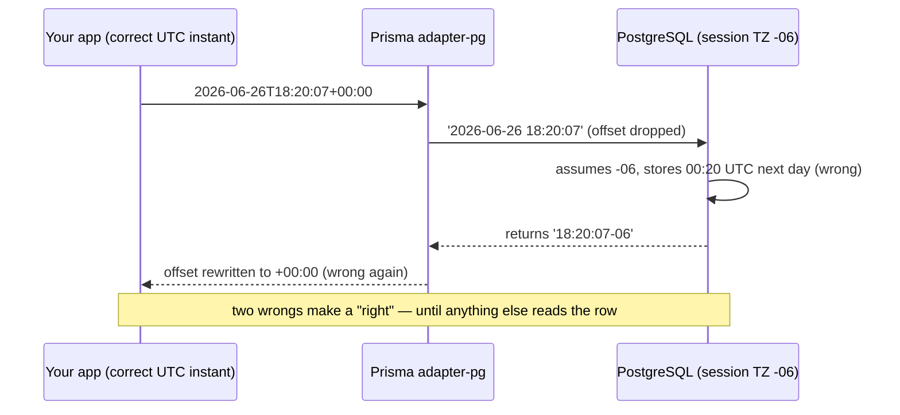

# Prisma Silently Drops Timezone Offsets

Your database rejects a new blog post because it was "published in the future." You check the timestamp you sent: it's right now, in UTC, offset and all. You check the server clock: fine. You run the same insert by hand in `psql`: works. You run it through Prisma: constraint violation. The failing row, according to Postgres, is six hours ahead of the present moment — six hours you never wrote anywhere.

That's the trap a developer walked into in late June, and the report they filed — [prisma/prisma#29662](https://github.com/prisma/prisma/issues/29662) — is one of the cleanest bug write-ups we've read this year. The short version: if you use Prisma with PostgreSQL, a `timestamptz` column, and the `@prisma/adapter-pg` driver adapter, Prisma strips the timezone offset from your timestamps on the way in. And then — this is the part that makes it nasty — it rewrites the offset on the way out, so everything looks correct as long as only Prisma touches the data.

You picked `timestamptz` precisely so timezones would be handled for you. The tool in the middle un-handled them.

## The bug in one paragraph

Quick vocabulary, because this only takes a minute. An ORM (a library like Prisma that turns your JavaScript objects into SQL queries) has to convert a JavaScript `Date` into a text literal Postgres understands. Postgres has two timestamp types: `timestamp` (no timezone — just a wall-clock reading) and `timestamptz` (timestamp *with* time zone — a real point in time). When you write `2026-06-26T18:20:07+00:00` into a `timestamptz` column, the `+00:00` part is the offset — the "which timezone is this clock reading from" tag.

The bug: Prisma's Postgres driver adapter formatted the value **without** that tag. Instead of sending:

```sql
INSERT INTO "Posts" (publish_date) VALUES ('2026-06-26 18:20:07+00');
```

it sent:

```sql
INSERT INTO "Posts" (publish_date) VALUES ('2026-06-26 18:20:07');
```

Same digits. Completely different meaning.

## Six hours into the future

Here's why those two literals aren't the same thing. Postgres doesn't actually store a timezone in a `timestamptz` column — it stores one universal instant. The [official documentation](https://www.postgresql.org/docs/current/datatype-datetime.html) spells out both halves of the behavior. With an offset: *"an input string that includes an explicit time zone will be converted to UTC using the appropriate offset."* Without one: *"it is assumed to be in the time zone indicated by the system's TimeZone parameter."*

So the naked literal `2026-06-26 18:20:07` is not "18:20 UTC." It's "18:20 *in whatever timezone this database session happens to be in*." The reporter's database ran on `America/Monterrey` time, UTC-6. Postgres read 18:20, assumed Monterrey, and stored the instant 00:20 UTC *the next day*. Six hours in the future — which is exactly when their perfectly reasonable safety constraint blew up:

```
originalCode: '23514',
message: 'new row for relation "Posts" violates check constraint "past_date"',
detail: 'Failing row contains (2026-06-27 18:20:07-06).'
```

A `CHECK ("publish_date" <= CURRENT_TIMESTAMP)` constraint — "you can't publish in the future" — was doing its job perfectly. The timestamp really was in the future. Prisma put it there.

And this isn't an exotic corner of Prisma. Timezone handling is one of the oldest open wounds in the project: [issue #5051](https://github.com/prisma/prisma/issues/5051), asking for better non-UTC timezone support, has been open since June 2020 and has collected 135 comments. One more detail that raises eyebrows: a helper called `formatDateTime` was referenced in the adapter's conversion code for plain `timestamp` columns but *never defined* — a straight `ReferenceError` waiting on that code path.

## The debugging dance

Put yourself in the reporter's chair for a minute.

First instinct: my clock is wrong. You `SELECT now()` on the database. It's correct. Fine.

Second guess: the constraint is wrong. You read it five times. `publish_date <= CURRENT_TIMESTAMP`. There is no way to misread that. It's not the constraint.

Third move — the classic — you bypass the suspect. You take the exact same timestamp, type the `INSERT` by hand in `psql` with the offset included, and it sails through. So the database is fine, the constraint is fine, the data is fine. The only thing left standing between your correct input and the wrong row is the ORM. You turn on Prisma's query logging, look at the actual SQL it emits, and there it is: your `+00:00` is just… gone.

That's where the story usually ends. This one has a second act, and it's the best part of the thread.

A contributor, `@amalv35`, picked the issue up within two days and opened a fix ([PR #29666](https://github.com/prisma/prisma/pull/29666)). The reporter tested it across timezone combinations, confirmed inserts were fixed, and closed the issue. Then, hours later, reopened it: *"Sorry for closing the issue prematurely, I just noticed a bug which happens now when reading records."*

Inserts were now correct — and reads were shifted. At this point the contributor made the move every one of us has made: suspect the test setup, not the code. The adapter ships as a compiled bundle, so patching `.ts` source files in `node_modules` does nothing — the runtime loads `dist/index.js`. Reasonable theory. Wrong. The reporter had built the actual branch and could prove the changes were live.

The real answer was a *second*, mirror-image bug. On the way out of the database, a normalizer function called `normalizeTimestamptz` took whatever offset Postgres sent back — say `2026-06-30 10:47:04-06` — and replaced it with `+00:00`. Ten forty-seven minus-six became ten forty-seven *UTC*. A six-hour shift, again, now in the read direction.

And here's the aha that explains why nobody had screamed about this earlier: **the two bugs cancel each other out.** Write drops the offset and shifts the stored instant one way; read stomps the offset and shifts it back. As the reporter put it in the original issue, "the time value within the same prisma application and database will be the same." Round-trip through Prisma, and every value comes back looking exactly like what you put in. Your unit tests pass. Your integration tests pass. The corruption is only visible to someone *else* — a raw SQL query, a reporting tool, another service, or a `CHECK` constraint that compares your fiction against the database's real clock.




## The fix, in two acts

The fix PR reworks the conversion layer in `@prisma/adapter-pg` (and its siblings `adapter-neon` and `adapter-ppg`, which had copy-pasted the same logic — three copies of the same bug).

**Act one, the write side.** Date arguments headed for a `timestamptz` column now go through a `formatDateTimeTz` formatter that keeps the offset, so the literal Postgres receives says what you meant: `'2026-06-26 18:20:07+00'`. Postgres converts it to UTC using *your* stated offset instead of guessing from the session timezone. The missing `formatDateTime` function for plain `timestamp` columns got defined while they were in there, killing the latent `ReferenceError`.

**Act two, the read side.** The normalizer now *preserves* the offset Postgres sends instead of overwriting it with `+00:00`:

```
PG wire format              After normalize                new Date(...) result
2026-06-30 10:47:04-06   →  2026-06-30T10:47:04-06:00  →  2026-06-30T16:47:04.000Z ✔
2026-06-30 23:47:04+07   →  2026-06-30T23:47:04+07:00  →  2026-06-30T16:47:04.000Z ✔
2026-06-30 22:17:04+05:30 → 2026-06-30T22:17:04+05:30  →  2026-06-30T16:47:04.000Z ✔
```

Every representation of the instant collapses to the same UTC moment, which is the entire point of `timestamptz`. The reporter re-ran a five-input test matrix (ISO strings with three different offsets, a `Z` suffix, and a raw `Date` object) across two session timezones: every single round trip came back identical.

## What to do today

As we publish this, the PR is still open, so the practical question is what to do right now.

**Pin your timezones to UTC.** The reporter's own workaround is the honest one, and it's also just good hygiene:

```sql
ALTER DATABASE yourdb SET timezone TO 'UTC';
```

When the session timezone is UTC, a dropped `+00:00` offset costs you nothing — "assume session timezone" and "assume UTC" become the same thing, as long as your app also sends UTC instants (a plain JavaScript `Date` always is one, under the hood). This is why most people have never seen this bug: their databases already run UTC. Our own GembaPay deployment keeps every Postgres box on UTC and treats local time as a display-layer concern, and this issue is a pretty good advertisement for that rule.

**Know whether you're on this code path.** The bug lives in the driver adapter packages (`@prisma/adapter-pg`, `@prisma/adapter-neon`, `@prisma/adapter-ppg`). If your project uses one of those, you're in the blast radius; audit any `timestamptz` data written while a non-UTC session timezone was in effect, because the stored instants are shifted by the session offset.

**Verify out-of-band.** After any fix — or before trusting your current setup — check a round trip with something that isn't Prisma: `psql`, a one-off `pg` client script, anything. Insert a known instant with an explicit non-zero offset, then `SELECT publish_date AT TIME ZONE 'UTC'` and compare.

## The lesson

The deeper principle hiding in this bug: **`timestamptz` does not store a timezone.** It stores a universal instant, and the offset on your input literal is the only thing telling Postgres how to compute that instant. Strip the offset and you haven't sent "the same time, unlabeled" — you've sent a different time that happens to share digits. Every naive timestamp string is a bet on the session timezone, and the session timezone is configuration you usually don't control from application code.

The second principle is about testing: a symmetric bug is invisible to round-trip tests. If the same library encodes and decodes, its mistakes can cancel perfectly. The fix is to test the boundary with a second, independent reader — raw SQL, another driver, another language. If your data is only ever "correct" when viewed through one lens, it isn't correct; it's consistently wrong.

## Credit & further reading

This article is based on a problem originally discussed in [prisma/prisma#29662](https://github.com/prisma/prisma/issues/29662). Thanks to `@Vanadium-Milk` for an exemplary reproduction case — including catching the read-side bug after the first fix — and to `@amalv35` for the fix in [PR #29666](https://github.com/prisma/prisma/pull/29666). For deeper reading, see the [PostgreSQL date/time types documentation](https://www.postgresql.org/docs/current/datatype-datetime.html).

## Frequently Asked Questions

### Am I affected if my database already runs in UTC?

Your stored instants are almost certainly fine. With the session timezone at UTC, the dropped offset changes nothing for UTC inputs, because Postgres's fallback assumption ("interpret this in the session timezone") happens to match what your app meant. JavaScript `Date` objects serialize to UTC instants, so the common Node-plus-UTC-database setup masks both halves of the bug. You'd still hit trouble if you pass ISO strings carrying non-zero offsets *and* something other than Prisma reads the rows, or if any client session overrides the timezone with `SET TIME ZONE`. Cheap insurance: run one explicit round-trip check through `psql` with a `+05:30`-style input and confirm the stored instant is right.

### Why didn't my tests catch this?

Because the write bug and the read bug are mirror images, and your tests probably use Prisma for both directions. The insert shifts the stored instant by the session offset; the read shifts it back by the same amount; the value you assert on looks perfect. The corruption only becomes observable at a boundary Prisma doesn't own — a raw SQL query, a `CHECK` constraint comparing against `CURRENT_TIMESTAMP`, a BI dashboard, or a second service reading the same table. That's exactly how it surfaced in the original report: not as a wrong value, but as a constraint violation on a row that claimed to live in the future.

### Is this a Prisma bug or just how Postgres works?

Both halves matter. Postgres is behaving exactly as documented: it never retains your original timezone, and it interprets offset-less literals in the session timezone. That's well-defined, decades-old behavior — not a quirk. The bug is squarely in the adapter's conversion layer, which threw away information (the offset) on the way in and fabricated information (a `+00:00` label) on the way out. A good mental model: Postgres kept its promises; the middleman edited the messages. That's also why the fix is so small — format the literal with the offset, preserve the offset when parsing — with no change needed in Postgres or your schema.

### Should I use `timestamp` or `timestamptz` in Postgres?

`timestamptz`, in almost every case — and this bug doesn't change that. A `timestamptz` is an unambiguous point in time no matter who reads it or where; a plain `timestamp` is a wall-clock reading with no anchor, which pushes the "what timezone was this?" problem onto every future reader of your schema. Note that Prisma's default mapping for `DateTime` is `timestamp(3)` — *without* timezone — so you have to opt in explicitly with `@db.Timestamptz()` in your schema. Keep doing that. Just pair it with a UTC database timezone and an out-of-band round-trip check until the adapter fix ships.

### What should I do with data written while the bug was live?

First, work out whether it's actually shifted: it is only if the writing session's timezone wasn't UTC at insert time. If so, the good news is the corruption is deterministic — every stored instant is off by exactly the session offset in force when it was written (mind daylight-saving changes, which alter that offset across the year). You can repair with a targeted `UPDATE` that adds the inverse interval, scoped to rows created in the affected window. Do it in a transaction, verify a sample against a known-good source (application logs, event timestamps from another system), and re-check any `CHECK` constraints before committing.
