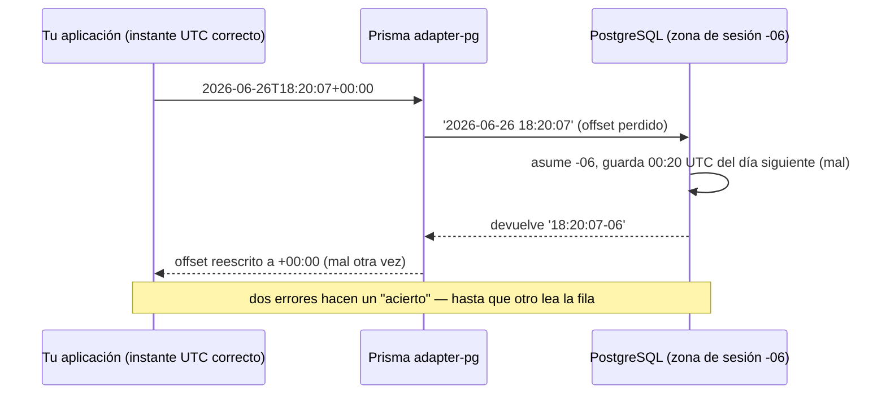

# Prisma pierde los offsets de zona horaria en silencio

Tu base de datos rechaza una nueva entrada del blog porque fue "publicada en el futuro". Revisas el timestamp que enviaste: es ahora mismo, en UTC, con offset y todo. Revisas el reloj del servidor: está bien. Ejecutas el mismo insert a mano en `psql`: pasa. Lo ejecutas a través de Prisma: violación de constraint. La fila fallida, según Postgres, está seis horas por delante del momento presente — seis horas que tú no escribiste en ninguna parte.

Esa es la trampa en la que cayó un desarrollador a finales de junio, y el reporte que presentó — [prisma/prisma#29662](https://github.com/prisma/prisma/issues/29662) — es uno de los reportes de bug más limpios que hemos leído este año. La versión corta: si usas Prisma con PostgreSQL, una columna `timestamptz` y el driver adapter `@prisma/adapter-pg`, Prisma elimina el offset de zona horaria de tus timestamps al entrar. Y luego — esta es la parte que lo hace tan dañino — reescribe el offset al salir, de modo que todo parece correcto mientras solo Prisma toque los datos.

Elegiste `timestamptz` precisamente para que las zonas horarias se manejaran por ti. La herramienta de en medio las des-manejó.

## El bug en un párrafo

Vocabulario rápido, porque solo toma un minuto. Un ORM (una librería como Prisma que convierte tus objetos JavaScript en consultas SQL) tiene que transformar un `Date` de JavaScript en un literal de texto que Postgres entienda. Postgres tiene dos tipos de timestamp: `timestamp` (sin zona horaria — solo una lectura de reloj de pared) y `timestamptz` (timestamp *con* zona horaria — un punto real en el tiempo). Cuando escribes `2026-06-26T18:20:07+00:00` en una columna `timestamptz`, la parte `+00:00` es el offset — la etiqueta de "desde qué zona horaria está leyendo este reloj".

El bug: el driver adapter de Postgres de Prisma formateaba el valor **sin** esa etiqueta. En lugar de enviar:

```sql
INSERT INTO "Posts" (publish_date) VALUES ('2026-06-26 18:20:07+00');
```

enviaba:

```sql
INSERT INTO "Posts" (publish_date) VALUES ('2026-06-26 18:20:07');
```

Los mismos dígitos. Un significado completamente distinto.

## Seis horas hacia el futuro

Aquí está el porqué esos dos literales no son lo mismo. Postgres en realidad no guarda una zona horaria en una columna `timestamptz` — guarda un único instante universal. La [documentación oficial](https://www.postgresql.org/docs/current/datatype-datetime.html) explica las dos mitades del comportamiento. Con offset: *"una cadena de entrada que incluye una zona horaria explícita será convertida a UTC usando el offset apropiado."* Sin offset: *"se asume que está en la zona horaria indicada por el parámetro TimeZone del sistema."*

Así que el literal desnudo `2026-06-26 18:20:07` no es "18:20 UTC". Es "18:20 *en la zona horaria en la que resulte estar esta sesión de base de datos*". La base de datos del reportero corría en hora `America/Monterrey`, UTC-6. Postgres leyó 18:20, asumió Monterrey y guardó el instante 00:20 UTC *del día siguiente*. Seis horas en el futuro — que es exactamente cuando su constraint de seguridad, perfectamente razonable, explotó:

```
originalCode: '23514',
message: 'new row for relation "Posts" violates check constraint "past_date"',
detail: 'Failing row contains (2026-06-27 18:20:07-06).'
```

Un constraint `CHECK ("publish_date" <= CURRENT_TIMESTAMP)` — "no puedes publicar en el futuro" — estaba haciendo su trabajo a la perfección. El timestamp realmente estaba en el futuro. Prisma lo puso ahí.

Y esto no es un rincón exótico de Prisma. El manejo de zonas horarias es una de las heridas abiertas más antiguas del proyecto: el [issue #5051](https://github.com/prisma/prisma/issues/5051), que pide mejor soporte para zonas horarias no UTC, lleva abierto desde junio de 2020 y ha acumulado 135 comentarios. Otro detalle que levanta cejas: una función auxiliar llamada `formatDateTime` estaba referenciada en el código de conversión del adapter para columnas `timestamp` normales pero *nunca fue definida* — un `ReferenceError` puro esperando en esa ruta de código.

## La danza del debugging

Ponte en la silla del reportero por un minuto.

Primer instinto: mi reloj está mal. Ejecutas `SELECT now()` en la base de datos. Es correcto. Bien.

Segunda suposición: el constraint está mal. Lo lees cinco veces. `publish_date <= CURRENT_TIMESTAMP`. No hay manera de malinterpretarlo. No es el constraint.

Tercer movimiento — el clásico — rodeas al sospechoso. Tomas exactamente el mismo timestamp, tecleas el `INSERT` a mano en `psql` con el offset incluido, y pasa sin problemas. Así que la base de datos está bien, el constraint está bien, los datos están bien. Lo único que queda en pie entre tu entrada correcta y la fila incorrecta es el ORM. Activas el registro de consultas de Prisma, miras el SQL real que emite, y ahí está: tu `+00:00` simplemente… desapareció.

Ahí es donde la historia suele terminar. Esta tiene un segundo acto, y es la mejor parte del hilo.

Un contribuidor, `@amalv35`, tomó el issue en dos días y abrió una corrección ([PR #29666](https://github.com/prisma/prisma/pull/29666)). El reportero la probó con varias combinaciones de zonas horarias, confirmó que los inserts estaban arreglados y cerró el issue. Luego, horas después, lo reabrió: *"Perdón por cerrar el issue prematuramente, acabo de notar un bug que ahora ocurre al leer registros."*

Los inserts ya eran correctos — y las lecturas estaban desplazadas. En ese momento el contribuidor hizo el movimiento que todos hemos hecho: sospechar del entorno de pruebas, no del código. El adapter se distribuye como un paquete compilado, así que parchear los archivos `.ts` en `node_modules` no hace nada — el runtime carga `dist/index.js`. Teoría razonable. Equivocada. El reportero había compilado la rama real y podía demostrar que los cambios estaban activos.

La respuesta real era un *segundo* bug, imagen especular del primero. A la salida de la base de datos, una función normalizadora llamada `normalizeTimestamptz` tomaba el offset que Postgres devolviera — digamos `2026-06-30 10:47:04-06` — y lo reemplazaba con `+00:00`. Las diez cuarenta y siete menos seis se convertían en las diez cuarenta y siete *UTC*. Un desplazamiento de seis horas, otra vez, ahora en la dirección de lectura.

Y aquí está el momento ajá que explica por qué nadie había gritado por esto antes: **los dos bugs se cancelan mutuamente.** La escritura pierde el offset y desplaza el instante guardado en una dirección; la lectura aplasta el offset y lo desplaza de vuelta. Como lo puso el reportero en el issue original, "el valor de tiempo dentro de la misma aplicación prisma y base de datos será el mismo". Da la vuelta completa a través de Prisma y cada valor regresa exactamente como lo pusiste. Tus tests unitarios pasan. Tus tests de integración pasan. La corrupción solo es visible para alguien *más* — una consulta SQL directa, una herramienta de reportes, otro servicio, o un constraint `CHECK` que compara tu ficción contra el reloj real de la base de datos.




## La corrección, en dos actos

El PR de corrección rehace la capa de conversión en `@prisma/adapter-pg` (y sus hermanos `adapter-neon` y `adapter-ppg`, que habían copiado y pegado la misma lógica — tres copias del mismo bug).

**Primer acto, el lado de escritura.** Los argumentos Date destinados a una columna `timestamptz` ahora pasan por un formateador `formatDateTimeTz` que conserva el offset, de modo que el literal que recibe Postgres dice lo que quisiste decir: `'2026-06-26 18:20:07+00'`. Postgres lo convierte a UTC usando *tu* offset declarado en lugar de adivinar con la zona horaria de la sesión. La función `formatDateTime` que faltaba para columnas `timestamp` normales quedó definida de paso, eliminando el `ReferenceError` latente.

**Segundo acto, el lado de lectura.** El normalizador ahora *conserva* el offset que Postgres envía en lugar de sobrescribirlo con `+00:00`:

```
PG wire format              After normalize                new Date(...) result
2026-06-30 10:47:04-06   →  2026-06-30T10:47:04-06:00  →  2026-06-30T16:47:04.000Z ✔
2026-06-30 23:47:04+07   →  2026-06-30T23:47:04+07:00  →  2026-06-30T16:47:04.000Z ✔
2026-06-30 22:17:04+05:30 → 2026-06-30T22:17:04+05:30  →  2026-06-30T16:47:04.000Z ✔
```

Cada representación del instante colapsa al mismo momento UTC, que es toda la razón de ser de `timestamptz`. El reportero volvió a ejecutar una matriz de prueba con cinco entradas (cadenas ISO con tres offsets distintos, un sufijo `Z` y un objeto `Date` crudo) en dos zonas horarias de sesión: absolutamente todos los viajes de ida y vuelta regresaron idénticos.

## Qué hacer hoy

Al momento de publicar esto, el PR sigue abierto, así que la pregunta práctica es qué hacer ahora mismo.

**Fija tus zonas horarias en UTC.** La solución temporal del propio reportero es la honesta, y además es simple buena higiene:

```sql
ALTER DATABASE yourdb SET timezone TO 'UTC';
```

Cuando la zona horaria de la sesión es UTC, un offset `+00:00` perdido no te cuesta nada — "asumir la zona de sesión" y "asumir UTC" se vuelven lo mismo, siempre que tu aplicación también envíe instantes UTC (un `Date` de JavaScript siempre lo es, por debajo). Por eso la mayoría de la gente nunca ha visto este bug: sus bases de datos ya corren en UTC. Nuestro propio despliegue de GembaPay mantiene cada máquina Postgres en UTC y trata la hora local como un asunto de la capa de presentación — y este issue es un buen anuncio de esa regla.

**Sabe si estás en esta ruta de código.** El bug vive en los paquetes de driver adapters (`@prisma/adapter-pg`, `@prisma/adapter-neon`, `@prisma/adapter-ppg`). Si tu proyecto usa alguno de ellos, estás en el radio de la explosión; audita cualquier dato `timestamptz` escrito mientras estuviera activa una zona horaria de sesión distinta de UTC, porque los instantes guardados están desplazados por el offset de la sesión.

**Verifica por fuera.** Después de cualquier corrección — o antes de confiar en tu configuración actual — comprueba un viaje de ida y vuelta con algo que no sea Prisma: `psql`, un script puntual con el cliente `pg`, lo que sea. Inserta un instante conocido con un offset explícito distinto de cero, luego haz `SELECT publish_date AT TIME ZONE 'UTC'` y compara.

## La lección

El principio profundo escondido en este bug: **`timestamptz` no guarda una zona horaria.** Guarda un instante universal, y el offset de tu literal de entrada es lo único que le dice a Postgres cómo calcular ese instante. Quita el offset y no habrás enviado "la misma hora, sin etiqueta" — habrás enviado una hora distinta que casualmente comparte dígitos. Cada cadena de timestamp sin offset es una apuesta sobre la zona horaria de la sesión, y la zona horaria de la sesión es configuración que normalmente no controlas desde el código de la aplicación.

El segundo principio es sobre testing: un bug simétrico es invisible para los tests de ida y vuelta. Si la misma librería codifica y decodifica, sus errores pueden cancelarse a la perfección. La solución es probar la frontera con un segundo lector independiente — SQL directo, otro driver, otro lenguaje. Si tus datos solo son "correctos" vistos a través de una lente, no son correctos; son consistentemente incorrectos.

## Créditos y lecturas adicionales

Este artículo se basa en un problema discutido originalmente en [prisma/prisma#29662](https://github.com/prisma/prisma/issues/29662). Gracias a `@Vanadium-Milk` por un caso de reproducción ejemplar — incluyendo detectar el bug del lado de lectura después de la primera corrección — y a `@amalv35` por la corrección en el [PR #29666](https://github.com/prisma/prisma/pull/29666). Para una lectura más profunda, consulta la [documentación de tipos de fecha/hora de PostgreSQL](https://www.postgresql.org/docs/current/datatype-datetime.html).

## Preguntas frecuentes

### ¿Estoy afectado si mi base de datos ya corre en UTC?

Tus instantes guardados casi con seguridad están bien. Con la zona horaria de sesión en UTC, el offset perdido no cambia nada para entradas UTC, porque la suposición de respaldo de Postgres ("interpreta esto en la zona de la sesión") coincide por casualidad con lo que tu aplicación quiso decir. Los objetos `Date` de JavaScript se serializan como instantes UTC, así que la combinación común de Node más base de datos en UTC enmascara las dos mitades del bug. Aun así tendrías problemas si pasas cadenas ISO con offsets distintos de cero *y* algo que no sea Prisma lee las filas, o si alguna sesión de cliente sobrescribe la zona con `SET TIME ZONE`. Un seguro barato: haz una comprobación explícita de ida y vuelta en `psql` con una entrada tipo `+05:30` y confirma que el instante guardado es correcto.

### ¿Por qué mis tests no detectaron esto?

Porque el bug de escritura y el bug de lectura son imágenes especulares, y tus tests probablemente usan Prisma en ambas direcciones. El insert desplaza el instante guardado por el offset de la sesión; la lectura lo desplaza de vuelta por la misma cantidad; el valor sobre el que haces assert se ve perfecto. La corrupción solo se vuelve observable en una frontera que Prisma no controla — una consulta SQL directa, un constraint `CHECK` que compara contra `CURRENT_TIMESTAMP`, un dashboard de BI, o un segundo servicio leyendo la misma tabla. Así fue exactamente como salió a la luz en el reporte original: no como un valor incorrecto, sino como una violación de constraint sobre una fila que afirmaba vivir en el futuro.

### ¿Es esto un bug de Prisma o simplemente cómo funciona Postgres?

Ambas mitades importan. Postgres se comporta exactamente como está documentado: nunca retiene tu zona horaria original e interpreta los literales sin offset en la zona de la sesión. Es un comportamiento bien definido con décadas de antigüedad — no una rareza. El bug está de lleno en la capa de conversión del adapter, que tiraba información (el offset) a la entrada y fabricaba información (una etiqueta `+00:00`) a la salida. Un buen modelo mental: Postgres cumplió sus promesas; el intermediario editó los mensajes. Por eso la corrección es tan pequeña — formatear el literal con el offset, conservar el offset al parsear — sin ningún cambio en Postgres ni en tu esquema.

### ¿Debería usar `timestamp` o `timestamptz` en Postgres?

`timestamptz`, en casi todos los casos — y este bug no cambia eso. Un `timestamptz` es un punto en el tiempo sin ambigüedad sin importar quién lo lea ni desde dónde; un `timestamp` simple es una lectura de reloj de pared sin ancla, que empuja el problema de "¿en qué zona horaria estaba esto?" a cada futuro lector de tu esquema. Ten en cuenta que el mapeo por defecto de Prisma para `DateTime` es `timestamp(3)` — *sin* zona horaria — así que tienes que optar explícitamente con `@db.Timestamptz()` en tu esquema. Sigue haciéndolo. Solo acompáñalo de una zona horaria UTC en la base de datos y una comprobación externa de ida y vuelta hasta que la corrección del adapter se publique.

### ¿Qué hago con los datos escritos mientras el bug estaba activo?

Primero determina si realmente están desplazados: solo lo están si la zona horaria de la sesión que escribía no era UTC al momento del insert. Si es así, la buena noticia es que la corrupción es determinista — cada instante guardado está corrido exactamente por el offset de sesión vigente cuando se escribió (ojo con el horario de verano, que cambia ese offset a lo largo del año). Puedes reparar con un `UPDATE` dirigido que sume el intervalo inverso, acotado a las filas creadas en la ventana afectada. Hazlo en una transacción, verifica una muestra contra una fuente confiable (logs de la aplicación, timestamps de eventos de otro sistema) y vuelve a comprobar los constraints `CHECK` antes de hacer commit.
