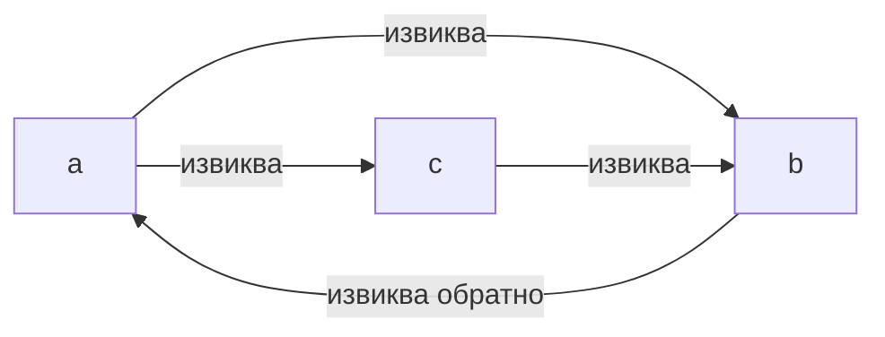

# Поправката на Stack Too Deep беше счупена

Знаете ритуала. Добавяте още една локална променлива в Solidity функция, натискате compile и ето го:

```
CompilerError: Stack too deep. Try compiling with `--via-ir` (cli)
or the equivalent `viaIR: true` (standard JSON)
```

И правите точно това, което пише в съобщението. Включвате `--via-ir`, договорът се компилира, тестовете минават и продължавате с живота си. Този флаг от години е стандартният отговор на общността — той буквално е отпечатан вътре в самата грешка.

А сега неудобната част. На 9 юли 2026 г. екипът на Solidity разкри, че точно механизмът, с който `--via-ir` кара тази грешка да изчезне, е бил ненадежден още от версия 0.7.2. При един тесен, но напълно легален модел — взаимно рекурсивни функции — той е можел тихо да повреди променливите ви. Без revert. Без предупреждение. Транзакцията минава успешно и просто записва грешните данни.

Шест години. Всяка версия от 0.7.2 до 0.8.35. Вече е поправено в 0.8.36 — и, в приятен обрат, същото издание доставя първата версия на това, което изглежда като *истинския* край на "Stack too deep". Нека разплетем цялата история, защото това е един от най-добрите детективски случаи из вътрешностите на компилатор от доста време насам.

## Проблемът: аварийният изход имаше дупка

Първо, 30-секундно припомняне защо тази грешка изобщо съществува. EVM (виртуалната машина, която изпълнява Ethereum договорите) държи работните стойности в стек, а нейните инструкции могат да достигат само **горните 16 слота** на този стек. Ако една функция жонглира с повече едновременно живи локални променливи, отколкото се побират в този прозорец, компилаторът физически не може да генерира код за нея. Това е "Stack too deep" — не забележка за стил, а твърд лимит на машината.

Тя е и една от най-псуваните грешки в екосистемата: появява се в 76 теми в Ethereum Stack Exchange, а най-гласуваният въпрос за нея в Stack Overflow се казва просто ["How to fix: CompilerError: Stack too deep"](https://stackoverflow.com/questions/74578910/how-to-fix-compilererror-stack-too-deep-try-compiling-with-via-ir-cli).

IR pipeline-ът (`--via-ir`) в повечето случаи я решава с нещо, наречено **stack-to-memory mover** (преместване от стека в паметта). Идеята е проста: ако променливите ви не се побират на стека, компилаторът избира някои от тях и ги паркира на фиксирани адреси в паметта, като заменя достъпа до стека с `mload`/`mstore` на тези адреси. Мислете за това като буферен паркинг за променливи.

Има обаче едно правило. Този трик е безопасен само за функции, които **не са рекурсивни**. Слотът в паметта е *фиксиран* адрес — по едно общо шкафче на променлива, на функция. Ако една функция извиква сама себе си (директно или през верига от други функции), всяко активно копие на тази функция ползва *същото шкафче*. Вътрешното извикване презаписва стойността, връща се, а външното извикване радостно чете обратно боклук.

Компилаторът знае това правило. Преди да премести каквото и да е в паметта, той строи граф на извикванията и пуска детекция на цикли: всяка функция върху цикъл е рекурсивна, нейните променливи остават на стека, готово. Бъгът беше в самата детекция на цикли.

## Дебъг танцът: как обхождането на граф ви лъже

Влезте в обувките на човека, който е гонил това (write-up-ът посочва clonker от екипа на Solidity, открил го на 11 май 2026 г.). Симптомът, ако изобщо го уцелите, е от най-лошия вид: функция връща грешна *стойност*. Не revert, който да проследите. Не събитие в грешен ред. Число, което просто не е това, което вашият код изчислява.

Първи инстинкт: сметката ви е грешна. Препрочитате функцията. Сметката е наред.

Второ предположение: нещо презаписва storage. Сравнявате storage слотовете преди и след. Записът *се е случил* — но на грешния индекс, с грешната стойност. В този момент започвате да се съмнявате в неща, на които сте вярвали с години.

Истинският виновник седи три слоя по-надолу — в начина, по който старата детекция на цикли обхожда графа на извикванията. Тя използваше търсене в дълбочина, което пази текущия път в стек и — това е ключовата подробност — маркира всяка напълно обходена функция като "посетена" и никога повече не я поглежда. Напълно нормална оптимизация. И ненадеждна в мига, в който два цикъла се пресекат.

Гледайте как се проваля върху три мънички функции:

```solidity
function a() { b(); c(); }
function b() { a(); }
function c() { b(); }
```

И трите са рекурсивни: `a` извиква `c`, а `c` се връща до `a` през `c → b → a`. Един голям цикъл, трима членове.



Сега проследете стария алгоритъм. Започва от `a`, слиза в `b`. `b` извиква `a` — тя е на текущия път, така че `a` и `b` са маркирани "в цикъл". Дотук вярно. `b` е напълно обходена, получава печат "посетена". Търсенето се връща в `a` и слиза в `c`. `c` извиква `b`… но `b` вече носи печата "посетена", така че търсенето спира точно там и никога не изминава реброто, което би затворило цикъла на `c`.

Присъда: `c` "не е рекурсивна". Което е невярно.

И ето детайлът, който прави този бъг наистина коварен: дали обхождането ще сгреши, **зависи от реда, в който посещава функциите — а този ред се извлича от хешовете на вътрешните им Yul имена**. Преименувате функция — и бъгът може да се появи или да изчезне. Вашият възпроизвеждащ пример може да спре да се възпроизвежда, защото сте преименували `c` на `helper`. Успех с bisect-ването в лош ден.


Оттам веригата на щетите е точно каквато правилото за безопасност предсказва. Ако погрешно класифицираната функция е достатъчно сложна, за да прелее 16-слотовия прозорец, mover-ът премества локалните ѝ променливи във фиксирани слотове в паметта — нещото, което никога не бива да прави за рекурсивна функция. Минималният възпроизвеждащ пример на екипа на Solidity държи 25 променливи живи през вложено извикване в `c`; компилаторът "разлива" параметъра `m` на `c` в паметта, рекурсията влиза отново в `c`, вътрешното извикване драска върху слота на `m`, а външното извикване после изпълнява `seed[m] = m` с повреден `m`. Тестът очаква `3`, а получава `0x4444`. Тихо.

## Решението: 0.8.36, Tarjan и как да четете нова грешка като добра новина

Поправката, доставена в [Solidity 0.8.36](https://www.soliditylang.org/blog/2026/07/09/solidity-0.8.36-release-announcement/), е удовлетворяващо класическа: изхвърляш ръчно написаното търсене по пътища и ползваш **алгоритъма на Tarjan** — учебникарския метод за намиране на силно свързани компоненти в граф. Една функция вече е рекурсивна тогава и само тогава, когато седи в компонент, който наистина може да достигне сам себе си — с пресичащи се цикли и всичко останало. Триото a/b/c отгоре се класифицира коректно като едно рекурсивно семейство и никоя от променливите им никога не напуска стека.

Какво реално да направите?

**1. Обновете до 0.8.36 и рекомпилирайте всичко, строено с `--via-ir`.** Ако никога не сте включвали `viaIR` (по подразбиране е изключен), legacy pipeline-ът не е засегнат и приключихте с четенето — този бъг никога не ви е докосвал.

**2. Ако 0.8.36 изведнъж хвърля "Stack too deep" върху код, който се компилираше добре на 0.8.35 — това не е регресия. Това е поправката, която си върши работата.** Кодът ви се е компилирал преди *именно защото* компилаторът е правел ненадеждно преместване. Сега отказва. Честните отговори са старите: преструктурирайте функцията, ограничете променливи в блокове, опаковайте неща в struct или разделете функцията.

**3. Проверете дали сте били изложени.** Всички тези условия трябва да са верни едновременно: компилация с `--via-ir`, взаимно рекурсивни вътрешни функции, пресичащи се цикли със споделена функция, лош късмет в реда на обхождане и погрешно класифицирана функция, достатъчно голяма, за да задейства разливането. Това са много съвпадения — екипът сканира около 207 000 `via-ir` договора в Sourcify и намери 272 с погрешно класифицирана функция, като **нито един** от тях реално не премества променливи вътре в нея. Няма известен засегнат деплойнат договор. Отбележете и един капан при по-стари toolchain-и: от 0.8.21 нататък mover-ът работи дори при *изключен* оптимизатор, така че `--optimize false` никога не е било защита.

**4. Ако искате да видите бъдещето, пробвайте експерименталния флаг.** Същото издание 0.8.36 даде на новия SSA-form кодов генератор разливане от стека в паметта, което — по думите на екипа — на практика решава stack-too-deep на този backend. Код, който всеки настоящ pipeline отхвърля, сега се компилира през `--experimental --via-ssa-cfg`. Той е изрично експериментален и не е по подразбиране за `--via-ir`, така че още не пускайте mainnet байткод с него. Но стабилизирането му е обявеният приоритет на екипа за следващите шест месеца, което значи, че най-прословутото съобщение за грешка в Solidity най-после е с включен обратен часовник.

В GEMBA IT това предупреждение кацна върху истински чеклист: нашата фабрика за договори GembaTools и clone-factory договорите зад GembaTicket се компилират с фиксирани версии на `solc`, така че "кой pipeline, коя версия, има ли рекурсия?" беше одит за понеделник сутрин, а не паника. (Отговор: никъде няма взаимна рекурсия, издишваме.)

## Поуката: аварийните изходи също са код

По-дълбокият извод не е "рекурсията е страшна". А че **механизмът, който кара една грешка да изчезне, заслужава същото подозрение като самата грешка**. `--via-ir` не изтри 16-слотовия лимит на EVM; той го замаза с умна трансформация, която носеше предусловие за безопасност — а проверката, налагаща това предусловие, имаше теоретико-графов бъг, оцелял шест години издания.

Когато инструмент ви предлага флаг, който превръща твърд провал в тих успех, попитайте на какъв инвариант залага флагът. И когато обновяване на компилатора превърне компилиращ се досега код в грешка, устоите на инстинкта да заковете старата версия и да продължите — понякога новата грешка е компилаторът, който най-после ви казва истината. Фиксирана версия на компилатора плюс тестове, които се изпълняват срещу *точния* производствен pipeline (с `--via-ir` и всичко останало) — това стои между вас и грешно число в mainnet, което никой explorer никога няма да отбележи като провал.

## Благодарности и допълнително четене

Тази статия стъпва върху разкритието на екипа на Solidity — [Unsound Spill In Mutual Recursion Bug](https://www.soliditylang.org/blog/2026/07/09/unsound-spill-in-mutual-recursion-bug/) — и върху [обявлението за изданието Solidity 0.8.36](https://www.soliditylang.org/blog/2026/07/09/solidity-0.8.36-release-announcement/). Благодарим на clonker от екипа на Solidity за откриването на бъга и на екипа за необичайно ясния технически write-up, включително минималния възпроизвеждащ пример, адаптиран по-горе. За по-задълбочено четене вижте официалния [списък с известни бъгове на компилатора](https://docs.soliditylang.org/en/latest/bugs.html) в документацията на Solidity.

## Често задавани въпроси

### Засегнат ли съм, ако никога не съм включвал via-ir?

Не. Бъгът живее в stack-to-memory mover-а на IR pipeline-а, а legacy (evmasm) pipeline-ът не го изпълнява. `viaIR` е изключен по подразбиране и в solc, и в Hardhat, и във Foundry, така че ако никога не сте се включили изрично — чрез `--via-ir` на командния ред или `settings.viaIR: true` в Standard JSON — този бъг никога не е докосвал вашия байткод. За да сте сигурни във Foundry проект, проверете `foundry.toml` за `via_ir = true`; в Hardhat потърсете `viaIR` под `solidity.settings`. Помнете, че някои екипи го включват само за production билдове — проверете release конфигурацията, не само профила по подразбиране.

### Договорът ми се компилираше на 0.8.35, но 0.8.36 казва "Stack too deep". Счупен ли е 0.8.36?

Обратното. Ако алгоритъмът на Tarjan вече класифицира някоя от функциите ви като рекурсивна, компилаторът повече няма право да разлива променливите ѝ в паметта — защото при рекурсия това преместване произвежда точно тихата повреда, описана по-горе. Кодът ви се е компилирал на 0.8.35 *само защото* компилаторът е правел ненадежден ход. Приемете новата грешка като безплатна одитна находка: преструктурирайте функцията така, че по-малко променливи да са живи едновременно, изнесете логика в помощни функции, използвайте struct-ове или ограничавайте временните променливи в блокове `{ }`. Заковаването обратно на 0.8.35 запазва риска от повреда, а не само удобството.

### Изключването на оптимизатора пази ли ме на засегнатите версии?

В общия случай не — и това изненадва хората. От Solidity 0.8.21 нататък преместването от стека в паметта е отделен етап на IR pipeline-а, който се изпълнява независимо от настройката на оптимизатора — така че `--via-ir` с изключен оптимизатор пак достига бъгливия код. Само в по-стария диапазон (0.7.2–0.8.20) mover-ът се изпълняваше единствено като част от Yul оптимизатора, тоест за излагане на риск трябваха едновременно `--via-ir` и `--optimize`. Ако вашето CI компилира с `viaIR: true` и без оптимизатор "за по-бързи билдове", на модерните версии пак сте били в обхвата.

### Как да разбера дали деплойнатите ми договори са засегнати?

Минете през условията по ред, като започнете от най-евтиното. Съдържат ли договорите ви взаимно рекурсивни вътрешни функции — две или повече функции, извикващи се една друга в цикъл? Ако не (преобладаващият случай), приключихте. Ако да — рекомпилирайте с 0.8.36: ако досега наред функция вече дава "Stack too deep", старият binary е премествал променливи вътре в рекурсивна функция и трябва да третирате деплойнатия байткод като подозрителен — тествайте го здраво и планирайте redeploy. За по-широко спокойствие: екипът на Solidity сканира около 207 000 via-ir договора в Sourcify и намери нула деплойнати договора, при които ненадеждното преместване реално се е случило.

### Да ползвам ли --experimental --via-ssa-cfg в production сега?

Още не. SSA CFG кодовият генератор с разливане в паметта е първият pipeline, който може да компилира на практика всяка функция без грешка stack-too-deep, което го прави много изкушаващ. Но екипът на Solidity го обозначава като експериментален, той не е по подразбиране за `--via-ir`, а експерименталните backend-и по дефиниция имат по-малко реален пробег — точно тази история показва колко може да струва фин бъг в генерирането на код. Използвайте го днес, за да *отпушите локални експерименти* или да проверите дали кодът ви изобщо би се компилирал, и дръжте production билдовете на стабилния pipeline. Екипът казва, че стабилизирането на SSA CFG е приоритетът за следващите шест месеца, така че чакането се мери в месеци, не в години.
