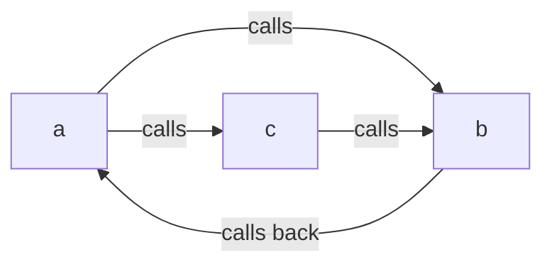

# Stack Too Deep's Fix Was Broken

You know the ritual. You add one more local variable to a Solidity function, hit compile, and there it is:

```
CompilerError: Stack too deep. Try compiling with `--via-ir` (cli)
or the equivalent `viaIR: true` (standard JSON)
```

So you do what the error message says. You flip on `--via-ir`, the contract compiles, the tests pass, and you move on with your life. That flag has been the community's standard answer for years — it's literally printed inside the error.

Here's the uncomfortable part. On July 9, 2026, the Solidity team disclosed that the exact mechanism `--via-ir` uses to make that error go away has been unsound since version 0.7.2. In a narrow but perfectly legal pattern — mutually recursive functions — it could quietly corrupt your variables. No revert. No warning. The transaction succeeds and simply writes the wrong data.

Six years. Every version from 0.7.2 through 0.8.35. Fixed now in 0.8.36 — and, in a nice twist, the same release ships the first version of what looks like the *real* end of "Stack too deep". Let's unpack the whole story, because it's one of the best compiler-internals detective cases in a while.

## The problem: the escape hatch had a hole in it

First, a 30-second refresher on why this error exists at all. The EVM (the virtual machine that runs Ethereum contracts) keeps working values on a stack, and its instructions can only reach the **top 16 slots** of that stack. If a function juggles more simultaneously-live local variables than fit in that window, the compiler physically cannot generate code for it. That's "Stack too deep" — not a style complaint, a hard limit of the machine.

It is also one of the most-cursed-at errors in the ecosystem: it comes up in 76 threads on Ethereum Stack Exchange, and the top Stack Overflow question about it is simply titled ["How to fix: CompilerError: Stack too deep"](https://stackoverflow.com/questions/74578910/how-to-fix-compilererror-stack-too-deep-try-compiling-with-via-ir-cli).

The IR pipeline (`--via-ir`) mostly solves it with something called the **stack-to-memory mover**. The idea is simple: if your variables don't fit on the stack, the compiler picks some of them and parks them at fixed memory addresses instead, swapping the stack reads for `mload`/`mstore` at those addresses. Think of it as overflow parking for variables.

There's one rule, though. That trick is only safe for functions that are **not recursive**. The memory slot is a *fixed* address — one shared locker per variable, per function. If a function calls itself (directly, or through a loop of other functions), every active copy of that function uses the *same locker*. The inner call overwrites the value, returns, and the outer call happily reads back garbage.

The compiler knows this rule. Before moving anything to memory, it builds a call graph and runs a cycle detection: any function sitting on a cycle is recursive, keep its variables on the stack, done. The bug was in that cycle detection.

## The debugging dance: how a graph traversal lies to you

Put yourself in the shoes of whoever chased this down (the write-up credits clonker from the Solidity team, who found it on May 11, 2026). The symptom, if you ever hit it, is the worst kind: a function returns a wrong *value*. Not a revert you can trace. Not an event out of order. A number that's simply not the one your source code computes.

First instinct: your own math is wrong. You re-read the function. The math is fine.

Second guess: something's overwriting storage. You diff storage slots before and after. The write *did* happen — to the wrong index, with the wrong value. At this point you start questioning things you've trusted for years.

The actual culprit sits three layers down, in how the old cycle detection walked the call graph. It used a depth-first search that kept the current path on a stack and — this is the key detail — marked every fully-explored function as "visited" and never looked at it again. A perfectly normal optimization. And unsound the moment two cycles intersect.

Watch it fail on three tiny functions:

```solidity
function a() { b(); c(); }
function b() { a(); }
function c() { b(); }
```

All three are recursive: `a` calls `c`, and `c` gets back to `a` through `c → b → a`. One big loop, three members.



Now trace the old algorithm. It starts at `a`, descends into `b`. `b` calls `a` — that's on the current path, so `a` and `b` get marked "in a cycle". Correct so far. `b` is fully explored, gets stamped "visited". The search returns to `a` and descends into `c`. `c` calls `b`… but `b` is already stamped "visited", so the search stops right there and never walks the edge that would close `c`'s cycle.

Verdict: `c` is "not recursive". Which is false.

And here's the detail that makes this bug genuinely evil: whether the traversal makes this mistake **depends on the order it visits functions in — and that order is derived from the hashes of the functions' internal Yul names**. Rename a function, and the bug can appear or vanish. Your reproduction case can stop reproducing because you renamed `c` to `helper`. Good luck bisecting that on a bad day.


From there the damage chain is exactly what the safety rule predicted. If the misclassified function is complex enough to overflow the 16-slot window, the mover relocates its locals to fixed memory slots — the thing it must never do for a recursive function. The Solidity team's minimal reproducer keeps 25 variables alive across a nested call in `c`; the compiler spills `c`'s parameter `m` to memory, the recursion re-enters `c`, the inner call scribbles over `m`'s slot, and the outer call then executes `seed[m] = m` with a corrupted `m`. The test expects `3` and gets `0x4444`. Silently.

## The solution: 0.8.36, Tarjan, and reading a new error as good news

The fix, shipped in [Solidity 0.8.36](https://www.soliditylang.org/blog/2026/07/09/solidity-0.8.36-release-announcement/), is satisfyingly classical: throw out the hand-rolled path-based search and use **Tarjan's algorithm**, the textbook method for finding strongly connected components in a graph. A function is now recursive if and only if it sits in a component that can genuinely reach itself — intersecting cycles and all. The a/b/c trio above gets correctly classified as one recursive family, and none of their variables ever leave the stack.

What should you actually do?

**1. Upgrade to 0.8.36 and recompile anything built with `--via-ir`.** If you never enabled `viaIR` (it's off by default), the legacy pipeline is unaffected and you're done reading — this bug never touched you.

**2. If 0.8.36 suddenly throws "Stack too deep" at code that compiled fine on 0.8.35 — that's not a regression. That's the fix working.** Your code compiled before *because* the compiler was doing an unsound relocation. Now it refuses. The honest answers are the old ones: restructure the function, scope variables into blocks, pack things into a struct, or split the function up.

**3. Check whether you were exposed.** All of these must be true: compiled with `--via-ir`, contains mutually recursive internal functions, the cycles intersect and share a function, the traversal order was unlucky, and the misclassified function was big enough to trigger spilling. That's a lot of coincidences — the team scanned roughly 207,000 `via-ir` contracts on Sourcify and found 272 with a misclassified function, and **none** of them actually relocated variables inside it. No deployed contract is known to be affected. Note one trap for older toolchains: on 0.8.21+ the mover runs even with the optimizer *off*, so `--optimize false` was never protection.

**4. If you want to see the future, try the experimental flag.** The same 0.8.36 release gave the new SSA-form code generator stack-to-memory spilling, which — in the team's words — effectively solves stack-too-deep on that backend. Code that every current pipeline rejects now compiles through `--experimental --via-ssa-cfg`. It is explicitly experimental and not the default for `--via-ir`, so don't ship mainnet bytecode with it yet. But stabilizing it is the team's stated priority for the next six months, which means the most notorious error message in Solidity is finally on a countdown.

At GEMBA IT this advisory landed on a real checklist: our GembaTools contract factory and the clone-factory contracts behind GembaTicket are compiled with pinned `solc` versions, so "which pipeline, which version, any recursion?" was a Monday-morning audit, not a panic. (Answer: no mutual recursion anywhere, breathe out.)

## The lesson: escape hatches are code too

The deeper takeaway isn't "recursion is scary". It's that **the machinery that makes an error disappear deserves the same suspicion as the error itself**. `--via-ir` didn't delete the EVM's 16-slot limit; it papered over it with a clever transformation that carried a safety precondition — and the check enforcing that precondition had a graph-theory bug that survived six years of releases.

When a tool offers you a flag that turns a hard failure into a silent success, ask what invariant the flag is betting on. And when a compiler upgrade turns previously-compiling code into an error, resist the instinct to pin the old version and move on — sometimes the new error is the compiler finally telling you the truth. A pinned compiler version plus a test suite that runs against the *exact* production pipeline (`--via-ir` and all) is what stands between you and a wrong number on mainnet that no explorer will ever flag as a failure.

## Credit & further reading

This article is based on the Solidity team's disclosure, [Unsound Spill In Mutual Recursion Bug](https://www.soliditylang.org/blog/2026/07/09/unsound-spill-in-mutual-recursion-bug/), and the [Solidity 0.8.36 release announcement](https://www.soliditylang.org/blog/2026/07/09/solidity-0.8.36-release-announcement/). Thanks to clonker of the Solidity team for finding the bug and to the team for an unusually clear technical write-up, including the minimal reproducer adapted above. For deeper reading, see the official [list of known compiler bugs](https://docs.soliditylang.org/en/latest/bugs.html) in the Solidity documentation.

## Frequently Asked Questions

### Am I affected if I never enabled via-ir?

No. The bug lives in the IR pipeline's stack-to-memory mover, and the legacy (evmasm) pipeline doesn't run it. `viaIR` is off by default in solc, Hardhat and Foundry alike, so if you never opted in — via `--via-ir` on the CLI or `settings.viaIR: true` in Standard JSON — this bug never touched your bytecode. To be sure in a Foundry project, check `foundry.toml` for `via_ir = true`; in Hardhat, look for `viaIR` under `solidity.settings`. Remember that some teams enable it only for production builds, so check your release configuration, not just the default profile.

### My contract compiled on 0.8.35 but 0.8.36 says "Stack too deep". Is 0.8.36 broken?

The opposite. If Tarjan's algorithm now classifies one of your functions as recursive, the compiler is no longer allowed to spill its variables to memory — because with recursion, that relocation produces exactly the silent corruption described above. Your code compiled on 0.8.35 *only because* the compiler was making an unsound move. Treat the new error as a free audit finding: restructure the function so fewer variables are live at once, move logic into helper functions, use structs, or scope temporaries in `{ }` blocks. Pinning back to 0.8.35 keeps the corruption risk, not just the convenience.

### Does disabling the optimizer protect me on affected versions?

Mostly no, and this surprises people. From Solidity 0.8.21 onward, the stack-to-memory relocation is a distinct stage of the IR pipeline that runs regardless of the optimizer setting — so `--via-ir` with the optimizer off still reaches the buggy code. Only on the older range (0.7.2–0.8.20) did the mover run solely as part of the Yul optimizer, meaning both `--via-ir` and `--optimize` were needed to be exposed. If your CI compiles with `viaIR: true` and no optimizer "for faster builds", you were still in scope on modern versions.

### How do I know if my deployed contracts are affected?

Work through the conditions in order, cheapest first. Do any of your contracts contain mutually recursive internal functions — two or more functions calling each other in a loop? If no (the overwhelmingly common case), you're done. If yes, recompile with 0.8.36: if a previously-fine function now errors with "Stack too deep", the old binary was relocating variables inside a recursive function and you should treat the deployed bytecode as suspect — test it hard and plan a redeploy. For wider peace of mind: the Solidity team scanned ~207,000 via-ir contracts on Sourcify and found zero deployed contracts where the unsound relocation actually happened.

### Should I use --experimental --via-ssa-cfg in production now?

Not yet. The SSA CFG code generator with memory spilling is the first pipeline that can compile essentially any function without a stack-too-deep error, which makes it very tempting. But the Solidity team labels it experimental, it's not the default for `--via-ir`, and experimental backends by definition have had less real-world mileage — this very story shows what a subtle code-generation bug can cost. Use it today to *unblock local experiments* or to check whether your code would compile at all, and keep production builds on the stable pipeline. The team says stabilizing SSA CFG is the priority for the next six months, so the wait should be measured in months, not years.
