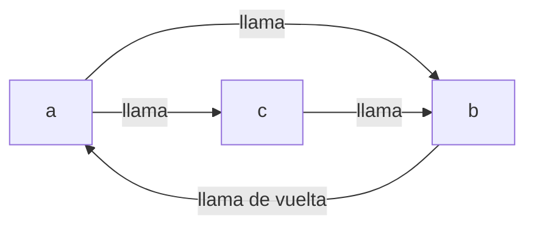

# La cura de Stack Too Deep estaba rota

Conoces el ritual. Añades una variable local más a una función de Solidity, compilas, y ahí está:

```
CompilerError: Stack too deep. Try compiling with `--via-ir` (cli)
or the equivalent `viaIR: true` (standard JSON)
```

Así que haces exactamente lo que dice el mensaje. Activas `--via-ir`, el contrato compila, los tests pasan y sigues con tu vida. Ese flag lleva años siendo la respuesta estándar de la comunidad — está literalmente impreso dentro del propio error.

Ahora viene la parte incómoda. El 9 de julio de 2026, el equipo de Solidity reveló que el mecanismo exacto con el que `--via-ir` hace desaparecer ese error ha sido defectuoso desde la versión 0.7.2. En un patrón estrecho pero perfectamente legal — funciones mutuamente recursivas — podía corromper tus variables en silencio. Sin revert. Sin advertencia. La transacción termina con éxito y simplemente escribe los datos equivocados.

Seis años. Todas las versiones desde 0.7.2 hasta 0.8.35. Ya está corregido en 0.8.36 — y, en un giro agradable, la misma versión trae la primera edición de lo que parece ser el *verdadero* final de "Stack too deep". Vamos a desenredar la historia completa, porque es uno de los mejores casos detectivescos de entrañas de compilador en mucho tiempo.

## El problema: la salida de emergencia tenía un agujero

Primero, un repaso de 30 segundos sobre por qué existe este error. La EVM (la máquina virtual que ejecuta los contratos de Ethereum) mantiene los valores de trabajo en una pila, y sus instrucciones solo pueden alcanzar los **16 huecos superiores** de esa pila. Si una función maneja más variables locales vivas a la vez de las que caben en esa ventana, el compilador físicamente no puede generar código para ella. Eso es "Stack too deep" — no una queja de estilo, sino un límite duro de la máquina.

También es uno de los errores más maldecidos del ecosistema: aparece en 76 hilos de Ethereum Stack Exchange, y la pregunta más votada sobre él en Stack Overflow se titula simplemente ["How to fix: CompilerError: Stack too deep"](https://stackoverflow.com/questions/74578910/how-to-fix-compilererror-stack-too-deep-try-compiling-with-via-ir-cli).

El pipeline IR (`--via-ir`) lo resuelve en la mayoría de los casos con algo llamado el **stack-to-memory mover** (el mecanismo que mueve valores de la pila a la memoria). La idea es simple: si tus variables no caben en la pila, el compilador elige algunas y las aparca en direcciones fijas de memoria, reemplazando los accesos a la pila por `mload`/`mstore` en esas direcciones. Piensa en ello como un aparcamiento de desbordamiento para variables.

Pero hay una regla. Ese truco solo es seguro para funciones que **no son recursivas**. El hueco de memoria es una dirección *fija* — una taquilla compartida por variable, por función. Si una función se llama a sí misma (directamente o a través de una cadena de otras funciones), cada copia activa de esa función usa la *misma taquilla*. La llamada interior sobrescribe el valor, retorna, y la llamada exterior lee alegremente basura.

El compilador conoce esta regla. Antes de mover nada a memoria, construye un grafo de llamadas y ejecuta una detección de ciclos: cualquier función que esté sobre un ciclo es recursiva, sus variables se quedan en la pila, listo. El bug estaba en esa detección de ciclos.

## La danza del debugging: cómo te miente un recorrido de grafo

Ponte en los zapatos de quien persiguió esto (el informe acredita a clonker, del equipo de Solidity, que lo encontró el 11 de mayo de 2026). El síntoma, si llegas a verlo, es del peor tipo: una función devuelve un *valor* incorrecto. No un revert que puedas rastrear. No un evento fuera de orden. Un número que simplemente no es el que tu código fuente calcula.

Primer instinto: tu propia aritmética está mal. Relees la función. La aritmética está bien.

Segunda sospecha: algo está sobrescribiendo el storage. Comparas los slots de storage antes y después. La escritura *sí ocurrió* — en el índice equivocado, con el valor equivocado. En ese momento empiezas a dudar de cosas en las que has confiado durante años.

El verdadero culpable está tres capas más abajo, en cómo la vieja detección de ciclos recorría el grafo de llamadas. Usaba una búsqueda en profundidad que guardaba el camino actual en una pila y — este es el detalle clave — marcaba cada función completamente explorada como "visitada" y no volvía a mirarla jamás. Una optimización perfectamente normal. Y defectuosa en cuanto dos ciclos se cruzan.

Mira cómo falla con tres funciones diminutas:

```solidity
function a() { b(); c(); }
function b() { a(); }
function c() { b(); }
```

Las tres son recursivas: `a` llama a `c`, y `c` vuelve a `a` a través de `c → b → a`. Un gran bucle, tres miembros.



Ahora sigue el algoritmo viejo. Empieza en `a`, desciende a `b`. `b` llama a `a` — que está en el camino actual, así que `a` y `b` quedan marcadas "en un ciclo". Correcto hasta aquí. `b` queda completamente explorada y recibe el sello de "visitada". La búsqueda vuelve a `a` y desciende a `c`. `c` llama a `b`… pero `b` ya lleva el sello de "visitada", así que la búsqueda se detiene ahí mismo y nunca recorre la arista que cerraría el ciclo de `c`.

Veredicto: `c` "no es recursiva". Lo cual es falso.

Y aquí está el detalle que hace este bug genuinamente perverso: que el recorrido cometa o no este error **depende del orden en que visita las funciones — y ese orden se deriva de los hashes de sus nombres internos en Yul**. Renombra una función, y el bug puede aparecer o desvanecerse. Tu caso de reproducción puede dejar de reproducirse porque renombraste `c` a `helper`. Buena suerte haciendo bisect con eso en un mal día.


A partir de ahí, la cadena de daños es exactamente la que predecía la regla de seguridad. Si la función mal clasificada es lo bastante compleja como para desbordar la ventana de 16 huecos, el mover reubica sus variables locales en huecos fijos de memoria — lo que jamás debe hacer con una función recursiva. El reproductor mínimo del equipo de Solidity mantiene 25 variables vivas a través de una llamada anidada en `c`; el compilador derrama el parámetro `m` de `c` a memoria, la recursión vuelve a entrar en `c`, la llamada interior garabatea sobre el hueco de `m`, y la llamada exterior ejecuta después `seed[m] = m` con un `m` corrupto. El test espera `3` y recibe `0x4444`. En silencio.

## La solución: 0.8.36, Tarjan, y leer un error nuevo como buena noticia

La corrección, publicada en [Solidity 0.8.36](https://www.soliditylang.org/blog/2026/07/09/solidity-0.8.36-release-announcement/), es satisfactoriamente clásica: tirar la búsqueda artesanal basada en caminos y usar el **algoritmo de Tarjan**, el método de libro de texto para encontrar componentes fuertemente conexas en un grafo. Una función ahora es recursiva si y solo si pertenece a una componente que de verdad puede alcanzarse a sí misma — ciclos cruzados incluidos. El trío a/b/c de arriba queda correctamente clasificado como una familia recursiva, y ninguna de sus variables sale jamás de la pila.

¿Qué deberías hacer en la práctica?

**1. Actualiza a 0.8.36 y recompila todo lo construido con `--via-ir`.** Si nunca activaste `viaIR` (viene desactivado por defecto), el pipeline legacy no está afectado y has terminado de leer — este bug nunca te tocó.

**2. Si 0.8.36 de repente lanza "Stack too deep" sobre código que compilaba bien en 0.8.35 — eso no es una regresión. Es la corrección haciendo su trabajo.** Tu código compilaba antes *porque* el compilador hacía una reubicación defectuosa. Ahora se niega. Las respuestas honestas son las de siempre: reestructura la función, limita variables a bloques, empaqueta cosas en un struct o divide la función.

**3. Comprueba si estuviste expuesto.** Todas estas condiciones deben cumplirse a la vez: compilación con `--via-ir`, funciones internas mutuamente recursivas, ciclos que se cruzan compartiendo una función, mala suerte en el orden del recorrido, y una función mal clasificada lo bastante grande como para activar el derrame. Son muchas coincidencias — el equipo escaneó unos 207 000 contratos `via-ir` en Sourcify y encontró 272 con una función mal clasificada, y **ninguno** de ellos reubicaba realmente variables dentro de ella. No se conoce ningún contrato desplegado afectado. Ojo con una trampa en toolchains antiguos: desde 0.8.21 el mover se ejecuta incluso con el optimizador *apagado*, así que `--optimize false` nunca fue protección.

**4. Si quieres ver el futuro, prueba el flag experimental.** La misma versión 0.8.36 dio al nuevo generador de código en forma SSA el derrame de pila a memoria, que — en palabras del equipo — resuelve en la práctica el stack-too-deep en ese backend. Código que todos los pipelines actuales rechazan ahora compila con `--experimental --via-ssa-cfg`. Es explícitamente experimental y no es el valor por defecto de `--via-ir`, así que no publiques todavía bytecode de mainnet con él. Pero estabilizarlo es la prioridad declarada del equipo para los próximos seis meses, lo que significa que el mensaje de error más famoso de Solidity por fin tiene cuenta atrás.

En GEMBA IT este aviso aterrizó sobre una checklist real: nuestra fábrica de contratos GembaTools y los contratos clone-factory detrás de GembaTicket se compilan con versiones fijadas de `solc`, así que "¿qué pipeline, qué versión, hay recursión?" fue una auditoría de lunes por la mañana, no un pánico. (Respuesta: no hay recursión mutua en ningún sitio; respiramos.)

## La lección: las salidas de emergencia también son código

La moraleja profunda no es "la recursión da miedo". Es que **la maquinaria que hace desaparecer un error merece la misma sospecha que el error mismo**. `--via-ir` no borró el límite de 16 huecos de la EVM; lo tapó con una transformación ingeniosa que llevaba una precondición de seguridad — y la comprobación que imponía esa precondición tenía un bug de teoría de grafos que sobrevivió a seis años de versiones.

Cuando una herramienta te ofrece un flag que convierte un fallo duro en un éxito silencioso, pregúntate qué invariante está apostando ese flag. Y cuando una actualización del compilador convierte código que compilaba en un error, resiste el instinto de fijar la versión antigua y seguir adelante — a veces el error nuevo es el compilador diciéndote por fin la verdad. Una versión de compilador fijada más una suite de tests que corre contra el pipeline de producción *exacto* (con `--via-ir` y todo) es lo que se interpone entre tú y un número equivocado en mainnet que ningún explorador marcará jamás como fallo.

## Créditos y lecturas adicionales

Este artículo se basa en la divulgación del equipo de Solidity, [Unsound Spill In Mutual Recursion Bug](https://www.soliditylang.org/blog/2026/07/09/unsound-spill-in-mutual-recursion-bug/), y en el [anuncio de la versión Solidity 0.8.36](https://www.soliditylang.org/blog/2026/07/09/solidity-0.8.36-release-announcement/). Gracias a clonker, del equipo de Solidity, por encontrar el bug, y al equipo por un informe técnico inusualmente claro, incluido el reproductor mínimo adaptado arriba. Para una lectura más profunda, consulta la [lista oficial de bugs conocidos del compilador](https://docs.soliditylang.org/en/latest/bugs.html) en la documentación de Solidity.

## Preguntas frecuentes

### ¿Estoy afectado si nunca activé via-ir?

No. El bug vive en el stack-to-memory mover del pipeline IR, y el pipeline legacy (evmasm) no lo ejecuta. `viaIR` viene desactivado por defecto en solc, Hardhat y Foundry por igual, así que si nunca optaste por él — mediante `--via-ir` en la CLI o `settings.viaIR: true` en Standard JSON — este bug jamás tocó tu bytecode. Para asegurarte en un proyecto Foundry, revisa `foundry.toml` buscando `via_ir = true`; en Hardhat, busca `viaIR` bajo `solidity.settings`. Recuerda que algunos equipos lo activan solo para builds de producción, así que revisa la configuración de release, no solo el perfil por defecto.

### Mi contrato compilaba en 0.8.35 pero 0.8.36 dice "Stack too deep". ¿Está roto 0.8.36?

Al contrario. Si el algoritmo de Tarjan ahora clasifica una de tus funciones como recursiva, el compilador ya no tiene permitido derramar sus variables a memoria — porque con recursión, esa reubicación produce exactamente la corrupción silenciosa descrita arriba. Tu código compilaba en 0.8.35 *solo porque* el compilador hacía un movimiento defectuoso. Trata el nuevo error como un hallazgo de auditoría gratis: reestructura la función para que haya menos variables vivas a la vez, mueve lógica a funciones auxiliares, usa structs o limita los temporales a bloques `{ }`. Volver a fijar 0.8.35 conserva el riesgo de corrupción, no solo la comodidad.

### ¿Me protege desactivar el optimizador en las versiones afectadas?

En general no, y esto sorprende. Desde Solidity 0.8.21, la reubicación de pila a memoria es una etapa separada del pipeline IR que se ejecuta independientemente del ajuste del optimizador — así que `--via-ir` con el optimizador apagado sigue alcanzando el código con el bug. Solo en el rango antiguo (0.7.2–0.8.20) el mover se ejecutaba únicamente como parte del optimizador de Yul, de modo que hacían falta a la vez `--via-ir` y `--optimize` para estar expuesto. Si tu CI compila con `viaIR: true` y sin optimizador "para builds más rápidas", en las versiones modernas seguías dentro del alcance.

### ¿Cómo sé si mis contratos desplegados están afectados?

Recorre las condiciones en orden, empezando por la más barata. ¿Alguno de tus contratos contiene funciones internas mutuamente recursivas — dos o más funciones llamándose entre sí en bucle? Si no (el caso abrumadoramente común), has terminado. Si sí, recompila con 0.8.36: si una función que antes iba bien ahora da "Stack too deep", el binario antiguo estaba reubicando variables dentro de una función recursiva y deberías tratar el bytecode desplegado como sospechoso — pruébalo a fondo y planifica un redespliegue. Para mayor tranquilidad: el equipo de Solidity escaneó unos 207 000 contratos via-ir en Sourcify y encontró cero contratos desplegados donde la reubicación defectuosa ocurriera de verdad.

### ¿Debería usar --experimental --via-ssa-cfg en producción ya?

Todavía no. El generador de código SSA CFG con derrame a memoria es el primer pipeline capaz de compilar prácticamente cualquier función sin un error de stack-too-deep, lo que lo hace muy tentador. Pero el equipo de Solidity lo etiqueta como experimental, no es el valor por defecto de `--via-ir`, y los backends experimentales por definición tienen menos kilómetros en el mundo real — esta misma historia muestra lo que puede costar un bug sutil de generación de código. Úsalo hoy para *desbloquear experimentos locales* o comprobar si tu código llegaría a compilar, y mantén las builds de producción en el pipeline estable. El equipo dice que estabilizar SSA CFG es la prioridad de los próximos seis meses, así que la espera se mide en meses, no en años.
