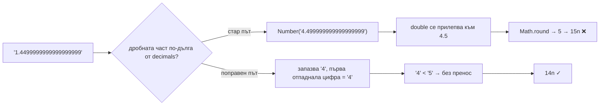

# Float-ът, скрит в parseUnits на viem

Направили сте всичко както трябва. Приложението ви никога не докосва обикновените JavaScript числа, когато става дума за пари. Всяка сума в токени живее като `bigint` — целочисленият тип с произволна точност, който пази огромни стойности точно, без закръгляне, никога. Точно затова сте избрали viem: това е Ethereum библиотеката, която направи "bigint навсякъде" своя идентичност — именно за да не може математиката с плаваща запетая тихо да измести някоя сума с част от цента.

И тогава, на 17 юли 2026 г., някой отвори [issue в GitHub на viem](https://github.com/wevm/viem/issues/4855), показвайки, че `parseUnits` — функцията, която превръща въведен от човек низ като `"1.45"` в единици за блокчейна — може да върне число, което е просто грешно. С единица в последната цифра. Без грешка. Без предупреждение. Просто малко по-различна сума от тази, която потребителят е написал.

Причината? Вътре в bigint-first библиотеката, точно по пътя, който парсва пари, имаше `Math.round(Number(...))`. Float. Скрит на последното място, където някой би се сетил да погледне.

## Бъгът в една конзолна сесия

Ето възпроизвеждането от issue-то — можете да го пуснете на всяка версия на viem, издадена преди 18 юли 2026 г.:

```ts
import { parseUnits } from 'viem'

parseUnits('1.4499999999999999999', 1)
// expected: 14n  (1.44999… rounds down to 1.4)
// actual:   15n  (that's 1.5 — the value went UP)

parseUnits('1.14999999999999999', 1)
// expected: 11n
// actual:   12n

parseUnits('0.4999999999999999999', 0)
// expected: 0n
// actual:   1n  (zero point something became one)
```

Бърз превод за всеки, който е нов в темата: `parseUnits(value, decimals)` умножава десетичен низ по 10 на степен `decimals` и връща резултата като `bigint`. Така `"1.5"` става `1500000n` за токен с 6 десетични знака като USDC, а `parseEther("1.5")` става `1500000000000000000n` wei — най-малката единица на ether. Всяка форма за депозит, всяко поле за swap, всяка кутийка "изпрати токени" в приложение с viem или wagmi минава през тази функция или през нейните обвивки.

Когато низът има повече десетични знаци, отколкото токенът поддържа, `parseUnits` закръгля. И тази стъпка на закръгляне — само тя — е мястото, където float-ът се е промъкнал.

## Какво всъщност се случваше

Кодът на `parseUnits` преди поправката обработваше случая "твърде много десетични знаци" така (съкратено, от [viem 2.37.0](https://github.com/wevm/viem/blob/viem%402.37.0/src/utils/unit/parseUnits.ts)):

```ts
const [left, unit, right] = [
  fraction.slice(0, decimals - 1),
  fraction.slice(decimals - 1, decimals),
  fraction.slice(decimals),
]

const rounded = Math.round(Number(`${unit}.${right}`))
```

Взима последната цифра, която има право да запази (`unit`), залепя цялата отхвърлена опашка след нея (`right`), превръща този низ в JavaScript `Number` и пита `Math.round` накъде да закръгли.

Проблемът: JavaScript `Number` е IEEE-754 double — стандартният 64-битов двоичен формат с плаваща запетая. Един double може вярно да съхрани само 15 до 17 значещи десетични цифри. Подайте му по-дълъг низ и той тихо се "прилепва" към най-близката стойност, която *може* да представи. Опитайте в която и да е браузърна конзола:

```js
> Number('4.499999999999999999')
4.5
> Math.round(4.5)
5
```

Първият ред е целият бъг. `4.499999999999999999` е математически под 4.5, така че трябва да се закръгли надолу към 4. Но най-близкият представим double до този 19-цифрен низ е *точно* 4.5. Информацията "по-малко от една втора" живее в цифрите от шестнайсета до деветнайсета — а float-ът изхвърля тези цифри, преди `Math.round` изобщо да ги види. Така стойност, която трябва да се закръгли надолу, се закръгля нагоре, и `1.4499999999999999999` става `15n` вместо `14n`.

Както написа авторът на issue-то, закръглянето тук трябва да се случва "изцяло в десетично/bigint пространство", гледайки самите цифри — "без конверсия през Number". Беше прав, и поправката (ще стигнем до нея) прави точно това.

Ако това ви звучи познато — това е същият капан зад най-известния въпрос в Stack Overflow: ["Is floating point math broken?"](https://stackoverflow.com/questions/588004/is-floating-point-math-broken), онзи с `0.1 + 0.2 !== 0.3` и десетки хиляди гласа. Двайсет години след този въпрос той пак намери свежа жертва — вътре в библиотеката, построена да бъде имунизирана срещу него.

## Танцът на дебъгването

Представете си как бихте срещнали този бъг на живо, защото никой не го среща, четейки `parseUnits.ts` за удоволствие.

Някаква сума в системата ви е с една единица встрани в последния десетичен знак. Веднъж. В един запис от хиляди. Първият ви инстинкт: *моята математика е грешна*. Проверявате отново собственото си изчисление на цената, всяко умножение, може би обвинявате режима на закръгляне на decimal библиотеката, която е произвела низа. Всичко излиза наред. Тихо изругаване.

Второ предположение: *грешни decimals за токена*. Всеки се е парил, приемайки 18 десетични знака, когато токенът има 6. Проверявате контракта. Decimals са верни. Не са decimals. Никога не са — е, обикновено *са* decimals, което прави нещата по-лоши, когато не са.

Вече браузърът е с дузина отворени табове и правите онова нещо, при което слагате `console.log` от двете страни на всяка конверсия. И накрая изолирате проблема до един-единствен ред: низът, който *влиза* в `parseUnits`, е верен до последната цифра, а bigint-ът, който *излиза*, е грешен. Този момент е истински дезориентиращ. Входът е верен. Изходът е грешен. Функцията между тях е от библиотека с милиони сваляния седмично — и това е функцията, чиято единствена работа е да не прави точно това.

"Аха" моментът идва, когато поставите дробната част в конзолата и напишете `Number(...)` около нея — и конзолата ви върне *различно число* от това, което сте написали. Не грешка. Не `NaN`. Просто леко различна стойност, поднесена с пълна увереност. Това е моментът, в който научавате (или си припомняте), че `Number('4.499999999999999999')` и `4.499999999999999999` са едно и също нещо за JavaScript — и че това "едно и също нещо" е 4.5.

За чест на viem, реакцията беше бърза: issue, подаден на 17 юли, поправка, слята на 18 юли от мейнтейнъра.


## Поправката: закръгляй, гледайки цифри, а не чрез конверсия

Слятата поправка ([PR #4859](https://github.com/wevm/viem/pull/4859)) изтръгва float-а изцяло. `parseUnits` сега делегира на малък value модул, който закръгля така, както бихте го направили на хартия: запази цифрите, които токенът позволява, погледни *първата отпаднала цифра като символ* и ако е 5 или повече, добави единица — с пренос в string/bigint пространство, където всяка цифра е точна. Общностен PR ([#4857](https://github.com/wevm/viem/pull/4857)) предложи същата идея с пренос по цифри независимо.



Защо това работи: низът вече съдържа точния отговор. Първата цифра, която ще изхвърлите, казва всичко, което half-up закръглянето трябва да знае. Няма никаква причина първо да прекарвате деветнайсет цифри през формат за 15–17 цифри — тази конверсия е единствената губеща стъпка в целия конвейер, и поправката просто я изтрива.

Какво да направите:

**1. Обновете viem.** Поправката влезе в main на 18 юли 2026 г. Проверете lockfile-а си — всяка версия на viem, издадена преди тази дата, още има float пътя. Закованите транзитивни копия (wagmi resolutions, monorepo overrides) също се броят.

**2. Ако още не можете да обновите, нормализирайте низа сами, преди да извикате `parseUnits`.** Ето готово решение, което закръгля half-away-from-zero само със string и bigint операции:

```ts
function parseUnitsExact(value: string, decimals: number): bigint {
  let [int = '0', frac = ''] = value.split('.')
  const negative = int.startsWith('-')
  if (negative) int = int.slice(1)

  const kept = frac.slice(0, decimals).padEnd(decimals, '0')
  const firstDropped = frac[decimals] ?? '0'

  let units = BigInt(int || '0') * 10n ** BigInt(decimals) + BigInt(kept || '0')
  if (firstDropped >= '5') units += 1n   // digit comparison — no floats anywhere
  return negative ? -units : units
}
```

Всяка стъпка е точна: `BigInt('…')` парсва десетични низове без ограничения в точността, а сравнението `firstDropped >= '5'` сравнява символи, което за единични цифри съвпада с числовия ред.

**3. Решете дали изобщо искате закръгляне.** За платежна сума тихото закръгляне *нагоре* е може би по-лошо от отказ. ethers.js поема по строгия път: подайте на неговия `parseUnits` повече десетични знаци, отколкото токенът позволява, и той хвърля грешка, вместо да закръгля. В GembaPay правим вариант на същото — въведените от потребителя суми се отрязват до десетичните знаци на токена в string пространство, преди какъвто и да е парсер да ги види, защото платежен портал никога не бива да таксува повече от числото, което клиентът е гледал.

Гранични случаи, които да имате предвид: низове с 15 или по-малко значещи цифри винаги са били наред (един double ги пази точно) — затова ръчното тестване никога не хвана това. Опасната зона са машинно генерираните низове — изходи с пълна точност от decimal библиотеки, борсови API-та или математика цена-по-количество — които внасят шестнайсет и повече значещи цифри в парсването.

## Урокът

Всяко място, където низ става `Number`, е граница, на която стойност може тихо да се промени. Не да гръмне с грешка — да се *промени*. Бъгът във viem е перфектен екземпляр, защото целият дизайн на библиотеката казва "ние не ползваме float-ове", а единственият оцелял float го е направил вътре в помощна функция, зад template literal, в клон, който се задейства само при дълги входове.

Два извода, които можете да приложите още тази седмица. Първо, изгрепайте паричните си пътища за `Number(`, `parseFloat(` и `+someString` — всяко попадение или е доказуемо ограничено до 15 цифри, или е бъг, чакащ дълъг вход. Второ, когато тествате код за парсване, не тествайте с красиви стойности като `1.5`. Тествайте с враждебни: деветнайсетцифрени опашки, `…4999999999999999999`, стойности точно под граница на закръгляне. Точната математика се проваля шумно; float математиката се проваля учтиво. Учтиво е по-лошо.

## Признание и допълнително четене

> Тази статия е базирана на проблем, първоначално докладван в [issue #4855 на wevm/viem](https://github.com/wevm/viem/issues/4855). Благодарности на `@baiyuxi930826` за ясните случаи за възпроизвеждане, на `@nikhilkumar1612` за предложението за поправка с пренос по цифри в [PR #4857](https://github.com/wevm/viem/pull/4857) и на `@jxom` за слятата поправка в [PR #4859](https://github.com/wevm/viem/pull/4859). За официалната документация на функцията вижте [документацията на viem за parseUnits](https://viem.sh/docs/utilities/parseUnits).

## Често задавани въпроси

### Този бъг засяга ли и parseEther и parseGwei?

Да. `parseEther(value)` е просто `parseUnits(value, 18)`, а `parseGwei(value)` е `parseUnits(value, 9)`, така че и двете споделяха float пътя. На практика `parseEther` имаше нужда от дробна част, по-дълга от 18 цифри, *и* около шестнайсет или повече значещи цифри, за да се задейства грешното закръгляне — нещо, което въведен от човек вход на практика никога не произвежда. `parseGwei` и токените с малко десетични знаци (USDC и EURC имат 6) са по-близо до ръба: всеки изчислен низ с по-висока точност — ценово изчисление, формула за ребалансиране, API отговор с пълна точност — влиза в клона за закръгляне, и достатъчно дълги опашки можеха да обърнат резултата.

### Колко вероятно беше да ударя това в production?

Ако всяка сума в приложението ви идва от човек, пишещ в поле за вход — вероятно никога: хората не пишат деветнайсет десетични знака. Реалистичният път са машинно генерираните низове: изход с пълна точност от decimal библиотека, резултати от `price × quantity`, сериализирани без отрязване, или баланси от борсово API, парсвани отново в единици. Те рутинно носят повече цифри от десетичните знаци на токена, което ги праща в клона за закръгляне при всяко извикване. После бъгът има нужда опашката да попадне близо до граница на закръгляне, така че е рядък — но рядък, тих и с единица встрани в пари е точно класът бъг, който искате да изключите, а не да оценявате по вероятност.

### formatUnits има ли същия проблем в обратната посока?

Не. `formatUnits` (и `formatEther`) вървят в безопасната посока: bigint влиза, низ излиза. Тази конверсия е чиста манипулация на цифри — превръщаш bigint-а в десетичния му низ, слагаш десетичната точка на правилното място, махаш крайните нули. Няма какво да се закръгля и няма никаква `Number` конверсия по пътя, така че изходният низ винаги е точен. Асиметрията е интересната част: същият модул имаше една посока без загуби и една със загуби — и губещата е посоката, по която тече потребителският вход.

### Какво прави ethers.js при твърде много десетични знаци?

Отказва. Подайте на `ethers.parseUnits("1.2345678", 6)` повече дробни цифри, отколкото единицата позволява, и той хвърля грешка, вместо да закръгля вместо вас. Това е истинска дизайнерска разделителна точка: viem избра "бъди снизходителен, закръгли", ethers избра "бъди строг, накарай извикващия да реши". След този бъг строгият избор изглежда по-добре от преди — изключение в логовете е досадно, но е видимо. За платежни потоци бихме спорили за още по-строго: отрежи или откажи на входната граница, така че числото, което се парсва, да е точно числото, което потребителят е потвърдил на екрана.

### Как да тествам собствения си код за този клас бъгове?

Спрете да тествате парсери с приятелски стойности. Добавете случаи с: опашки от деветнайсет и повече цифри, стойности точно под граница на закръгляне (`…449999…`), стойности точно върху нея (`…45`), отрицателни на всички тези и `decimals: 0`. Ако имате property-based тестване (fast-check работи добре в TypeScript), генерирайте случайни десетични низове, прекарайте ги през вашата parse функция и сверете резултата с референтна имплементация, построена върху `BigInt` string математика — като `parseUnitsExact` по-горе. А в code review третирайте всяко `Number(x)`, където `x` може да надхвърли 15 значещи цифри, като находка — по същия начин, по който бихте третирали неескейпнат SQL.
