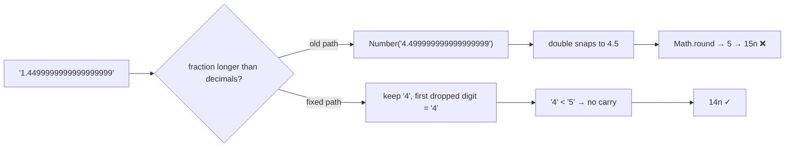

# The Float Hiding in viem's parseUnits

You did everything right. Your app never touches JavaScript's normal numbers for money. Every token amount lives as a `bigint` — the arbitrary-precision integer type that can hold huge values exactly, with no rounding, ever. That's the whole reason you picked viem: it's the Ethereum library that made "bigint everywhere" its identity, precisely so floating-point math could never quietly nudge an amount by a fraction of a cent.

And then, on July 17, 2026, someone opened [an issue on viem's GitHub](https://github.com/wevm/viem/issues/4855) showing that `parseUnits` — the one function that turns a human-typed string like `"1.45"` into on-chain units — could return a number that was simply wrong. Off by one at the last digit. No error. No warning. Just a slightly different amount than the user typed.

The cause? Inside the bigint-first library, on the exact path that parses money, there was a `Math.round(Number(...))`. A float. Hiding in the last place anyone would think to look.

## The bug in one console session

Here's the reproduction from the issue, and you can still run it on any viem version released before July 18, 2026:

```ts
import { parseUnits } from 'viem'

parseUnits('1.4499999999999999999', 1)
// expected: 14n  (1.44999… rounds down to 1.4)
// actual:   15n  (that's 1.5 — the value went UP)

parseUnits('1.14999999999999999', 1)
// expected: 11n
// actual:   12n

parseUnits('0.4999999999999999999', 0)
// expected: 0n
// actual:   1n  (zero point something became one)
```

Quick translation for anyone new to this: `parseUnits(value, decimals)` multiplies a decimal string by 10 to the power of `decimals` and returns the result as a `bigint`. It's how `"1.5"` becomes `1500000n` for a 6-decimal token like USDC, or how `parseEther("1.5")` becomes `1500000000000000000n` wei — the smallest unit of ether. Every deposit form, every swap input, every "send tokens" box in a viem or wagmi app funnels through this function or one of its wrappers.

When the string has more decimal places than the token supports, `parseUnits` rounds. And that rounding step — only that step — is where the float snuck in.

## What was actually happening

The pre-fix source of `parseUnits` handled the "too many decimals" case like this (shortened, from [viem 2.37.0](https://github.com/wevm/viem/blob/viem%402.37.0/src/utils/unit/parseUnits.ts)):

```ts
const [left, unit, right] = [
  fraction.slice(0, decimals - 1),
  fraction.slice(decimals - 1, decimals),
  fraction.slice(decimals),
]

const rounded = Math.round(Number(`${unit}.${right}`))
```

It takes the last digit it's allowed to keep (`unit`), glues the entire discarded tail behind it (`right`), converts that string to a JavaScript `Number`, and asks `Math.round` which way to go.

The problem: a JavaScript `Number` is an IEEE-754 double — the standard 64-bit binary floating-point format. A double can only faithfully hold 15 to 17 significant decimal digits. Feed it a longer string and it silently snaps to the nearest value it *can* represent. Try it in any browser console:

```js
> Number('4.499999999999999999')
4.5
> Math.round(4.5)
5
```

That first line is the whole bug. `4.499999999999999999` is mathematically below 4.5, so it should round down to 4. But the nearest representable double to that 19-digit string is *exactly* 4.5. The "less than one half" information lives in digits sixteen through nineteen — and the float throws those digits away before `Math.round` ever sees them. So a value that should round down rounds up, and `1.4499999999999999999` becomes `15n` instead of `14n`.

As the reporter put it in the issue, rounding here needs to happen "entirely in decimal/bigint space", by looking at the actual digits — "without Number conversion." They were right, and the fix (we'll get there) does exactly that.

If this feels familiar, it's the same trap behind the most famous question on Stack Overflow — ["Is floating point math broken?"](https://stackoverflow.com/questions/588004/is-floating-point-math-broken), the one with `0.1 + 0.2 !== 0.3` and tens of thousands of upvotes. Twenty years of that question, and it still found a fresh victim inside the library built to be immune to it.

## The debugging dance

Picture how you'd meet this bug in the wild, because nobody meets it by reading `parseUnits.ts` for fun.

An amount in your system is off by one unit at the last decimal. Once. In one record out of thousands. Your first instinct: *my math is wrong*. So you re-derive your own price calculation, check every multiplication, maybe blame the rounding mode of the decimal library that produced the string. That all checks out. Curse quietly.

Second guess: *wrong decimals for the token*. Everyone has been burned by assuming 18 decimals when the token has 6. You check the contract. Decimals are right. It's not the decimals. It's never — well, usually it *is* the decimals, which makes it worse when it isn't.

By now the browser has a dozen tabs open and you're doing the thing where you `console.log` both sides of every conversion. And then you finally isolate it to a single line: the string going *into* `parseUnits` is correct to the last digit, and the bigint coming *out* is wrong. That moment is genuinely disorienting. The input is right. The output is wrong. The function between them is from a library with millions of weekly downloads, and it's the function whose only job is to not do this.

The "aha" comes when you paste the fractional part into the console and type `Number(...)` around it — and the console prints back a *different number* than the one you typed. Not an error. Not `NaN`. Just a slightly different value, delivered with total confidence. That's the moment you learn (or re-learn) that `Number('4.499999999999999999')` and `4.499999999999999999` are the same thing to JavaScript, and that "the same thing" is 4.5.

To viem's credit, the turnaround was fast: issue filed July 17, fix merged July 18 by the maintainer.


## The fix: round by looking at digits, not by converting

The merged fix ([PR #4859](https://github.com/wevm/viem/pull/4859)) rips the float out entirely. `parseUnits` now delegates to a small value module that rounds the way you'd do it on paper: keep the digits the token allows, look at the *first dropped digit as a character*, and if it's 5 or higher, add one — carrying in string/bigint space, where every digit is exact. A community PR ([#4857](https://github.com/wevm/viem/pull/4857)) proposed the same digit-carry idea independently.



Why this works: the string already contains the exact answer. The first digit you're about to throw away tells you everything half-up rounding needs to know. There is no reason to squeeze nineteen digits through a 15-to-17-digit format first — that conversion is the only lossy step in the whole pipeline, and the fix simply deletes it.

What you should do:

**1. Upgrade viem.** The fix landed on main on July 18, 2026. Check your lockfile — any viem released before that date still has the float path. Pinned transitive copies (wagmi resolutions, monorepo overrides) count too.

**2. If you can't upgrade yet, normalize the string yourself before calling `parseUnits`.** Here's a drop-in that rounds half-away-from-zero using only string and bigint operations:

```ts
function parseUnitsExact(value: string, decimals: number): bigint {
  let [int = '0', frac = ''] = value.split('.')
  const negative = int.startsWith('-')
  if (negative) int = int.slice(1)

  const kept = frac.slice(0, decimals).padEnd(decimals, '0')
  const firstDropped = frac[decimals] ?? '0'

  let units = BigInt(int || '0') * 10n ** BigInt(decimals) + BigInt(kept || '0')
  if (firstDropped >= '5') units += 1n   // digit comparison — no floats anywhere
  return negative ? -units : units
}
```

Every step is exact: `BigInt('…')` parses decimal strings without precision limits, and comparing `firstDropped >= '5'` compares characters, which for single digits matches numeric order.

**3. Decide whether you even want rounding.** For a payment amount, silently rounding *up* is arguably worse than refusing. ethers.js takes the strict road: give its `parseUnits` more decimals than the token allows and it throws instead of rounding. On GembaPay we do a version of the same thing — user-typed amounts are truncated to the token's decimals in string space before any parser sees them, because a payment gateway should never charge more than the number the customer looked at.

Edge cases to keep in mind: strings with 15 or fewer significant digits were always fine (a double holds them exactly), which is why manual testing never caught this. The danger zone is machine-generated strings — full-precision outputs from decimal libraries, exchange APIs, or price-times-quantity math — that carry sixteen-plus significant digits into the parse.

## The lesson

Every place a string becomes a `Number` is a boundary where value can silently change. Not error out — *change*. The viem bug is a perfect specimen because the library's entire design says "we don't do floats", and the one float that survived did so inside a helper, behind a template literal, on a branch that only fires for long inputs.

Two takeaways you can apply this week. First, grep your money paths for `Number(`, `parseFloat(` and `+someString` — every hit is either provably bounded to 15 digits or it's a bug waiting for a long input. Second, when you test parsing code, don't test with pretty values like `1.5`. Test with hostile ones: nineteen-digit tails, `…4999999999999999999`, values just under a rounding boundary. Exact math fails loudly; float math fails politely. Politely is worse.

## Credit & further reading

> This article is based on a problem originally reported in [wevm/viem issue #4855](https://github.com/wevm/viem/issues/4855). Thanks to `@baiyuxi930826` for the clear reproduction cases, `@nikhilkumar1612` for the digit-carry fix proposal in [PR #4857](https://github.com/wevm/viem/pull/4857), and `@jxom` for the merged fix in [PR #4859](https://github.com/wevm/viem/pull/4859). For the function's official documentation, see the [viem parseUnits docs](https://viem.sh/docs/utilities/parseUnits).

## Frequently Asked Questions

### Does this bug affect parseEther and parseGwei too?

Yes. `parseEther(value)` is just `parseUnits(value, 18)` and `parseGwei(value)` is `parseUnits(value, 9)`, so both shared the float path. In practice `parseEther` needed a fractional part longer than 18 digits *and* about sixteen or more significant digits to trigger the mis-round, which human-typed input basically never produces. `parseGwei` and low-decimal tokens (USDC and EURC have 6 decimals) sit closer to the edge: any higher-precision computed string — a price calculation, a rebalancing formula, an API response with full precision — enters the rounding branch, and sufficiently long tails could flip the result.

### How likely was I to actually hit this in production?

If every amount in your app comes from a human typing into an input field, probably never — people don't type nineteen decimal places. The realistic path is machine-generated strings: a decimal library's full-precision output, `price × quantity` results serialized without trimming, or balances from an exchange API re-parsed into units. Those routinely carry more digits than the token's decimals, which sends them into the rounding branch on every single call. The bug then needs the tail to land near a rounding boundary, so it's rare — but rare, silent, and off-by-one in money is exactly the class of bug you want to rule out rather than estimate.

### Does formatUnits have the same problem in reverse?

No. `formatUnits` (and `formatEther`) go the safe direction: bigint in, string out. That conversion is pure digit manipulation — turn the bigint into its decimal string, insert the decimal point at the right position, trim trailing zeros. There's nothing to round and no `Number` conversion anywhere on the path, so the output string is always exact. The asymmetry is the interesting part: the same module had one lossless direction and one lossy one, and the lossy one is the direction user input flows through.

### What does ethers.js do with too many decimals?

It refuses. Hand `ethers.parseUnits("1.2345678", 6)` more fractional digits than the unit allows and it throws an error rather than rounding for you. That's a real design fork: viem chose "be forgiving, round it", ethers chose "be strict, make the caller decide". After this bug, the strict choice looks better than it used to — an exception in your logs is annoying, but it's visible. For payment flows we'd argue for stricter still: truncate or reject at the input boundary, so the number that gets parsed is exactly the number the user confirmed on screen.

### How do I test my own code for this class of bug?

Stop testing parsers with friendly values. Add cases with: tails of nineteen-plus digits, values just below a rounding boundary (`…449999…`), values exactly on it (`…45`), negatives of all of those, and `decimals: 0`. If you have property-based testing (fast-check works well in TypeScript), generate random decimal strings, run them through your parse function, and check the result against a reference implementation built on `BigInt` string math — like `parseUnitsExact` above. And in code review, treat any `Number(x)` where `x` can exceed 15 significant digits as a finding, the same way you'd treat unescaped SQL.
