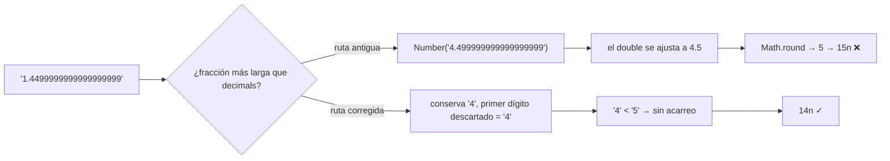

# El float escondido en parseUnits de viem

Lo hiciste todo bien. Tu aplicación nunca toca los números normales de JavaScript cuando se trata de dinero. Cada cantidad de tokens vive como un `bigint` — el tipo entero de precisión arbitraria que guarda valores enormes de forma exacta, sin redondeos, nunca. Esa es exactamente la razón por la que elegiste viem: es la librería de Ethereum que hizo de "bigint en todas partes" su identidad, precisamente para que la aritmética de coma flotante jamás pudiera mover una cantidad una fracción de céntimo sin avisar.

Y entonces, el 17 de julio de 2026, alguien abrió [un issue en el GitHub de viem](https://github.com/wevm/viem/issues/4855) mostrando que `parseUnits` — la función que convierte una cadena escrita por un humano como `"1.45"` en unidades on-chain — podía devolver un número simplemente incorrecto. Con un error de uno en el último dígito. Sin error. Sin aviso. Solo una cantidad ligeramente distinta de la que el usuario escribió.

¿La causa? Dentro de la librería bigint-first, justo en la ruta que parsea dinero, había un `Math.round(Number(...))`. Un float. Escondido en el último lugar donde a alguien se le ocurriría mirar.

## El bug en una sesión de consola

Aquí está la reproducción del issue — puedes ejecutarla en cualquier versión de viem publicada antes del 18 de julio de 2026:

```ts
import { parseUnits } from 'viem'

parseUnits('1.4499999999999999999', 1)
// expected: 14n  (1.44999… rounds down to 1.4)
// actual:   15n  (that's 1.5 — the value went UP)

parseUnits('1.14999999999999999', 1)
// expected: 11n
// actual:   12n

parseUnits('0.4999999999999999999', 0)
// expected: 0n
// actual:   1n  (zero point something became one)
```

Traducción rápida para quien sea nuevo en esto: `parseUnits(value, decimals)` multiplica una cadena decimal por 10 elevado a `decimals` y devuelve el resultado como `bigint`. Así es como `"1.5"` se convierte en `1500000n` para un token de 6 decimales como USDC, o como `parseEther("1.5")` se convierte en `1500000000000000000n` wei — la unidad más pequeña del ether. Cada formulario de depósito, cada campo de swap, cada caja de "enviar tokens" en una aplicación con viem o wagmi pasa por esta función o por sus envoltorios.

Cuando la cadena tiene más decimales de los que el token admite, `parseUnits` redondea. Y ese paso de redondeo — solo ese — es donde se coló el float.

## Qué estaba pasando en realidad

El código de `parseUnits` antes del arreglo manejaba el caso de "demasiados decimales" así (abreviado, de [viem 2.37.0](https://github.com/wevm/viem/blob/viem%402.37.0/src/utils/unit/parseUnits.ts)):

```ts
const [left, unit, right] = [
  fraction.slice(0, decimals - 1),
  fraction.slice(decimals - 1, decimals),
  fraction.slice(decimals),
]

const rounded = Math.round(Number(`${unit}.${right}`))
```

Toma el último dígito que puede conservar (`unit`), pega detrás toda la cola descartada (`right`), convierte esa cadena en un `Number` de JavaScript y le pregunta a `Math.round` hacia dónde ir.

El problema: un `Number` de JavaScript es un double IEEE-754 — el formato estándar de coma flotante binaria de 64 bits. Un double solo puede guardar fielmente entre 15 y 17 dígitos decimales significativos. Dale una cadena más larga y se ajusta en silencio al valor más cercano que *sí puede* representar. Pruébalo en cualquier consola del navegador:

```js
> Number('4.499999999999999999')
4.5
> Math.round(4.5)
5
```

Esa primera línea es todo el bug. `4.499999999999999999` está matemáticamente por debajo de 4.5, así que debería redondear hacia abajo a 4. Pero el double representable más cercano a esa cadena de 19 dígitos es *exactamente* 4.5. La información de "menos de un medio" vive en los dígitos dieciséis a diecinueve — y el float tira esos dígitos antes de que `Math.round` llegue a verlos. Así, un valor que debería redondear hacia abajo redondea hacia arriba, y `1.4499999999999999999` se convierte en `15n` en vez de `14n`.

Como lo expresó el autor del issue, el redondeo aquí tiene que ocurrir "enteramente en espacio decimal/bigint", mirando los dígitos reales — "sin conversión a Number". Tenía razón, y el arreglo (ya llegaremos) hace exactamente eso.

Si esto te suena, es la misma trampa detrás de la pregunta más famosa de Stack Overflow — ["Is floating point math broken?"](https://stackoverflow.com/questions/588004/is-floating-point-math-broken), la del `0.1 + 0.2 !== 0.3` con decenas de miles de votos. Veinte años de esa pregunta, y aun así encontró una víctima fresca dentro de la librería construida para ser inmune a ella.

## El baile del debugging

Imagina cómo te encontrarías este bug en la vida real, porque nadie lo encuentra leyendo `parseUnits.ts` por diversión.

Una cantidad en tu sistema está desviada en una unidad en el último decimal. Una vez. En un registro de entre miles. Tu primer instinto: *mi cálculo está mal*. Así que rehaces tu propio cálculo de precio, revisas cada multiplicación, quizá culpas al modo de redondeo de la librería decimal que produjo la cadena. Todo cuadra. Maldices en voz baja.

Segunda hipótesis: *decimales equivocados del token*. Todo el mundo se ha quemado asumiendo 18 decimales cuando el token tiene 6. Revisas el contrato. Los decimales están bien. No son los decimales. Nunca lo son — bueno, normalmente *sí* lo son, lo que empeora las cosas cuando no lo son.

A estas alturas el navegador tiene una docena de pestañas abiertas y estás haciendo eso de poner `console.log` a ambos lados de cada conversión. Y por fin lo aíslas a una sola línea: la cadena que *entra* en `parseUnits` es correcta hasta el último dígito, y el bigint que *sale* está mal. Ese momento desorienta de verdad. La entrada es correcta. La salida es incorrecta. La función entre ambas viene de una librería con millones de descargas semanales — y es la función cuyo único trabajo es no hacer exactamente esto.

El momento "ajá" llega cuando pegas la parte fraccionaria en la consola y escribes `Number(...)` alrededor — y la consola te devuelve un *número distinto* del que escribiste. No un error. No `NaN`. Solo un valor ligeramente diferente, entregado con total seguridad. Ese es el momento en que aprendes (o recuerdas) que `Number('4.499999999999999999')` y `4.499999999999999999` son lo mismo para JavaScript, y que ese "lo mismo" es 4.5.

En honor a viem, la reacción fue rápida: issue presentado el 17 de julio, arreglo fusionado el 18 de julio por el mantenedor.


## El arreglo: redondear mirando dígitos, no convirtiendo

El arreglo fusionado ([PR #4859](https://github.com/wevm/viem/pull/4859)) arranca el float por completo. `parseUnits` ahora delega en un pequeño módulo de valores que redondea como lo harías en papel: conserva los dígitos que el token permite, mira el *primer dígito descartado como carácter*, y si es 5 o mayor, suma uno — con acarreo en espacio string/bigint, donde cada dígito es exacto. Un PR de la comunidad ([#4857](https://github.com/wevm/viem/pull/4857)) propuso la misma idea de acarreo por dígitos de forma independiente.



Por qué funciona: la cadena ya contiene la respuesta exacta. El primer dígito que estás a punto de tirar te dice todo lo que el redondeo half-up necesita saber. No hay ninguna razón para pasar antes diecinueve dígitos por un formato de 15 a 17 dígitos — esa conversión es el único paso con pérdida de toda la tubería, y el arreglo simplemente lo elimina.

Qué deberías hacer:

**1. Actualiza viem.** El arreglo entró en main el 18 de julio de 2026. Revisa tu lockfile — cualquier viem publicado antes de esa fecha todavía tiene la ruta con float. Las copias transitivas fijadas (resolutions de wagmi, overrides de monorepo) también cuentan.

**2. Si aún no puedes actualizar, normaliza la cadena tú mismo antes de llamar a `parseUnits`.** Aquí tienes un reemplazo directo que redondea half-away-from-zero usando solo operaciones de string y bigint:

```ts
function parseUnitsExact(value: string, decimals: number): bigint {
  let [int = '0', frac = ''] = value.split('.')
  const negative = int.startsWith('-')
  if (negative) int = int.slice(1)

  const kept = frac.slice(0, decimals).padEnd(decimals, '0')
  const firstDropped = frac[decimals] ?? '0'

  let units = BigInt(int || '0') * 10n ** BigInt(decimals) + BigInt(kept || '0')
  if (firstDropped >= '5') units += 1n   // digit comparison — no floats anywhere
  return negative ? -units : units
}
```

Cada paso es exacto: `BigInt('…')` parsea cadenas decimales sin límites de precisión, y comparar `firstDropped >= '5'` compara caracteres, lo que para dígitos sueltos coincide con el orden numérico.

**3. Decide si siquiera quieres redondeo.** Para un importe de pago, redondear *hacia arriba* en silencio es posiblemente peor que negarse. ethers.js toma el camino estricto: dale a su `parseUnits` más decimales de los que la unidad permite y lanza un error en vez de redondear. En GembaPay hacemos una versión de lo mismo — las cantidades escritas por el usuario se truncan a los decimales del token en espacio de string antes de que ningún parser las vea, porque una pasarela de pagos nunca debe cobrar más que el número que el cliente vio en pantalla.

Casos límite a tener en cuenta: las cadenas con 15 o menos dígitos significativos siempre estuvieron bien (un double las guarda exactas) — por eso las pruebas manuales nunca detectaron esto. La zona de peligro son las cadenas generadas por máquinas — salidas a precisión completa de librerías decimales, APIs de exchanges o cálculos de precio por cantidad — que meten dieciséis o más dígitos significativos en el parseo.

## La lección

Cada lugar donde una cadena se convierte en `Number` es una frontera donde el valor puede cambiar en silencio. No fallar con un error — *cambiar*. El bug de viem es un espécimen perfecto porque todo el diseño de la librería dice "nosotros no usamos floats", y el único float superviviente lo hizo dentro de un helper, detrás de un template literal, en una rama que solo se activa con entradas largas.

Dos conclusiones que puedes aplicar esta semana. Primero, haz grep en tus rutas de dinero buscando `Number(`, `parseFloat(` y `+someString` — cada resultado o está demostrablemente acotado a 15 dígitos o es un bug esperando una entrada larga. Segundo, cuando pruebes código de parseo, no pruebes con valores bonitos como `1.5`. Prueba con valores hostiles: colas de diecinueve dígitos, `…4999999999999999999`, valores justo por debajo de un límite de redondeo. La aritmética exacta falla haciendo ruido; la de coma flotante falla con educación. Con educación es peor.

## Créditos y lecturas adicionales

> Este artículo se basa en un problema reportado originalmente en el [issue #4855 de wevm/viem](https://github.com/wevm/viem/issues/4855). Gracias a `@baiyuxi930826` por los casos de reproducción claros, a `@nikhilkumar1612` por la propuesta de arreglo con acarreo por dígitos en el [PR #4857](https://github.com/wevm/viem/pull/4857), y a `@jxom` por el arreglo fusionado en el [PR #4859](https://github.com/wevm/viem/pull/4859). Para la documentación oficial de la función, consulta la [documentación de parseUnits de viem](https://viem.sh/docs/utilities/parseUnits).

## Preguntas frecuentes

### ¿Este bug afecta también a parseEther y parseGwei?

Sí. `parseEther(value)` es simplemente `parseUnits(value, 18)` y `parseGwei(value)` es `parseUnits(value, 9)`, así que ambos compartían la ruta con float. En la práctica, `parseEther` necesitaba una parte fraccionaria de más de 18 dígitos *y* unos dieciséis o más dígitos significativos para provocar el redondeo incorrecto — algo que la entrada escrita por humanos básicamente nunca produce. `parseGwei` y los tokens de pocos decimales (USDC y EURC tienen 6) están más cerca del borde: cualquier cadena calculada con mayor precisión — un cálculo de precio, una fórmula de rebalanceo, una respuesta de API a precisión completa — entra en la rama de redondeo, y colas suficientemente largas podían voltear el resultado.

### ¿Qué probabilidad tenía yo de sufrir esto en producción?

Si cada cantidad de tu aplicación viene de un humano tecleando en un campo de entrada, probablemente nunca — la gente no escribe diecinueve decimales. La ruta realista son las cadenas generadas por máquinas: la salida a precisión completa de una librería decimal, resultados de `price × quantity` serializados sin recortar, o saldos de la API de un exchange re-parseados a unidades. Esas cadenas llevan rutinariamente más dígitos que los decimales del token, lo que las envía a la rama de redondeo en cada llamada. Después, el bug necesita que la cola caiga cerca de un límite de redondeo, así que es raro — pero raro, silencioso y con un error de uno en dinero es exactamente la clase de bug que quieres descartar, no estimar.

### ¿formatUnits tiene el mismo problema a la inversa?

No. `formatUnits` (y `formatEther`) van en la dirección segura: entra un bigint, sale una cadena. Esa conversión es pura manipulación de dígitos — convertir el bigint a su cadena decimal, insertar el punto decimal en la posición correcta, quitar los ceros finales. No hay nada que redondear y no hay ninguna conversión a `Number` en el camino, así que la cadena de salida siempre es exacta. La asimetría es la parte interesante: el mismo módulo tenía una dirección sin pérdidas y otra con pérdidas — y la que pierde es la dirección por la que fluye la entrada del usuario.

### ¿Qué hace ethers.js con demasiados decimales?

Se niega. Dale a `ethers.parseUnits("1.2345678", 6)` más dígitos fraccionarios de los que la unidad permite y lanza un error en vez de redondear por ti. Es una bifurcación de diseño real: viem eligió "sé indulgente, redondea", ethers eligió "sé estricto, que decida quien llama". Después de este bug, la opción estricta se ve mejor que antes — una excepción en tus logs es molesta, pero es visible. Para flujos de pago defenderíamos algo aún más estricto: truncar o rechazar en la frontera de entrada, para que el número que se parsea sea exactamente el número que el usuario confirmó en pantalla.

### ¿Cómo pruebo mi propio código contra esta clase de bugs?

Deja de probar parsers con valores amistosos. Añade casos con: colas de diecinueve o más dígitos, valores justo por debajo de un límite de redondeo (`…449999…`), valores exactamente encima (`…45`), los negativos de todos ellos y `decimals: 0`. Si tienes pruebas basadas en propiedades (fast-check funciona bien en TypeScript), genera cadenas decimales aleatorias, pásalas por tu función de parseo y compara el resultado con una implementación de referencia construida sobre aritmética de strings con `BigInt` — como `parseUnitsExact` de arriba. Y en el code review, trata cualquier `Number(x)` donde `x` pueda superar los 15 dígitos significativos como un hallazgo, igual que tratarías SQL sin escapar.
