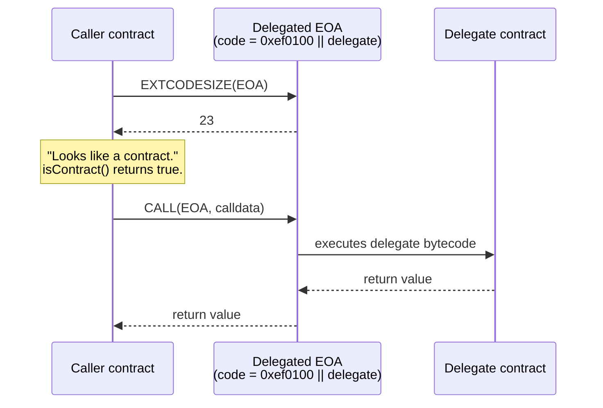
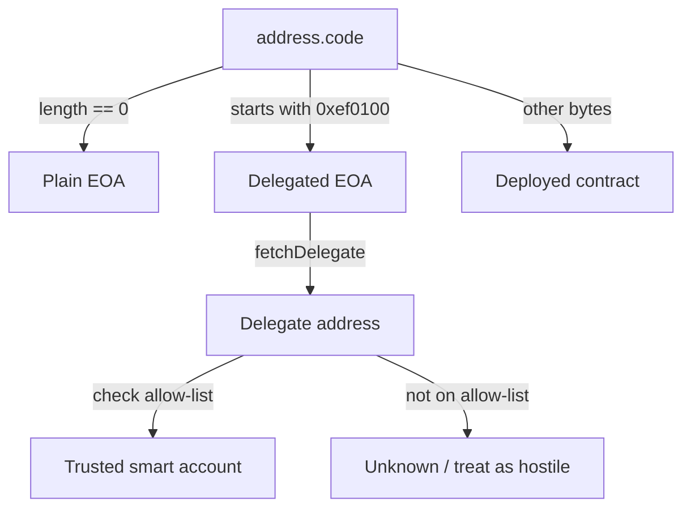

Six months ago you wrote a little guard in one of your smart contracts that looks like this:

```solidity
require(msg.sender.code.length == 0, "EOA only");
```

It's been quietly doing its job — keeping bots out of your NFT mint, locking down an airdrop claim, or gating a fee discount. Then Pectra (a major Ethereum upgrade) went live on the main network last May. Then EIP-7702 — the upgrade rule that changed everything here — started rolling out. Then, on April 29, 2026, an attacker drained 1,988.5 QNT — about 54.93 ETH — out of a token reserve because the team's admin was an EOA (a normal wallet address controlled by a private key, not a contract) and a "batch execution contract" they trusted skipped one access check. SlowMist, a well-known security firm, posted the alert the same day.

Here's the heart of it. The check Solidity has taught for years — *"if `extcodesize` is zero, it's an EOA"* — quietly stopped being true. (`extcodesize` is just the opcode that asks "how much code does this address have?") A delegated EOA now has code. Exactly 23 bytes of it. And the shape of that code fools every contract still using the old pattern.

Wintermute's research team looked at these authorizations on the main network and found something striking: **97% of all EIP-7702 delegations point to the same handful of contracts** — sweeper code the community nicknamed *CrimeEnjoyor*. So no, this isn't a theoretical worry anymore.

This post is the field guide we wish we'd had: every place `isContract()` now lies to you, the safe replacement for each one, and how to ask the question correctly in 2026 — both on-chain and off-chain.

## The Problem: What Pectra Did to extcodesize

Before EIP-7702, the rule was dead simple. Normal wallets (EOAs) had no code; smart contracts did. So this:

```solidity
function isContract(address account) internal view returns (bool) {
    return account.code.length > 0;
}
```

…was simply true. OpenZeppelin — the most widely used library of audited Solidity building blocks — shipped almost exactly that helper inside `Address.sol` for years, and tens of thousands of contracts pulled it in to do things like detect callbacks, gate NFT mints, refuse contract callers in a lottery, or sort out counterparties in flash-loan checks.

EIP-7702 changed the rule. It adds a new kind of transaction that lets an EOA sign an *authorization tuple* — basically a signed note saying "point my address at this delegate contract." Once that note lands in a block, the EOA's account holds a 23-byte stub:

```
0xef 0x01 0x00 || <20-byte delegate address>
```

That stub is the delegation indicator. Think of it like a forwarding sticker on your mailbox: from the outside it's a tiny label, but mail dropped in gets handled by the address it points to. The spec spells out exactly what each opcode returns for a delegated EOA:

- `EXTCODESIZE` returns **23** — the length of the indicator, not the size of the delegate's code.
- `EXTCODEHASH` returns the hash of the indicator itself; it does **not** follow delegation.
- `CODESIZE`, evaluated while executing inside the delegated account, returns the size of the delegate's real code.

So from the outside everything looks like a tiny 23-byte contract, but on the inside, when the delegate actually runs, it sees the delegate's own code. As the EIP rationale puts it: *"if instead delegations were followed, an account would be able to temporarily masquerade as having a particular codehash, which would break contracts that rely on codehashes as a definition of possible account behavior."*

That paragraph was written to defend the design. But it also describes the bug perfectly: every contract that ever wrote `account.code.length > 0` to mean *"this is a smart contract"* now treats a delegated EOA as a smart contract. And every contract that wrote `account.code.length == 0` to mean *"this is a human"* now treats a delegated EOA as **not** a human — even though there is, quite literally, a person on the other end.



Here's how Pascal Caversaccio put it when he opened OpenZeppelin issue #5676 on May 9, 2025: *"With EIP-7702, EOAs can have code starting with `0xef0100`. The function could check if the code length is zero **or** the first three bytes are `0xef0100`."* The issue stayed open for nearly a year and was finally resolved in v5.5.0 with `EIP7702Utils.sol`. It's the cleanest single-file summary of what the new pattern should look like.

## The Debugging Dance: Four Places This Bites

Three months after Pectra hit the main network, the bug reports started landing in audit firms' inboxes. And every team's first instinct on the triage call is the same — *check the RPC* (the connection to the blockchain). RPC's fine. Then *check the chain ID*. Chain ID's fine. Then *re-deploy on a local fork, write a Foundry script, prove it doesn't happen.* (Foundry is the popular Solidity testing toolkit.) The catch: Foundry's local test chain, Anvil, runs in pre-Pectra mode by default unless you pass `--hardfork prague`, so half the time the test passes locally and fails on the real network. Tabs pile up. Somebody pings the auditor on Discord. *Maybe the user's on a multisig?* Nope — it's a plain wallet address. *Maybe gas estimation is off?* It isn't. It's never the gas limit.

The "aha" moment lands when someone finally runs `cast code <user-address>` and sees:

```
0xef01005d3a536e4d6dbd6114cc1ead35777bab948e3643
```

Twenty-three bytes. Starts with `0xef0100`. A delegated EOA. And every guard, gate, hook, and discount in the protocol that touched that address has been quietly filing it under "smart contract" for weeks.

Here are the four spots where we've seen this hurt the most.

### 1. The "no contracts allowed" mint guard

A fair-launch NFT collection wants to keep the bots out. The mint function checks:

```solidity
require(msg.sender == tx.origin, "no contracts");
require(msg.sender.code.length == 0, "no contracts");
```

The `tx.origin` check was already weak (a delegated EOA *is* the origin), but the code-length check was meant to be the belt-and-braces backstop. Both fail open now: a delegated wallet running CrimeEnjoyor-style logic strolls past both checks and mints in batch.

### 2. The discounted-fee tier for "individuals"

A DEX router (a contract that routes trades on a decentralized exchange) charges 30 bps to contract callers and 25 bps to EOAs — the idea being that contracts are usually MEV bots and real people deserve the cheaper rate. The router decides which is which using OpenZeppelin's old `Address.isContract`. After Pectra, every user who upgraded to a smart account — and a wave of Coinbase Smart Wallet, Ambire, and ZeroDev users did exactly that in late 2025 and early 2026 — starts getting charged the pricier 30-bps tier. Support tickets pile up. Nobody can figure out why.

### 3. ERC-721 / ERC-1155 receiver hooks

`_safeMint` is supposed to call `onERC721Received` on contract recipients and skip that check for normal wallets. Older OpenZeppelin versions (and the many forks of them) decide whether to make the call using `to.code.length > 0`. After delegation, a delegated EOA *does* have code — so `_safeMint` happily calls `onERC721Received` on it. If the delegate doesn't implement that function — and most CrimeEnjoyor-class sweepers don't — the call reverts and the mint fails. The result: legitimate users get "transaction reverted" with no obvious reason, on what looked like a perfectly normal mint.

### 4. Flash-loan callbacks and other "contract-only" entry points

A flash-loan provider only routes `flashLoan` to addresses that have code, because the callback contract has to implement a specific interface. Now a delegated EOA passes that gate, the lender wires the funds, and the delegate's logic — *which the user signed without reading* — sweeps the tokens out and never repays. The transaction reverts on the repayment check, but a malicious delegate can be built to satisfy the repayment function while siphoning value out elsewhere.

The April 29 QNT incident is a cousin of #4. The reserve's admin was an EOA, and a "batch execution contract" the team leaned on for ops didn't properly check that the incoming call really came through the intended admin path. Once delegation went live on that EOA, the attacker chained calls through the delegate and around the access check. SlowMist's post-mortem says it plainly: *"the admin identity of a QNT reserve pool is held by an EOA"* — which the team had been reasoning about as if it were still a zero-byte account.


## The Solution: Three Levels of "Is This an EOA?"

Stop asking *"does it have code?"*. That question doesn't give you a useful answer anymore. Ask one of three sharper questions instead, and pick the strictness that matches what you actually need.

### Level 1 — "Plain EOA, no delegation" (strictest)

This is the post-Pectra version of the old "no contract code, period" check. It has to return false for both contracts *and* delegated EOAs.

```solidity
function isPlainEOA(address target) internal view returns (bool) {
    return target.code.length == 0;
}
```

The code is the same one-liner, but the *meaning* has shifted: a delegated EOA now correctly comes back as false. Reach for this when you want to reject anything that can run custom logic on the address's behalf — a fair-launch mint, a captcha-style gate, a "humans only" airdrop claim.

### Level 2 — "EOA or delegated EOA, but not a deployed contract"

Pascal Caversaccio's original proposal in OpenZeppelin issue #5676, adopted as the v5.5.0 shape:

```solidity
bytes3 internal constant EIP7702_PREFIX = 0xef0100;

function isEOA(address target) internal view returns (bool) {
    bytes memory code = target.code;
    return code.length == 0 || bytes3(code) == EIP7702_PREFIX;
}
```

Reach for this when you're guarding a feature that should treat all humans the same — whether or not they've upgraded to a 7702 smart account — while still excluding deployed contracts. Fee-tier discounts for individuals are the textbook case: someone with a smart-account upgrade is still a person, and charging them the bot rate is just a UX bug.

### Level 3 — "Who is this delegated to?" (introspection)

OpenZeppelin shipped `EIP7702Utils.fetchDelegate` in v5.5.0:

```solidity
// SPDX-License-Identifier: MIT
pragma solidity ^0.8.20;

library EIP7702Utils {
    bytes3 internal constant EIP7702_PREFIX = 0xef0100;

    function fetchDelegate(address account) internal view returns (address) {
        bytes23 delegation = bytes23(account.code);
        return bytes3(delegation) == EIP7702_PREFIX
            ? address(bytes20(delegation << 24))
            : address(0);
    }
}
```

This hands you back the delegate address — or `address(0)` for plain EOAs and deployed contracts. Use it when your decision depends on *what* the EOA delegates to: for example, only allowing delegates from an approved list of audited smart-account implementations (Safe, Coinbase Smart Wallet, ZeroDev's Kernel, Ambire's wallet contract). Several DeFi protocols are starting to do exactly this — asking *"the user is a smart account, but is it a known-good one?"*.



### What changes in `_safeMint` and other receiver hooks

OpenZeppelin's v5.x ERC-721 already dropped the `isContract` shortcut before the receiver call — it just calls `onERC721Received` and falls back gracefully when the recipient doesn't implement it. If you're still on a pre-5.0 fork that gates that callback on `code.length > 0`, upgrade or patch the gate; otherwise legitimate delegated wallets will revert on safe mints.

### Off-chain (viem / ethers) detection

In your indexer or frontend, do the same check using `eth_getCode`:

```typescript
import { publicClient } from "./client";

const EIP7702_PREFIX = "0xef0100";

export async function classifyAddress(addr: `0x${string}`) {
  const code = await publicClient.getCode({ address: addr });
  if (!code || code === "0x") return { kind: "eoa" as const };
  if (code.toLowerCase().startsWith(EIP7702_PREFIX)) {
    const delegate = `0x${code.slice(8, 48)}` as `0x${string}`;
    return { kind: "delegated-eoa" as const, delegate };
  }
  return { kind: "contract" as const };
}
```

That's the same three-way answer your Solidity guard should be giving, now available to your TypeScript backend. (viem and ethers are the two common JavaScript libraries for talking to Ethereum.) For an ethers v6 version, swap `publicClient.getCode` for `provider.getCode` — the indicator format is identical, because it's defined at the protocol layer, not by the library.

## The Lesson

The bigger point: in the Pectra era, a contract has to treat *"does this address have code?"* as a **three-state** answer, not a yes/no. Plain EOA, delegated EOA, and deployed contract are three different categories now, and almost every security or UX decision that matters wants to tell at least two of them apart.

If you maintain a Solidity codebase that's older than May 2025, go audit every reference to `extcodesize`, `code.length`, `Address.isContract`, and any home-grown version. For each call site, decide which of the three levels you actually wanted. Most of the time it's Level 1 (reject contracts and delegated wallets in fair launches) or Level 2 (treat all humans alike for fee logic). Level 3 is for protocol-policy gates that need to inspect the delegate itself.

And — zooming out — when an opcode that's been load-bearing in your security model since the Frontier release (Ethereum's very first version) suddenly changes meaning, the lesson isn't *"patch the call sites."* It's that account abstraction is now something your contracts have to model on purpose. The textbook `tx.origin == msg.sender` check died in 2017. `extcodesize > 0` is dying in 2026. There'll be a next one.

## Credit & Further Reading

This article is based on the problem class raised in [OpenZeppelin issue #5676](https://github.com/OpenZeppelin/openzeppelin-contracts/issues/5676) by `@pcaversaccio` (Pascal Caversaccio), resolved via PR #5587 and shipped in [`EIP7702Utils.sol`](https://github.com/OpenZeppelin/openzeppelin-contracts/blob/v5.5.0/contracts/account/utils/EIP7702Utils.sol) in OpenZeppelin Contracts v5.5.0. The exploit data references the April 29, 2026 [QNT reserve pool incident](https://www.cryptotimes.io/2026/04/29/eip-7702-flaw-drains-1988-qnt-from-ethereum-pool/) reported by SlowMist, and the [CrimeEnjoyor delegation epidemic](https://dev.to/ohmygod/the-crimeenjoyor-epidemic-how-eip-7702-delegation-phishing-drained-450k-wallets-and-how-to-e2g) writeup, with the 97% sweeper finding from Wintermute's research. For the authoritative spec, see [EIP-7702 on eips.ethereum.org](https://eips.ethereum.org/EIPS/eip-7702).

## Frequently Asked Questions

### Should I remove every isContract check from my contracts?

No — but you should review every one. What changed is the *meaning* of the check, not whether the question is worth asking. If your protocol has a "no contracts" rule to fend off MEV bots or unfair launches, that rule still makes sense — you just need to phrase it as "no code at all" (Level 1) instead of the old "no code at all, end of check." If your rule was about routing — say, "send refunds via low-level `call` to EOAs and via `transfer` to contracts" — that distinction is *less* useful than it was, since delegated EOAs run code when they receive. In that case the right move is often to stop branching at all and use the same path for both.

### Does this affect tx.origin checks too?

Yes, but in a different way. `tx.origin` always returns the original EOA, no matter what's delegated, so `tx.origin == msg.sender` will be true for a delegated EOA calling directly. The check was already known to be fragile (it breaks under arbitrary forwarders, account-abstraction relayers, and even some wallet UX layers), and Pectra didn't make it newly wrong — just newly fashionable to abuse. Treat `tx.origin` as a debugging tool, not a security primitive. If you need to authorize "the human behind this transaction" in 2026, the right answer is EIP-712 typed-data signatures, not origin checks.

### Will Foundry or Hardhat reproduce delegated-EOA behavior locally?

Foundry's `anvil` supports the Prague hardfork (which includes EIP-7702) — pass `--hardfork prague` when you start it, then build authorization tuples via cheatcodes or by composing the type-4 transaction directly. Hardhat 3 supports Prague natively in its EDR backend as of the 3.0 release; older Hardhat 2 networks default to Cancun and will quietly act as if EIP-7702 doesn't exist — which is exactly the trap that lets this bug reach production. If your CI passes locally but breaks on a Sepolia or mainnet fork, check your local EVM version first.

### How do I check off-chain whether a user's wallet is delegated, and to what?

Call `eth_getCode` (`provider.getCode` in ethers, `publicClient.getCode` in viem) for the address. If the result is `0x`, it's a plain EOA. If it starts with `0xef0100`, the next 20 bytes are the delegate address — slice them out and resolve. For end-user UX, several wallet teams have published delegation-checker apps (eip7702.app is a common reference); pointing a worried user at one is faster than building your own. From the backend, treat the delegate address like any other contract address: look it up against your allow-list, fetch its code, and decide whether you trust it.

### How is this different from the older ERC-1271 smart-contract wallet model?

ERC-1271 lets a contract wallet (Safe, Argent, and so on) prove it owns a signature. The contract is deployed at the wallet's address, and `code.length > 0`. EIP-7702 is the mirror image: the *EOA* gains the ability to run code at its own address by pointing at a delegate. Both are forms of account abstraction, but their on-chain shape is different — an ERC-1271 wallet looks like a contract; a 7702 wallet looks like an EOA with a 23-byte stub. A correct signature-verification flow in 2026 has to handle all three: plain EOAs (ECDSA recover), delegated EOAs (still ECDSA recover at the protocol level, though the delegate may add its own logic), and ERC-1271 contracts (call `isValidSignature`). OpenZeppelin's `SignatureChecker` already covers the first and third; for raw signature checks the second behaves just like the first.

### What about EXTCODEHASH-based audits and access lists?

`EXTCODEHASH` on a delegated EOA returns the hash of the 23-byte delegation indicator — *not* the hash of the delegate's bytecode. If you've been using `EXTCODEHASH` to whitelist "known-safe" contract code, you'll need an extra step: hash-check the delegation stub, pull out the delegate address, then check the delegate's code hash separately. The same goes for EVM access-list audits and bytecode-fingerprint-based bot detection. The single-call shortcut is gone.
