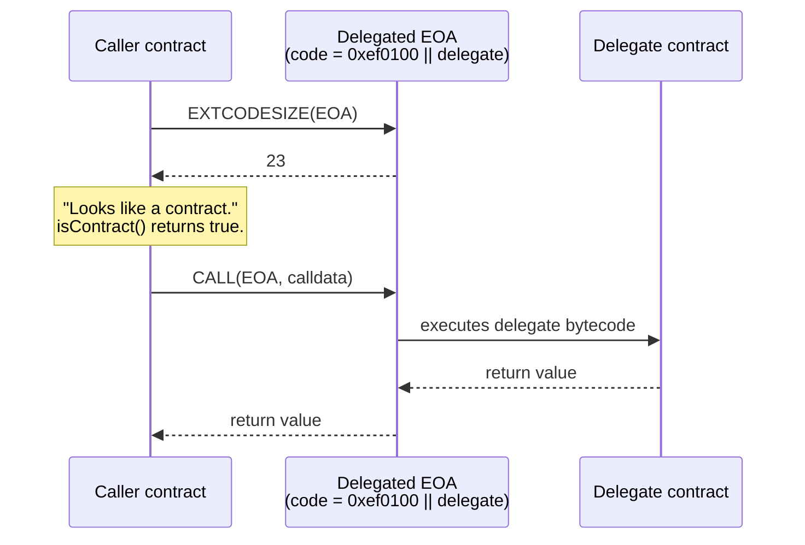
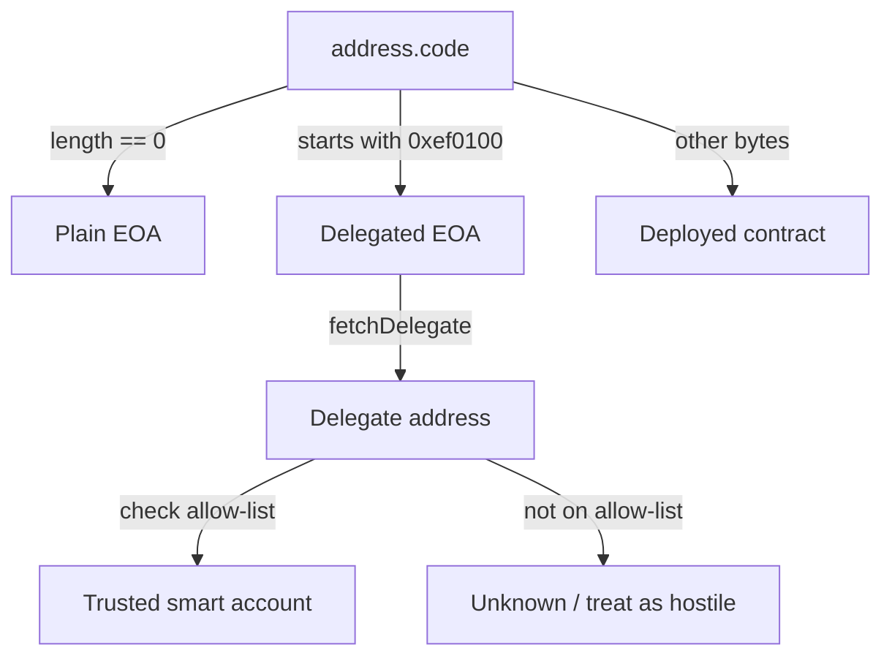

You wrote a smart-contract guard six months ago that looks like this:

```solidity
require(msg.sender.code.length == 0, "EOA only");
```

It's been protecting your NFT mint, your airdrop claim, or your fee-discount tier. Then Pectra went live on Ethereum mainnet last May. Then EIP-7702 started rolling out. Then, on April 29, 2026, an attacker drained 1,988.5 QNT — roughly 54.93 ETH — from a token reserve pool because the team's admin was an EOA and a "batch execution contract" they trusted forgot one access check. SlowMist posted the alert the same day.

The deeper story is that the textbook check Solidity has been teaching for years — *"if `extcodesize` is zero, it's an EOA"* — quietly stopped being true. A delegated EOA now has bytecode. Exactly 23 bytes of it. And the shape of that bytecode will fool every contract still using the old pattern.

Wintermute's research team, after surveying authorizations on mainnet, found that **97% of all EIP-7702 delegations point to the same handful of contracts** — sweeper bytecode the community has nicknamed *CrimeEnjoyor*. The problem class isn't theoretical anymore.

This post is the field guide we wish we had: every place `isContract()` lies, every safe replacement, and the on-chain and off-chain ways to ask the question correctly in 2026.

## The Problem: What Pectra Did to extcodesize

Before EIP-7702, the rule was simple. Externally owned accounts had no code; smart contracts did. So:

```solidity
function isContract(address account) internal view returns (bool) {
    return account.code.length > 0;
}
```

…was the truth. OpenZeppelin shipped almost exactly that helper inside `Address.sol` for years, and tens of thousands of contracts pulled it in directly — to detect callbacks, gate NFT mints, refuse contract callers in lottery selection, classify counterparties in flash-loan checks, and so on.

EIP-7702 changed the rule. It introduces a new transaction type that lets an EOA sign an *authorization tuple* designating a delegate contract. After that authorization is included in a block, the EOA's account state contains a 23-byte stub:

```
0xef 0x01 0x00 || <20-byte delegate address>
```

That stub is the delegation indicator. The spec is explicit about what each opcode returns when applied to a delegated EOA:

- `EXTCODESIZE` returns **23** — the length of the indicator, not the size of the delegate's code.
- `EXTCODEHASH` returns the hash of the indicator itself; it does **not** follow delegation.
- `CODESIZE`, evaluated while executing inside the delegated account, returns the size of the delegate's real code.

In other words, externally everything looks like a tiny 23-byte contract, but internally, when the delegate runs, it sees the delegate's own bytecode. As the EIP rationale puts it: *"if instead delegations were followed, an account would be able to temporarily masquerade as having a particular codehash, which would break contracts that rely on codehashes as a definition of possible account behavior."*

That paragraph was meant to defend the design choice. In practice, it also describes exactly the bug: every contract that ever wrote `account.code.length > 0` and meant *"this is a smart contract"* now treats a delegated EOA as a smart contract. And every contract that wrote `account.code.length == 0` and meant *"this is a human"* now treats a delegated EOA as **not** a human — even though there is, literally, a human on the other end.



Quoting the proposer of OpenZeppelin issue #5676 (Pascal Caversaccio, May 9 2025): *"With EIP-7702, EOAs can have code starting with `0xef0100`. The function could check if the code length is zero **or** the first three bytes are `0xef0100`."* The issue was open for nearly a year and was ultimately resolved in v5.5.0 with `EIP7702Utils.sol`. It is the cleanest single-file summary of what the new pattern needs to look like.

## The Debugging Dance: Four Places This Bites

Three months after Pectra mainnet, the bug reports started landing in audit firms' inboxes. Every team's instinct on the first triage call is the same — *check the RPC*. RPC is fine. Then *check the chain ID*. Chain ID is fine. Then *re-deploy on a local fork, write a Foundry script, prove it doesn't repro.* Foundry's local Anvil happily runs in pre-Pectra mode by default if you don't pass `--hardfork prague`, so half the time the test passes locally and fails on mainnet. Tabs accumulate. Discord pings the auditor. *Maybe the user is using a multisig?* No — a wallet address. *Maybe gas estimation is off?* It's not. It's never the gas limit.

The "aha" lands when somebody runs `cast code <user-address>` and sees:

```
0xef01005d3a536e4d6dbd6114cc1ead35777bab948e3643
```

Twenty-three bytes. Starts with `0xef0100`. A delegated EOA. And every guard, gate, hook, and discount in the protocol that touched that address has been quietly classifying it as a smart contract for weeks.

Here are the four places we've seen this hurt the most.

### 1. The "no contracts allowed" mint guard

A fair-launch NFT collection wants to keep bots out. The mint function checks:

```solidity
require(msg.sender == tx.origin, "no contracts");
require(msg.sender.code.length == 0, "no contracts");
```

The `tx.origin` check was already weak (a delegated EOA *is* the origin), but the code-length check was the belt-and-braces backstop. Both fail open now: a delegated wallet running CrimeEnjoyor-style logic walks straight past both checks and mints in batch.

### 2. The discounted-fee tier for "individuals"

A DEX router charges 30 bps to contract callers and 25 bps to EOAs, on the theory that contracts are usually MEV bots and individuals deserve a cheaper rate. The router branches on OpenZeppelin's old `Address.isContract`. After Pectra, every user who authorized a smart-account upgrade — a wave of Coinbase Smart Wallet, Ambire, and ZeroDev users did exactly this in late 2025 and early 2026 — starts getting charged the 30-bps tier. Support tickets accumulate. Nobody understands why.

### 3. ERC-721 / ERC-1155 receiver hooks

`_safeMint` is supposed to call `onERC721Received` on contract recipients and skip the check for EOAs. Older OpenZeppelin implementations (and many forks of them) gate the call with `to.code.length > 0`. After delegation, a delegated EOA *does* have code, so `_safeMint` happily invokes `onERC721Received` on it. If the delegate doesn't implement the selector — most CrimeEnjoyor-class sweepers don't — the call reverts and the mint fails. Result: legitimate users see "transaction reverted" with no clear reason on what looked like a normal mint.

### 4. Flash-loan callbacks and other "contract-only" entry points

A flash-loan provider routes `flashLoan` only to addresses with code, because the callback contract has to implement an interface. Now a delegated EOA passes the gate, the lender wires the funds, and the delegate's logic — *which the user signed without reading* — sweeps the tokens out and never repays. The transaction reverts on the repayment check, but a malicious delegate can be designed to satisfy the repayment selector while siphoning value elsewhere.

The April 29 QNT incident is a sibling of #4. The reserve pool's admin was an EOA, and a "batch execution contract" the team relied on for ops did not properly validate that the inbound call originated from the intended admin path. After delegation went live for that EOA, the attacker chained calls through the delegate and around the access check. SlowMist's post-mortem reads, plainly: *"the admin identity of a QNT reserve pool is held by an EOA"*, which the team had reasoned about as if it were still a zero-byte account.


## The Solution: Three Levels of "Is This an EOA?"

Stop asking *"does it have code?"*. That question no longer has a useful answer. Ask one of three more precise questions instead, and pick the strictness level that matches what you actually need.

### Level 1 — "Plain EOA, no delegation" (strictest)

The post-Pectra equivalent of the old "no contract code, period" check. It must return false for both contracts *and* delegated EOAs.

```solidity
function isPlainEOA(address target) internal view returns (bool) {
    return target.code.length == 0;
}
```

The code is the same one-liner, but the *semantics* have shifted: a delegated EOA now correctly returns false here. Use this when you want to reject anything that can execute custom logic on behalf of the address — a fair-launch mint, a captcha-style gate, a "human-only" airdrop claim.

### Level 2 — "EOA or delegated EOA, but not a deployed contract"

Pascal Caversaccio's original proposal in OpenZeppelin issue #5676, adopted as the v5.5.0 shape:

```solidity
bytes3 internal constant EIP7702_PREFIX = 0xef0100;

function isEOA(address target) internal view returns (bool) {
    bytes memory code = target.code;
    return code.length == 0 || bytes3(code) == EIP7702_PREFIX;
}
```

Use this when you're guarding a feature that should treat humans — whether they've upgraded to a 7702 smart account or not — the same, but exclude deployed contracts. Fee-tier discounts for individuals are the canonical example: a user with a smart-account upgrade is still an individual, and charging them the bot rate is a UX bug.

### Level 3 — "Who is this delegated to?" (introspection)

OpenZeppelin shipped `EIP7702Utils.fetchDelegate` in v5.5.0:

```solidity
// SPDX-License-Identifier: MIT
pragma solidity ^0.8.20;

library EIP7702Utils {
    bytes3 internal constant EIP7702_PREFIX = 0xef0100;

    function fetchDelegate(address account) internal view returns (address) {
        bytes23 delegation = bytes23(account.code);
        return bytes3(delegation) == EIP7702_PREFIX
            ? address(bytes20(delegation << 24))
            : address(0);
    }
}
```

This returns the delegate address — or `address(0)` for plain EOAs and deployed contracts. Use it when you need a policy decision based on *what* the EOA is delegating to: for example, allowing only delegates that match an allow-list of audited smart-account implementations (Safe, Coinbase Smart Wallet, ZeroDev's Kernel, Ambire's wallet contract). Several DeFi protocols are starting to use exactly this pattern for *"the user is a smart account, but is it a known-good one?"*.



### What changes in `_safeMint` and other receiver hooks

OpenZeppelin's v5.x ERC-721 already removed the `isContract` short-circuit before the receiver call — the implementation calls `onERC721Received` and falls back when the recipient doesn't implement the selector. If you're still on a pre-5.0 fork that gates the callback on `code.length > 0`, upgrade or patch the gate; otherwise legitimate delegated wallets will revert on safe mints.

### Off-chain (viem / ethers) detection

In your indexer or frontend, do the equivalent check using `eth_getCode`:

```typescript
import { publicClient } from "./client";

const EIP7702_PREFIX = "0xef0100";

export async function classifyAddress(addr: `0x${string}`) {
  const code = await publicClient.getCode({ address: addr });
  if (!code || code === "0x") return { kind: "eoa" as const };
  if (code.toLowerCase().startsWith(EIP7702_PREFIX)) {
    const delegate = `0x${code.slice(8, 48)}` as `0x${string}`;
    return { kind: "delegated-eoa" as const, delegate };
  }
  return { kind: "contract" as const };
}
```

That is the same three-way answer your Solidity guard should be giving, exposed to your TypeScript backend. For an ethers v6 equivalent, swap `publicClient.getCode` for `provider.getCode` — the indicator format is identical because it is defined at the protocol layer, not the library.

## The Lesson

The wider point: a Pectra-era contract has to treat *"does this address have code?"* as a **three-state** answer, not a Boolean. Plain EOA, delegated EOA, and deployed contract are three distinct categories now, and almost every meaningful security or UX decision wants to distinguish between at least two of them.

If you maintain a Solidity codebase that predates May 2025, audit every reference to `extcodesize`, `code.length`, `Address.isContract`, and any rolled-your-own variant. Decide, per call site, which of the three levels you wanted. Most of the time it is Level 1 (reject contracts and delegated wallets in fair launches) or Level 2 (group all humans together for fee-tier logic). Level 3 is for protocol-policy gates that need to inspect the delegate itself.

And — bigger picture — when an opcode that has been load-bearing in your security model since the Frontier release changes its meaning, the lesson is not *"patch the call sites"*. It is that account abstraction is now a thing your contracts have to model explicitly. The textbook `tx.origin == msg.sender` check died in 2017. `extcodesize > 0` is dying in 2026. The next one will come.

## Credit & Further Reading

This article is based on the problem class raised in [OpenZeppelin issue #5676](https://github.com/OpenZeppelin/openzeppelin-contracts/issues/5676) by `@pcaversaccio` (Pascal Caversaccio), resolved via PR #5587 and shipped in [`EIP7702Utils.sol`](https://github.com/OpenZeppelin/openzeppelin-contracts/blob/v5.5.0/contracts/account/utils/EIP7702Utils.sol) in OpenZeppelin Contracts v5.5.0. The exploit data references the April 29, 2026 [QNT reserve pool incident](https://www.cryptotimes.io/2026/04/29/eip-7702-flaw-drains-1988-qnt-from-ethereum-pool/) reported by SlowMist, and the [CrimeEnjoyor delegation epidemic](https://dev.to/ohmygod/the-crimeenjoyor-epidemic-how-eip-7702-delegation-phishing-drained-450k-wallets-and-how-to-e2g) writeup, with the 97% sweeper finding from Wintermute's research. For the authoritative spec, see [EIP-7702 on eips.ethereum.org](https://eips.ethereum.org/EIPS/eip-7702).

## Frequently Asked Questions

### Should I remove every isContract check from my contracts?

No — but you should review every one. The semantics changed; the validity of the question did not. If your protocol has a "no contracts" rule because you're protecting against MEV bots or unfair launches, that rule still makes sense, you just need to express it as "no code at all" (Level 1) instead of "no code at all, end of check." If your rule was about routing — for example, "send refunds via low-level `call` to EOAs and via `transfer` to contracts" — that distinction is *less* useful than it used to be, since delegated EOAs run code on receive. In that case the right answer is often to stop branching entirely and use the same path for both.

### Does this affect tx.origin checks too?

Yes, but differently. `tx.origin` always returns the original EOA, regardless of delegation, so `tx.origin == msg.sender` will be true for a delegated EOA calling directly. The check was already known to be fragile (it breaks under arbitrary forwarders, account-abstraction relayers, and even some wallet UX layers), and Pectra did not make it newly wrong, just newly fashionable to abuse. Treat `tx.origin` as a debugging tool, not a security primitive. If you need to authorize "the human behind this transaction" in 2026, the right answer is EIP-712 typed-data signatures, not origin checks.

### Will Foundry or Hardhat reproduce delegated-EOA behavior locally?

Foundry's `anvil` supports the Prague hardfork (which includes EIP-7702) — pass `--hardfork prague` when starting it, then construct authorization tuples via cheatcodes or by composing the type-4 transaction directly. Hardhat 3 supports Prague natively in its EDR backend as of the 3.0 release; older Hardhat 2 networks default to Cancun and will silently behave as if EIP-7702 doesn't exist, which is exactly the trap that lets the bug ship to production. If your CI passes locally and breaks on a Sepolia or mainnet fork, check your local EVM version first.

### How do I check off-chain whether a user's wallet is delegated, and to what?

Call `eth_getCode` (`provider.getCode` in ethers, `publicClient.getCode` in viem) for the address. If the result is `0x`, it's a plain EOA. If it starts with `0xef0100`, the next 20 bytes are the delegate address — slice them out and resolve. For end-user UX, several wallet teams have published delegation-checker apps (eip7702.app is a common reference); pointing a concerned user at one is faster than building your own. From a backend perspective, treat the delegate address as you would any other contract address: look it up against your allow-list, fetch its code, and decide whether you trust it.

### How is this different from the older ERC-1271 smart-contract wallet model?

ERC-1271 lets a contract wallet (Safe, Argent, etc.) prove it owns a signature. The contract is deployed at the wallet's address, and `code.length > 0`. EIP-7702 is the inverse: the *EOA* gains the ability to run code at its own address by pointing at a delegate. Both are forms of account abstraction, but the on-chain shape is different — an ERC-1271 wallet looks like a contract; a 7702 wallet looks like an EOA with a 23-byte stub. A correct signature-verification flow in 2026 has to handle: plain EOAs (ECDSA recover), delegated EOAs (still ECDSA recover at the protocol level, but the delegate may impose extra logic), and ERC-1271 contracts (call `isValidSignature`). OpenZeppelin's `SignatureChecker` already covers the first and third; the second is the same as the first for raw signature checks.

### What about EXTCODEHASH-based audits and access lists?

`EXTCODEHASH` on a delegated EOA returns the hash of the 23-byte delegation indicator — *not* the hash of the delegate's bytecode. If you've been using `EXTCODEHASH` to whitelist "known-safe" contract code, you'll need an extra step: hash-check the delegation stub, parse out the delegate address, then check the delegate's code hash separately. The same logic applies to EVM access-list audits and bytecode-fingerprint-based bot detection. The single-call shortcut is gone.
